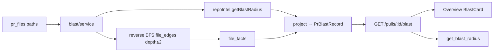

# Development Plan: Blast Radius

## Goal

- Add a **Blast Radius** map of potential PR impact: symbols declared in
  changed files, who imports/calls them, and which HTTP endpoints (and crons)
  may depend on the changed code.
- Answer the reviewer question *“What else might this diff touch?”* using
  **repo-intel facts only** — no model invents nodes or edges.
- Expose the map via `GET /pulls/:id/blast`, a **Blast** tab on the PR page, and
  a real MCP `get_blast_radius` (replacing the L04 stub).
- Optional later: one cheap LLM call that explains the map in a single
  paragraph; the graph itself always comes from the index.

## Success criteria

- [ ] New server module `modules/blast/` with `GET /pulls/:id/blast`
      (workspace-scoped)
- [ ] Changed files loaded from `pr_files`; symbols/callers from
      `repoIntel.getBlastRadius(repoId, changedFiles)`
- [ ] Callers: exclude declaration file; ≤ **20 per symbol**; sort by file rank
      DESC (not a global slice of 20)
- [ ] HTTP/cron impact via **reverse import graph** (BFS depth ≤ 2) over
      `file_edges` + `file_facts` — not invented routes
- [ ] Incomplete index → `status: partial | degraded` with an explicit `reason`;
      never mask missing data as a silent empty success
- [ ] Overview tab shows **Blast Radius card to the right of Intent** (two-column
      row under any full-width brief/description). **No separate Blast tab.**
- [ ] Blast card UI matches the Overview mock: header + icon totals
      (symbols / callers / endpoints / crons), expandable symbol tree →
      `file:line` callers → endpoint/cron tags, **Graph** button opens a modal
      force-layout (purple symbols / gray callers / green endpoints + legend),
      Prior PRs footer (stub until history API exists)
- [ ] `file:line` opens the correct blob at PR `head_sha` (FindingCard /
      `githubBlobUrl`)
- [ ] MCP `get_blast_radius({ repo, pr })` calls the same HTTP route (stub
      removed); compact JSON result; annotations unchanged (read-only)
- [ ] Package tests + typecheck pass for touched packages (`server`, `client`,
      `mcp`); both `vendor/shared` copies stay in sync if contracts change

## Affected modules

| Module | Why | Notes from AGENTS.md / INSIGHTS.md |
|--------|-----|-------------------------------------|
| `server/` | New `modules/blast/`; optional small repo-intel read for reverse dependents | Onion module pattern (`intent/`, `smart-diff/`); register in `modules/index.ts` |
| `server/` `repo-intel` | Prefer `getDependentFiles` (or enhance `getBlastRadius`) for reverse BFS | `BFS_DEPTH = 2`, `MAX_CALLERS_PER_SYMBOL = 20` already in constants; persistent path exists |
| `server/src/vendor/shared` + `client/src/vendor/shared` | Response DTO / reuse `ChangedSymbol`, `DownstreamImpact` | **High risk:** two byte-identical copies — edit both (INSIGHTS) |
| `client/` | Blast **card on Overview** (right of Intent), hook | Colocate `BlastCard` next to `IntentCard`; deep-links via `github-urls.ts`; **no** PR header Blast tab |
| `mcp/` | Replace `get_blast_radius` stub with HTTP client | Flat args `repo` + `pr`; resolve via existing `api/resolve.ts` |
| `e2e/` | Out of MVP | Defer browser coverage |

### Scaffolding already in repo (do not reinvent)

| Layer | Exists | Path / evidence |
|-------|--------|-----------------|
| Facade | `RepoIntel.getBlastRadius` → `BlastResult` | `repo-intel/types.ts`, `service.ts` |
| Persistent blast | symbols, resolved callers, `factsByFile`, rank sort | `tryPersistentBlast` |
| Degraded blast | ripgrep + clone endpoint extract, always `degraded` | same service (T1 path) |
| Limits | `MAX_CALLERS_PER_SYMBOL = 20`, `BFS_DEPTH = 2` | `repo-intel/constants.ts` |
| Import graph | `file_edges` (`from` imports `to`) | `db/schema/repo-intel.ts` |
| File facts | endpoints + crons per path | `getFileFacts` |
| Zod UI shapes | `ChangedSymbol`, `BlastCaller`, `DownstreamImpact`, `BlastRadius` | `contracts/brief.ts` (both vendors) |
| PR files | `pr_files` via `getPrFiles` | intent / smart-diff / reviews repos |
| UI deep-link | `githubBlobUrl` + `MonoLink` | `client/src/lib/github-urls.ts`, FindingCard |
| MCP stub | `not_implemented` tool + tests | `mcp/src/tools/get-blast-radius.ts` |
| Module registry comment | “blast” listed as future lesson | `server/src/modules/index.ts` |

### Gaps vs product requirements

| Requirement | Current gap |
|-------------|-------------|
| Per-symbol caller cap (20) | `tryPersistentBlast` does `callers.slice(0, 20)` **globally** |
| Reverse import walk for HTTP impact | Endpoints today from **caller files’** facts only (or clone parse when degraded) |
| HTTP API for PR blast | No `modules/blast/`, no `GET /pulls/:id/blast` |
| Honest status surface | Facade has `degraded`/`reason`; no API `partial`/`degraded` projection for UI/MCP |
| Overview Blast card | PR tabs: overview / findings / diff — Blast belongs **inside Overview**, not a 4th tab |
| MCP real tool | Stub must not call `getBlastRadius` today — homework wires real route |

## Constraints & risks

- **No LLM for the graph.** Optional summary only; fail-open to a deterministic
  template. Nodes/edges always from index.
- **Do not embed indexing in blast.** Orchestrate reads; indexing stays in
  repo-intel jobs/pipeline.
- **Shared contracts:** prefer a dedicated transport type (e.g. `PrBlastRecord`)
  wrapping reused shapes + `status`/`reason`/`totals`, rather than overloading
  `PrBrief.blast` / bare `BlastRadius` (avoids breaking brief composition).
  Sync both vendor copies in one change.
- **Empty vs degraded:** PR with no symbols in changed files can be `ok` + empty
  arrays + explicit reason like `no_changed_symbols`. Missing/unusable index must
  be `partial`/`degraded` with `reason` — never look like “nothing is affected.”
- **Precision over recall for callers:** persistent path only counts references
  with resolved `decl_file` (existing intel rule). Do not invent callers from
  NULL decl rows.
- **MCP process boundary:** HTTP only (`DEVDIGEST_API_BASE`); never import
  `server/src/modules/*` into `mcp/`.
- **Do not touch** unused course tables “cleanup”; do not invent Graph / Prior
  PRs in MVP.
- **Local auth:** `LocalNoAuth` / workspace from `getContext` — same as intent.

## Approach

### Data flow



### Status mapping

| Condition | `status` | Notes |
|-----------|----------|-------|
| Index `full`, usable blast | `ok` | |
| Index `partial`, or truncated fan-out | `partial` | Always set `reason` |
| Flag off / no clone / `no_data` / facade degraded | `degraded` | Always set `reason` |
| No changed files or no symbols in diff | `ok` (or `empty`) | Empty arrays + explicit reason; not “index broken” |

### API contract

**`GET /pulls/:id/blast`**

```ts
{
  status: 'ok' | 'partial' | 'degraded',
  reason?: string,
  changed_symbols: ChangedSymbol[],
  downstream: DownstreamImpact[],  // per changed symbol
  summary: string,                 // deterministic template; LLM optional later
  totals?: {
    symbols: number,
    callers: number,
    endpoints: number,
    crons: number,
  },
}
```

`DownstreamImpact` (existing shared shape):

- `symbol`, `callers[{ name, file, line }]`, `endpoints_affected[]`,
  `crons_affected[]`

### Attribution rules

1. **Symbols** — declared in changed files (from `getBlastRadius.changedSymbols`).
2. **Callers** — group by `viaSymbol`; drop rows where `file ===` declaration
   file; sort by `rank` DESC; take ≤ 20 per symbol.
3. **Endpoints / crons** — union of:
   - `factsByFile` for caller files of that symbol (when present), and
   - `file_facts` for files reached by reverse import BFS (depth ≤ 2) from the
     symbol’s declaration file / changed seeds.
4. Header **totals** — counts across the projected map (for UI summary bar).

### Reverse import walk

- Edge semantics: `from_file` **imports** `to_file`.
- Reverse hop: given seed `S`, dependents are rows with `to_file = S` →
  `from_file`.
- BFS up to `BFS_DEPTH` (2). Prefer a small repo-intel read
  `getDependentFiles(repoId, seeds, depth)` (or fold into `getBlastRadius`) so
  API / UI / MCP share one truth. No clone parse on the hot path when the
  persistent index is usable.

### Locked decisions

| Topic | Decision |
|-------|----------|
| Where reverse-walk lives | Prefer **repo-intel read** (or enhance `getBlastRadius`); blast module orchestrates + projects |
| Shared type | New **`PrBlastRecord`** (or equivalent) with `status`/`reason`/`totals`; reuse nested shapes; do not break `PrBrief.blast` |
| Endpoint attribution | **Per-symbol** in `downstream[]`; totals in header |
| LLM summary | **Out of MVP**; deterministic `summary` string from totals |
| UI placement | **Overview two-column row**: Intent (left) · Blast Radius (right). Matches product mock; remove any dedicated Blast tab |
| Tree / Graph | **Tree** is the default card list. **Graph** opens a modal force-layout (purple symbols → gray callers → green endpoints + legend). Same `PrBlastRecord` data — no extra API |
| Prior PRs footer | Included on `GET /pulls/:id/blast` as `prior_prs[]` via `pr_files` path overlap in the same repo (prefer merged → closed → open). No LLM notes. UI lists them under the Blast card footer. |
| Clickable paths | GitHub blob at PR `head_sha` (existing helper) — not in-app code viewer |

## Work breakdown

### Phase 0 — Shared contracts

- Add transport Zod (`PrBlastRecord` + status enum) in both
  `server/src/vendor/shared` and `client/src/vendor/shared`.
- Reuse `ChangedSymbol`, `BlastCaller`, `DownstreamImpact` where possible.
- Typecheck both packages after the sync edit.

### Phase 1 — Server `modules/blast/` + intel read

New Fastify plugin (pattern: `modules/intent/`, `modules/smart-diff/`):

| Piece | Responsibility |
|-------|----------------|
| `repository.ts` | Workspace PR + `getPrFiles` |
| `project.ts` | Pure `BlastResult` (+ dependents/facts) → `PrBlastRecord`; per-symbol cap/sort |
| `service.ts` | Load files → `getBlastRadius` → reverse dependents → project status |
| `routes.ts` | `GET /pulls/:id/blast` |
| Register | `server/src/modules/index.ts` |

Also:

- Fix / wrap caller limiting so **20 is per symbol** (projector and/or
  `tryPersistentBlast` — prefer projector so facade consumers stay safe).
- Add reverse-dependent read if not already on the facade.
- Unit tests: projector limits, decl-file exclusion, status mapping.
- Integration test: route returns degraded/partial with `reason` when index
  unusable; happy path shape when fixtures allow.

### Phase 2 — Client Overview Blast card

| Piece | Responsibility |
|-------|----------------|
| `lib/hooks` (e.g. `blast.ts`) | `usePrBlast(prId)` → GET |
| `OverviewTab` | Responsive **2-column grid**: `IntentCard` \| `BlastCard`; pass `repoFullName` + `headSha` |
| `BlastCard` + children | Card chrome (match Intent): totals with icons, Tree\|Graph toggle, expandable symbols → callers → endpoint/cron tags, degraded banner, Prior PRs footer stub |
| `PrDetailHeader` / `page.tsx` | **Do not** add a Blast tab; if a Blast tab was added earlier, remove it |
| i18n | `messages/*/prReview.json` (`prReview.blast.*`) |
| Links | `githubBlobUrl(repoFullName, headSha, file, line)` + `MonoLink` |

MVP visual scope = **Tree** live; Graph control present but stubbed; Prior PRs footer present without backend.

### Phase 3 — MCP `get_blast_radius`

- Replace stub: `resolveRepo` → `resolvePull` → `GET /pulls/:id/blast`.
- Result schema: compact projection of `PrBlastRecord` (cap lists; keep
  `status`/`reason`).
- Update `mcp/AGENTS.md`, `mcp/README.md`, `mcp/INSIGHTS.md` (stub insight
  becomes historical / replace with real-tool note).
- Replace `blast-stub.test.ts` with HTTP-mocked success + degraded cases;
  keep registration order tests green.

### Phase 4 (optional, separate PR) — LLM summary

- One cheap flash call (intent-like) for `summary` only.
- Fail-open to deterministic template.
- Do not block GET; optional query/`POST` later if needed.

## Implementation order

```
0. shared PrBlastRecord (+ status)
1. repo-intel reverse dependents (if needed)
2. blast/service + route + projector tests
3. client BlastTab + deep-links
4. MCP wire-up (drop stub)
5. (opt) summary LLM
```

## Test plan

| Layer | What |
|-------|------|
| `server` unit | Projector: ≤20 callers/symbol, exclude decl file, rank order, merge endpoints/crons, status/reason |
| `server` IT | `GET /pulls/:id/blast` workspace 404; degraded/partial honesty; ok shape with fixtures |
| `client` | Smoke: tab renders totals + expandable row; MonoLink href uses head sha |
| `mcp` | Mock API: success projection; degraded passthrough; resolve errors still actionable |
| Typecheck | `server`, `client`, `mcp` |

## Out of scope

- Force-directed Graph polish beyond the SVG modal (zoom/pan/drag) — optional later
- Prior-PR history beyond file-overlap on imported PRs (e.g. GitHub search for PRs not in the local DB)
- Writing/updating the repo index from the blast module
- Full PR Brief card (L05) above the Intent/Blast row — may land later;
  Overview layout must still place Intent \| Blast correctly without it
- Changes to `@devdigest/shared` vendor beyond blast transport
- E2E browser suite for Blast
- CI workflow for `mcp/` (unchanged from L04 deferral)
- Dedicated PR header **Blast** tab (wrong placement vs mock)

## Open questions (resolved for implementer)

1. **Extend `BlastRadius` vs new record?** → New `PrBlastRecord` with status;
   reuse nested shapes.
2. **Where does reverse BFS live?** → Prefer repo-intel; blast projects.
3. **LLM in first PR?** → No; deterministic summary only.

## References

- Course / MCP stub plan: [`docs/plans/devdigest-mcp.md`](devdigest-mcp.md)
  (deferred homework: replace stub)
- Repo-intel README: `server/src/modules/repo-intel/README.md`
- UI deep-links: `client/src/lib/github-urls.ts`
- Existing shared blast shapes: `contracts/brief.ts`
