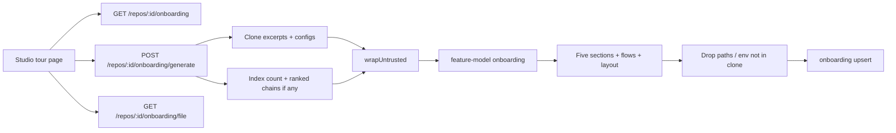

# Implementation Plan: Onboarding Generator

## Spec source
- Path: `docs/specs/2026-08-14-onboarding-generator.md`
- Spec ID: SPEC-02

## Execution mode
multi-agent

## Success criteria
- [ ] AC-01
- [ ] AC-02
- [ ] AC-03
- [ ] AC-04
- [ ] AC-05
- [ ] AC-06
- [ ] AC-07
- [ ] AC-08
- [ ] AC-09
- [ ] AC-10
- [ ] AC-11
- [ ] AC-12
- [ ] AC-13
- [ ] AC-14
- [ ] AC-15
- [ ] AC-16
- [ ] AC-17
- [ ] AC-18
- [ ] AC-19
- [ ] AC-20
- [ ] AC-21
- [ ] AC-22
- [ ] AC-23
- [ ] AC-24
- [ ] AC-25
- [ ] AC-26
- [ ] AC-27
- [ ] AC-28
- [ ] AC-29
- [ ] AC-30
- [ ] AC-31
- [ ] AC-32

## AC coverage
| AC | Plan task(s) | Notes |
| AC-01 | Phase 4 — repo-scoped tour page | `/repos/{repoId}/onboarding`, not `/onboarding` |
| AC-02 | Phase 3 — GET empty envelope; Phase 4 — empty Generate state | Empty/null sections, no invented kinds |
| AC-03 | Phase 2 — structured write of five kinds in order; persist | `architecture`, `critical_paths`, `local_setup`, `reading_path`, `first_tasks` |
| AC-04 | Phase 3 — envelope `generated_at` + `files_indexed`; Phase 4 — title/subtitle/actions | Title **Onboarding for {repo-name}**; **Regenerate** + **Share link** |
| AC-05 | Phase 5 — in-page TOC + five section cards | Exact on-page titles from spec |
| AC-06 | Phase 5 — `MermaidDiagram` on architecture when parseable | Reuse existing component |
| AC-07 | Phase 5 — skip diagram when missing/empty/invalid | Component already returns `null`; no broken placeholder |
| AC-08 | Phase 2 — overview in `body` (+ optional mermaid); Phase 5 — render it | General “how pieces connect” |
| AC-09 | Phase 2 — nested `layout`; Phase 5 — render hierarchy | Areas/packages and children; do not invent extra packages |
| AC-10 | Phase 2 — require `flows` with ordered steps; Phase 5 — flow cards | Ranked file chains are facts only, never the UI |
| AC-11 | Phase 3 — clone file preview route; Phase 6 — **Open** on cited steps | In-app text preview only |
| AC-12 | Phase 5 — install / commands / env; copy on each command | Commands may be empty |
| AC-13 | Phase 2 — README is an input fact; reject verbatim body | Compare against clone README before persist |
| AC-14 | Phase 5 — numbered reading plan; first item = start file | `note` = short reason |
| AC-15 | Phase 5 — task cards + exactly one Low/Medium/High badge | Stored `low` \| `medium` \| `high` |
| AC-16 | Phase 5 — copy presents tasks as join-and-learn work | i18n, not imported issues |
| AC-17 | Phase 2 — upsert by `repo_id` PK | One current tour; regenerate replaces |
| AC-18 | Phase 4 — mutation `isPending` generating/regenerating UI | No second competing tour on screen |
| AC-19 | Phase 6 — clipboard copy of current studio URL | No token, no public URL |
| AC-20 | Phase 2 — `wrapUntrusted` on clone/index facts | Never treat excerpts as instructions |
| AC-21 | Phase 2 — drop paths absent from clone before persist | Do not store invented paths |
| AC-22 | Phase 3 — `clone_unavailable` 409; keep stored row | Distinct from empty GET |
| AC-23 | Phase 2/3 — validate fully then persist; on fail keep previous | No partial row |
| AC-24 | Phase 3 — `getById(workspaceId, repoId)` on read/generate/preview | Same rejection family as other repo routes; never return bodies |
| AC-25 | Phase 2 — `resolveFeatureModel(..., 'onboarding')` | Existing Settings slot; do not add an id |
| AC-26 | Out of scope | No MCP tool or payload field; do not touch `mcp/` |
| AC-27 | Phase 2 — `getIndexState` count into envelope; generate anyway | Subtitle 0 / unavailable; do not block |
| AC-28 | Phase 4 — NAV item + `activeKeyFor` fix | Add-repo `/onboarding` must not highlight Onboarding Tour |
| AC-29 | Phase 6 — Open unavailable state; tour page stays up | Binary / missing / unreadable |
| AC-30 | Phase 3 — Fastify rate-limit on generate (conventions-extract family) | Small per-minute cap, keyed per repository |
| AC-31 | Phase 2 — env **names** only when evidenced in clone/config | No guessed secrets/keys; never persist values |
| AC-32 | Phase 5 — render every task; no hide-by-level | Same complexity on all tasks is valid |

## Affected modules
| Module | Why | Notes from AGENTS.md / INSIGHTS.md |
| `server/` | New Fastify plugin `modules/onboarding/`; reuse table `onboarding`; generate via feature-model `onboarding` | Onion plugin like `conventions/` / `project-context/`. Register in `modules/index.ts`. Secrets never in DB. Copy a local `isPathSafe` — do **not** import `conventions/sampler` or `project-context/helpers`. Do **not** use `walkClone` as the sole sampler (TS/JS + size cap; misses compose / `.env.example`). `clone_unavailable` is `AppError(..., 409)` like project-context (`INSIGHTS` 2026-08-14), not conventions’ `ValidationError`. Fastify response Zod must include envelope fields or they are stripped (`INSIGHTS` 2026-08-14). |
| `server/src/vendor/shared` + `client/src/vendor/shared` | Additive onboarding DTO fields + page envelope | **High risk:** two byte-identical copies, no sync script (`INSIGHTS` 2026-08-01). Edit **both** `contracts/knowledge.ts` identically; typecheck both packages. Reuse `Onboarding` / `OnboardingSection` / `OnboardingLink` — do not invent a second tour document type. |
| `client/` | Repo tour page, nav, i18n, hooks | Colocate under `app/repos/[repoId]/onboarding/_components/`. Hooks in `src/lib/hooks/*` via `src/lib/api.ts` only. Reuse `MermaidDiagram` (`securityLevel: "strict"`, parse-before-render). File preview: fixed aside like `ContextAttach/PreviewSidebar` — **not** `Drawer` (`INSIGHTS` 2026-08-14). Mock AppShell in page tests (`INSIGHTS` 2026-08-01). `vi.mock` path must match the SUT import. Do **not** change `client/src/lib/feature-models.ts` (slot already exists). |
| `reviewer-core/` | Import `wrapUntrusted` only | Filesystem-free. No engine / prompt-assembly change. |
| `mcp/` | Out of scope (AC-26) | No new tool. |
| `e2e/` | Out of scope | Existing `e2e/specs/06-onboarding.flow.json` is the **add-repository** screen at `/onboarding` — do not retarget it. |

### Scaffolding already in repo (do not reinvent)

| Layer | Exists | Path / evidence |
| DB table | `onboarding` PK `repo_id`, `json` jsonb, `generated_at` timestamptz | `server/src/db/schema/context.ts`; `0000_init.sql` — **no module writes it yet** |
| Shared DTO | `Onboarding` = `{ sections: OnboardingSection[] }` | both `vendor/shared/contracts/knowledge.ts` — missing layout/flows/commands/env/note/complexity/envelope |
| Feature-model slot | `id: 'onboarding'` in `FEATURE_MODELS` | both vendor `platform.ts` + `client/src/lib/feature-models.ts` |
| System prompt | `onboarding.system.md` (`{{sections}}`, `{{language}}`) | Mentions stale `routes_and_apis`; must emit **flows** under `critical_paths` |
| Prompt loader | `renderPrompt` | `server/src/platform/prompts.ts` |
| LLM + timeout | `completeStructured` + `withTimeout` | Mirror `conventions/service.ts` (`EXTRACT_TIMEOUT_MS` 90s, `maxRetries: 2`) |
| Untrusted wrap | `wrapUntrusted` | `@devdigest/reviewer-core` |
| Index facts | `repoIntel.getIndexState`, `getTopFilesByRank`, `getCriticalPaths` | Facade; empty/`degraded` when flag off — **facts only**, not Critical paths UI |
| Clone preview pattern | `isPathSafe` + UTF-8 check | Copy into onboarding helpers; do not reuse `GET /repos/:id/context/file` (markdown under specs/docs/insights only) |
| Rate limit family | conventions extract `max: 3, timeWindow: '1 minute'` | `@fastify/rate-limit` on the POST |
| Mermaid UI | `MermaidDiagram` | invalid → render nothing |
| i18n | `messages/en/onboarding.json` | Stale `generate.body` (lists “conventions & gotchas”); `shell.nav.onboarding-tour` label already exists |
| Nav | **item missing** in `client/src/vendor/ui/nav.ts` | `activeKeyFor` currently treats any pathname containing `/onboarding` as `onboarding-tour` (steals add-repo) |
| Add-repo | `/onboarding` + `AddRepoView` | Must stay; e2e `06-onboarding.flow.json` depends on it |
| Do **not** use | `walkClone` as only input; Project Context attachments; convention candidates; review-prompt slots; `Drawer` for Open; GitHub deep-links | Spec non-goals |

## Constraints & risks
- No monorepo workspace; `cd` into each package for scripts. Cross-package types via path aliases.
- Additive `@devdigest/shared` change is **in spec** (layout, flows, commands/env, reading notes, complexity, envelope). Edit **both** vendor copies in one change. Do not break existing `Onboarding` required fields (`kind`, `title`, `body`, `links`).
- Fastify: one Zod schema drives request **and** response. Point generate/read `response: { 200 }` at the **envelope**, not bare `Onboarding`, or `generated_at` / `files_indexed` are stripped.
- Reuse table `onboarding` (one row per repo). Do not create a second tour table. Do not write markdown into the git clone.
- reviewer-core stays filesystem-free; only the API reads the clone.
- Secrets never in git or DB; provider keys stay in the secrets store. Tour JSON must not persist API keys or env **values** — names only when evidenced (AC-31).
- Clone/index bytes are untrusted: wrap before the model; mermaid `securityLevel: "strict"`; markdown as markdown (no raw HTML/script); Open preview is text, never executed; commands are copied, not run by the studio.
- Open paths: reject `..`, absolute paths, and anything that resolves outside the clone (`invalid_path`). Missing/unreadable/binary → unavailable for that preview (AC-29), not a failed tour page.
- Tenancy: `RepoRepository.getById(workspaceId, id)` (or equivalent) on every route. Other-workspace / unknown repo → existing `NotFoundError` (`not_found`, 404). `LocalNoAuth` still scopes by workspace. Do not return another workspace’s `json`.
- Do not add `FeatureModelId` values. Do not change Settings defaults. Do not add MCP tools (AC-26).
- Do not merge this page with Project Context or replace `/onboarding` add-repo.
- Do not reuse repo-intel `partial` / `degraded` as tour document status. Index off/empty is AC-27, not AC-23.
- Ranked/critical **file** chains from `getCriticalPaths` must not be stored or shown as the Critical paths section (AC-10).
- Peer-module imports: onboarding may use `container.repoIntel` and `resolveFeatureModel`. It must not import `conventions/*` or `project-context/*`.
- `kind` on the shared DTO stays `z.string()` (additive, non-breaking). The **module** enforces the five-kind ordered invariant before persist.

## Approach

Locked HTTP names (spec marked these `assumption:` — do not invent a parallel set):

| Method | Path | Role |
| GET | `/repos/:id/onboarding` | Current tour envelope. No row → 200 with empty `sections` and `generated_at: null` (AC-02). Unknown repo → `not_found`. |
| POST | `/repos/:id/onboarding/generate` | Generate or regenerate. Rate-limited. Success → new envelope. Failure → error, previous row untouched. |
| GET | `/repos/:id/onboarding/file?path=` | Read-only clone preview for **Open**. |

### Phase 0 — Shared contracts
- [ ] Additively extend both vendor copies of `contracts/knowledge.ts` (byte-identical): optional `note` on `OnboardingLink`; optional structured fields on `OnboardingSection`: `layout` (nested `{ name, children? }`), `flows` (`{ title, steps: [{ label, path? }] }`), `commands` (`string[]`), `env_vars` (`string[]` names only), `tasks` (`{ title, path?, complexity: 'low' \| 'medium' \| 'high' }[]`); add envelope `OnboardingTour = Onboarding.extend({ generated_at: z.string().datetime().nullable(), files_indexed: z.number().int() })`. Keep required `kind` / `title` / `body` / `links`.  AC: AC-03, AC-04, AC-09, AC-10, AC-12, AC-14, AC-15, AC-27, AC-31
- [ ] Typecheck `client/` and `server/` after the dual edit so the copies still agree.  AC: AC-03, AC-04

### Phase 1 — Persistence module skeleton
- [ ] Add `server/src/modules/onboarding/` (routes, service, repository, constants, helpers, facts collector, llm-schema, persist mapper). Register the plugin in `modules/index.ts`. Repository: `getByRepoId`, `upsert` on PK `repo_id` replacing `json` + bumping `generated_at`. Store `{ sections, files_indexed }` in `json`; map `generated_at` from the column. No new table; no clone writes. No migration unless Drizzle typing of `json` requires it.  AC: AC-17, AC-27
- [ ] Copy local `isPathSafe` / POSIX-rel / UTF-8 helpers (same rules as project-context: no `..`, no absolute, resolve stays inside clone + `sep`).  AC: AC-11, AC-21, AC-29

### Phase 2 — Facts, model write, grounding
- [ ] Facts collector (clone required): directory outline for nested layout; manifests / compose / scripts / `.env.example` (and similar) for install-run-env; README as **one fact among others**; optional `getIndexState().filesIndexed` (0 when missing/degraded); optional `getTopFilesByRank` + `getCriticalPaths` as **writer facts** only. Budget-cap excerpts. Do not call `walkClone` as the only source.  AC: AC-08, AC-09, AC-10, AC-12, AC-13, AC-20, AC-27, AC-31
- [ ] Update `server/src/prompts/onboarding.system.md` to require exactly the five kinds in order, architecture **overview + nested layout**, `critical_paths` as **application flows** (ordered steps — not `routes_and_apis` file dumps), `local_setup` from code/configs (not README paste), numbered reading plan, first tasks with complexity. Keep SECURITY / untrusted rules. Interpolate `{{sections}}` and `{{language}}` = `English`.  AC: AC-03, AC-08, AC-09, AC-10, AC-13, AC-14, AC-15, AC-16, AC-20
- [ ] Call `resolveFeatureModel(container, workspaceId, 'onboarding')` and `llm.completeStructured` with a module-local Zod schema (stricter than HTTP: require `layout`, `flows` with `steps.min(1)` at write time, `complexity` on tasks). Wrap the user payload with `wrapUntrusted('onboarding-facts', …)`. `withTimeout` ~90s; `temperature: 0`.  AC: AC-20, AC-25
- [ ] Post-parse invariants before any write: exactly five sections in kind order; architecture has general `body` and a nested `layout` (hierarchy, not a single paragraph); `critical_paths` has flows with ordered steps (a flat `links` file list is invalid — retry once or fail, do not persist); `local_setup.body` is not a verbatim/whitespace-normalized copy of README; `env_vars` ⊆ names evidenced in collected configs/code (drop the rest, never invent); every `path` on links/steps/tasks must exist inside the clone or be omitted; keep all five kinds even if a list becomes empty after drops. On model/timeout/invalid after retry: throw `AppError('generation_failed', …)` and **do not** upsert.  AC: AC-03, AC-08, AC-09, AC-10, AC-13, AC-17, AC-21, AC-23, AC-31
- [ ] Successful path: upsert one row (replace previous `json` + `generated_at`); record `files_indexed` from that generation (0 if index empty/unavailable).  AC: AC-17, AC-27

### Phase 3 — HTTP routes
- [ ] `GET /repos/:id/onboarding`: workspace-scoped repo lookup; 200 envelope when stored; 200 `{ sections: [], generated_at: null, files_indexed: 0 }` when no row — **not** 404 and **not** invented sections; unknown repo `not_found` without a tour body. Response schema = `OnboardingTour`.  AC: AC-02, AC-04, AC-24
- [ ] `POST /repos/:id/onboarding/generate`: same tenancy; if clone missing/unreadable → `AppError('clone_unavailable', …, 409)` and leave existing row; else run Phase 2; `config.rateLimit: { max: 3, timeWindow: '1 minute' }` with `keyGenerator` including `repoId` (per-repository cap, same family as conventions extract).  AC: AC-18, AC-22, AC-23, AC-24, AC-30
- [ ] `GET /repos/:id/onboarding/file?path=`: workspace-scoped; reject escape with `invalid_path`; missing/unreadable/non-UTF8 → file-unavailable payload (or 404 `file_unavailable`) **for this preview only**. Do not use `/context/file`.  AC: AC-11, AC-24, AC-29

### Phase 4 — Studio page, nav, empty/pending chrome
- [ ] Thin `client/src/app/repos/[repoId]/onboarding/page.tsx` + colocated `OnboardingView` (hooks in `src/lib/hooks/onboarding.ts`, re-export from `hooks/index.ts`). `useQuery` GET; `useMutation` POST generate that invalidates the tour query.  AC: AC-01, AC-02, AC-18
- [ ] Add WORKSPACE nav item `onboarding-tour` → `/repos/:repoId/onboarding` in `client/src/vendor/ui/nav.ts` (icon already in registry, e.g. `Layers`). Fix `activeKeyFor`: only `/repos/:repoId/onboarding` maps to `onboarding-tour`; add-repository `/onboarding` must **not**. Leave `/onboarding` AddRepoView unchanged. Rewrite stale `messages/en/onboarding.json` to the five canonical parts (English).  AC: AC-01, AC-28
- [ ] Empty state: Generate CTA, no fake sections. Stored tour: title **Onboarding for {current repo name}**, subtitle with index file count from **that** generation plus relative `generated_at`, actions **Regenerate** and **Share link**. While mutation pending: generating/regenerating copy; keep showing the previous tour if one exists (no second tour).  AC: AC-02, AC-04, AC-18, AC-27
- [ ] Clone-unavailable and generation-failed: keep previous tour on screen when present; explain clone required vs generation failed. Do not persist from the client.  AC: AC-22, AC-23

### Phase 5 — Five sections UI
- [ ] In-page navigation to: Architecture overview, Critical paths, How to run locally, Guided reading path, First tasks. Render each section’s title + markdown `body` (`Markdown` from `@devdigest/ui`). Empty in-section lists are in-section empty, not a page error.  AC: AC-05
- [ ] Architecture card: general overview (`body`) first; `MermaidDiagram` only when `diagram` is non-empty and parseable (else omit — no error box); nested layout immediately under (tree of `layout` children). Do not render mermaid from other sections.  AC: AC-06, AC-07, AC-08, AC-09
- [ ] Critical paths: one card per **flow**, steps in order; not a flat important-files list. **Open** only on a step that cites a path.  AC: AC-10, AC-11
- [ ] How to run locally: generated install + commands + evidenced env-var **names**; each command has copy-to-clipboard (brief copied / copy-failed — no download).  AC: AC-12, AC-19
- [ ] Guided reading: numbered; item 1 visually the start file; later items “read next”; each with short `note`. **Open** when the path is present.  AC: AC-11, AC-14
- [ ] First tasks: cards with title, optional path, exactly one complexity badge `Low` \| `Medium` \| `High`; i18n presents them as recommended learning work for someone who just joined; show **all** tasks together (no filter/hide by level). Reuse existing Chip/Badge chrome; do not invent `SEV` colours.  AC: AC-15, AC-16, AC-32

### Phase 6 — Share, Open preview, copy failures
- [ ] **Share link** copies `window.location.href` (studio tour URL) via `navigator.clipboard.writeText`; confirm briefly; if clipboard missing/throws, show copy failed. No share-token API.  AC: AC-19
- [ ] **Open**: fetch preview; show read-only **text** in a non-modal fixed aside (PreviewSidebar pattern — not `Drawer`, not GitHub). Prefer `<pre>`/monospace for source (these are not Project Context markdown specs). Unavailable → message on the aside; tour page remains. Extremely large files: still text preview, do not execute.  AC: AC-11, AC-29

## Recommendations
- HTTP paths above match `/repos/:id/context` style; stick to them.
- Persist `files_indexed` inside `json` and keep `generated_at` on the existing column — avoids a migration on a table that already fits one-tour-per-repo.
- Reuse conventions extract’s 90s timeout / structured-output / `maxRetries: 2`, then **one** extra validation retry for missing flows/layout; then `generation_failed`.
- Concurrent POSTs: PK upsert is last-write-win (still one tour). Rely on rate-limit + client `isPending` rather than a new job queue (spec: synchronous, no background job).
- Do not extend `GET /repos/:id/context/file` — wrong allow-list.
- Do not add an e2e flow unless test-writer later chooses; add-repo e2e must keep using `/onboarding`.

## Skill routing (for implementer)
| Skill | When / which paths | Required? |
| onion-architecture | `server/src/modules/onboarding/**` — plugin boundaries, no peer imports | yes |
| fastify-best-practices | `server/src/modules/onboarding/routes.ts` — Zod response, rateLimit, errors | yes |
| drizzle-orm-patterns | `onboarding` table upsert/get; jsonb mapping | yes |
| postgresql-table-design | Reuse existing PK/`json`/`generated_at`; add a column only if json overlay is insufficient | yes |
| zod | Dual `vendor/shared/contracts/knowledge.ts`; module llm-schema vs HTTP envelope | yes |
| security | Untrusted wrap, path traversal on Open, no secrets in JSON, mermaid strict, rate-limit | yes |
| typescript-expert | Dual vendor copies; envelope vs section types | no (if types stay straightforward) |
| frontend-ui-architecture | `client/src/app/repos/[repoId]/onboarding/**` colocation; hooks in `lib/hooks` | yes |
| next-best-practices | Thin `page.tsx`; `'use client'` on the view | yes |
| react-best-practices | Split section cards; pending/empty/error states; no fetch in components | yes |
| react-testing-library | Implementer smoke tests only; mock AppShell; `vi.mock` = SUT import path | yes |
| mermaid-diagram | Architecture diagram only; invalid → omit | yes (client render) |
| engineering-insights | After non-trivial work | yes |
| test gap-fill | — | **defer** to `test-writer` (multi-agent); each `it(...)` cites `AC-NN` |
| plan vs code check | — | **defer** to `plan-verifier` (**last**, after tests) |
| architecture boundaries | — | **defer** to `architecture-reviewer` (after implementer; parallel with test-writer) |
| logic / security / pre-PR | — | **defer** to `pr-self-review` / `security` (after plan-verifier) |
| feature docs | — | **defer** to `doc-writer` (optional; do not duplicate the SDD spec) |

## Out of scope for implementer
- Architecture review (`architecture-reviewer`) — after implementer, parallel with test-writer
- Plan verification (`plan-verifier`) — **last**, after tests
- Test gap-fill (`test-writer`) — unless Execution mode is single-agent
- Docs (`doc-writer`) — do not write a second SDD spec
- Logic / security / pre-PR (`pr-self-review`) — after plan-verifier
- Opening PRs
- AC-26 (no MCP tool) — verify `mcp/` untouched; do not add tools
- Replacing `/onboarding` add-repository; public share tokens; clone markdown export; GitHub Open links; in-app prose editing; auto-generate on import; multi-language tours; using the tour as review-prompt context; new `FeatureModelId`
- Retargeting `e2e/specs/06-onboarding.flow.json`

## Verification plan
Split ownership. Do **not** make implementer run a full package `pnpm test`.

### Implementer-owned (cheap)
| Package | Command | Scope |
| client | `pnpm typecheck`; `pnpm exec vitest run <touched test files>` | new tour view / nav helper tests only; skip if none yet |
| server | `pnpm typecheck`; unit vitest on touched files only (`--exclude '**/*.it.test.ts'`) | facts/path-drop/README-verbatim/env-evidence helpers; no Docker |

### test-writer-owned
| Package | Command | Scope |
| server | `pnpm exec vitest run --exclude '**/*.it.test.ts'` plus `pnpm exec vitest run .it.test` (Docker) | Grounding unit tests; integration: empty GET vs clone_unavailable generate, upsert replace, workspace isolation, invalid structured result does not persist; each `it(...)` cites `AC-NN` |
| client | `pnpm exec vitest run <new tests>` | Empty state, header/subtitle, five-section TOC, mermaid omit, pending regenerate, share clipboard, Open unavailable, all complexity badges visible; mock AppShell |

### plan-verifier
Trust Implementation Report + Test Report when those commands already `pass`.
Re-run Bash only if reports are missing, `partial`/`fail`, or an AC cannot be evidenced from files.

## Open questions
- none
