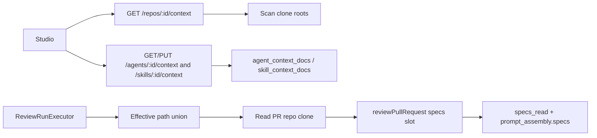

# Implementation Plan: Project Context

## Spec source
- Path: `docs/specs/2026-08-14-project-context.md`
- Spec ID: SPEC-01

## Execution mode
multi-agent

## Success criteria
- [ ] AC-01
- [ ] AC-02
- [ ] AC-03
- [ ] AC-04
- [ ] AC-05
- [ ] AC-06
- [ ] AC-07
- [ ] AC-08
- [ ] AC-09
- [ ] AC-10
- [ ] AC-11
- [ ] AC-12
- [ ] AC-13
- [ ] AC-14
- [ ] AC-15
- [ ] AC-16
- [ ] AC-17
- [ ] AC-18
- [ ] AC-19
- [ ] AC-20
- [ ] AC-21
- [ ] AC-22
- [ ] AC-23
- [ ] AC-24

## AC coverage
| AC | Plan task(s) | Notes |
| AC-01 | Phase 2 — catalog scan + GET; Phase 5 — Project Context list | Top-level `specs`/`docs`/`insights` only (case-insensitive); `*.md`; category = root |
| AC-02 | Phase 2 — empty catalog; Phase 5 — empty UI | Clone present, zero matches → 200 + empty list, not invented files |
| AC-03 | Phase 2 — preview content; Phase 5 — read-only preview | Same file bytes as attach-tab preview |
| AC-04 | Phase 3 — used-by count; Phase 5 — explorer badge | Distinct agents: direct attach ∪ enabled linked skill that attaches the path |
| AC-05 | Phase 6 — agent Context tab | Catalog + attach + category + preview + attached/total badge + token total |
| AC-06 | Phase 1 — persist; Phase 3 — replace-full-list; Phase 6 — save | Paths + order on the agent; used on later runs |
| AC-07 | Phase 3 — store order; Phase 4 — inject in that order; Phase 6 — reorder UI | Earlier in the list → earlier in `## Project context` |
| AC-08 | Phase 2 — return text (or char length); Phase 6 — `ceil(chars / 4)` | Reuse existing client heuristic; no API `tokens` field required |
| AC-09 | Phase 6 — client filter | File name or path, case-insensitive; no matches → empty list |
| AC-10 | Phase 3 — skill GET/PUT; Phase 6 — skill Context tab | Same catalog; inherit copy required |
| AC-11 | Phase 1 + 3 — skill persist; Phase 4 — inherit on run | Only globally enabled + link-enabled skills |
| AC-12 | Phase 4 — effective-set union | Agent paths ∪ inherited skill paths; dedupe by repo-relative path |
| AC-13 | Phase 4 — read clone + pass `specs` slot | Full text; existing untrusted wrapper; not system/skill bodies |
| AC-14 | Phase 4 — omit empty specs | Omit `reviewPullRequest` `specs` key; `prompt_assembly.specs` null/absent |
| AC-15 | Phase 7 — Prompt Assembly label | Exact copy: **Project context — attached specs (untrusted)**; existing expand/fullscreen |
| AC-16 | Phase 4 — `specs_read`; Phase 7 — already rendered | Injected paths only, injection order |
| AC-17 | Phase 4 — skip missing/unsafe at run | Continue run; omit skipped paths from `specs_read`; not a failed run |
| AC-18 | Phase 2 + 3 — workspace-scoped lookups | Same rejection family as other repo/agent routes (`not_found` / unauthenticated); never return bodies |
| AC-19 | Phase 4 — specs slot only | Do not merge into `systemPrompt` or skill bodies |
| AC-20 | Phase 2 — clone unavailable error; Phase 5 — unavailable UI | Distinct from AC-02 empty success |
| AC-21 | Phase 2 — live scan; Phase 5 — Refresh refetch | Not repo-intel reindex |
| AC-22 | Phase 4 — union order | Agent position wins if agent also attached the path; else inherited position |
| AC-23 | Phase 6 — warning when total > 4000 | Skill tab = that skill’s files; agent tab = effective set; save and run still allowed; no truncate |
| AC-24 | Phase 6 — hide warning at ≤ 4000 | |

## Affected modules
| Module | Why | Notes from AGENTS.md / INSIGHTS.md |
| `server/` | New `modules/project-context/`; attachment tables; wire `reviews/run-executor.ts` | Onion Fastify plugin (`blast/` / `intent/` pattern). Register in `modules/index.ts`. Secrets never in DB. Do **not** reuse `walkClone` (TS/JS + 400 KB cap — wrong for this catalog). Copy a local `isPathSafe` (do not import `conventions/sampler`). Stub tables are stubs — generate a real migration (`INSIGHTS` 2026-08-03). `setSkills` is delete+insert in one transaction and does **not** bump `agents.version` — mirror that. Gate any `specs.loaded` live-log line on a non-empty injected set (`skills.loaded` insight). Put user-visible log text in `msg`, not `data`. |
| `server/src/vendor/shared` + `client/src/vendor/shared` | Attachment list DTOs; optional catalog row extension | **High risk:** two byte-identical copies, no sync script (`INSIGHTS` 2026-08-01). Edit both identically; typecheck both packages. Reuse `SpecFile`, `PromptAssembly.specs`, `specs_read` — do not add a parallel prompt slot. |
| `client/` | Project Context page, agent/skill Context tabs, Prompt Assembly label, nav | Colocate under `app/repos/[repoId]/context/_components/` and editor `_components/ContextTab/`. Hooks in `src/lib/hooks/*` via `src/lib/api.ts` only. Reuse `estimateTokens` (`ceil(chars / 4)` in `components/SkillBodyEditor/helpers.ts`). Mock AppShell in list tests (`INSIGHTS` 2026-08-01). DnD border longhand (`INSIGHTS` 2026-08-02). `vi.mock` path must match the SUT import. |
| `reviewer-core/` | Consume existing `specs` slot only | Filesystem-free. `assemblePrompt` already emits `## Project context` + `wrapUntrusted('spec-i', …)` and omits the section when `specs` is missing/empty. **No engine change** unless a test gap is found. Do not add a second heading. Do not default an unused slot. |
| `mcp/` | Out of scope | `run_agent_on_pr` already `POST /pulls/:id/review` — picks up executor injection with no MCP change. |
| `e2e/` | Out of scope | No AC requires browser e2e. |

### Scaffolding already in repo (do not reinvent)

| Layer | Exists | Path / evidence |
| HTTP catalog hook | `useContextFiles` → `GET /repos/:id/context` | `client/src/lib/hooks/core.ts` — **no server route yet** |
| `SpecFile` | `{ path, content?, size?, updated_at? }` | both `vendor/shared/contracts/platform.ts` |
| Prompt slot | `PromptParts.specs` → `## Project context` + untrusted wrap | `reviewer-core/src/prompt.ts` |
| Trace | `prompt_assembly.specs`, `specs_read` | `contracts/trace.ts`; executor currently hardcodes `specs_read: []` and never passes `specs` |
| Prompt Assembly UI | specs row already rendered when non-null | `TraceBody.tsx`; label `runs.trace.prompt.specs` = “Project context (dynamic)” — **wrong copy** |
| Token heuristic | `ceil(text.length / 4)` | client `estimateTokens`; `PromptBlock`; server tokenizer fallback |
| Skill-link replace | `AgentsRepository.setSkills` delete+insert txn | `POST /agents/:id/skills` |
| Inheritance filter | `skillsRepo.bodiesForAgent` — both enabled flags, link order | extend analogously for skill attachment paths (need `skill.id`, not only name/body) |
| Clone + tenancy | `repos.clonePath`; `RepoRepository.getById(workspaceId, id)` | missing clone → AC-20; wrong workspace → `NotFoundError` (AC-18) |
| Path safety pattern | `isPathSafe` in conventions sampler | reimplement in project-context helpers (no peer import) |
| i18n + sidebar label | `messages/en/context.json`, `shell.nav.context` | **NAV item missing** in `client/src/vendor/ui/nav.ts` (omitted as a dead link). Page route does not exist. |
| Agent/skill editors | Config+Skills / Config+Preview+Stats+Versions | add a Context tab; `?tab=` already used |
| Do **not** use | `useReindexContext` → `POST /repos/:id/context/reindex`; `walkClone`; repo-intel `partial`/`degraded` | Spec: live clone scan; AC-20 is catalog-unavailable, not intel status |

## Constraints & risks
- No monorepo workspace; `cd` into each package for scripts. Cross-package types via path aliases.
- reviewer-core stays filesystem-free; only the API reads the clone. Pass resolved strings into `reviewPullRequest({ specs })`.
- Do not touch `@devdigest/shared` except the attachment (+ catalog row) DTOs this feature needs. Edit **both** vendor copies in one change.
- Secrets never in git or DB; do not persist clone credentials or file bodies on agent/skill rows — **paths only**.
- Agents/skills are workspace-scoped; documents are repo-scoped. Stored paths have no `repoId`; a run on repo B resolves against repo B’s clone (missing → AC-17).
- Do not reuse repo-intel reindex or `code_chunks` as the catalog.
- Do not merge project-context text into skill bodies or the system prompt (AC-19).
- Untrusted markdown must go through existing `wrapUntrusted` (closing `</untrusted>` already stripped in the engine).
- Attachment writes: reject `..` / absolute / outside-clone / not-under-discovery-root / non-`.md` with `invalid_path` (**save**). Missing file at **run** is skip, not HTTP error.
- `LocalNoAuth`: AC-18 is workspace-scoped `getById` → existing `NotFoundError` (`not_found`, 404), same family as other repo/agent routes. Do not invent a new auth stack.
- `walkClone` excludes non-TS/JS and caps file size — **forbidden** for this catalog. Extremely large markdown is still listed and injected in full (warning only).
- Do not bump `agents.version` / `skills.version` on attachment-only writes (same as `setSkills`; skill versions are body-only — `INSIGHTS` 2026-08-01).
- Repo-intel off must not strip project context.
- Fastify: one Zod schema drives request **and** response. Do not change `SpecFile` shape incompatibly without updating the client hook.
- CI-only runners that bypass studio `ReviewRunExecutor` are **out of scope** (spec open question). Do not add a second injection path.

## Approach

### Phase 0 — Shared contracts
- [ ] In **both** `server/src/vendor/shared/contracts/platform.ts` and `client/src/vendor/shared/contracts/platform.ts`, add attachment transport types next to `SpecFile` (do not fork a second prompt slot): `AgentContextAttachment` `{ path, order }`, `SkillContextAttachment` `{ path }` (list order = order), plus list wrappers `{ documents: [...] }`. Optionally `ContextCatalogFile = SpecFile.extend({ category: z.enum(['specs','docs','insights']), used_by_agents: z.number().int() })` so Fastify response Zod does not strip AC-01/AC-04 fields. Keep `SpecFile` itself unchanged. Typecheck `server` and `client` after the sync edit.  AC: AC-01, AC-04, AC-06, AC-11

### Phase 1 — Persistence
- [ ] Add `agent_context_docs` (`agent_id` FK cascade, `path` text, `order` int, PK `(agent_id, path)`) and `skill_context_docs` (`skill_id` FK cascade, `path` text, `order` int, PK `(skill_id, path)`). Index `path` for used-by. Put tables beside agents/skills schema (or a small `db/schema/project-context.ts` exported from `schema.ts`). Run `pnpm db:generate` from `server/` — do not hand-write SQL that drifts from Drizzle.  AC: AC-06, AC-11

### Phase 2 — Server catalog + preview
- [ ] Add Fastify plugin `server/src/modules/project-context/` (`routes.ts`, `service.ts`, `repository.ts`, `helpers.ts` / `scan.ts`, `constants.ts`). Register in `modules/index.ts`. Routes call `getContext` then workspace-scoped repo lookup (`NotFoundError` if missing — AC-18).  AC: AC-18
- [ ] Implement a **dedicated** recursive scanner (not `walkClone`): only top-level dirs whose names match `specs`/`docs`/`insights` case-insensitively; recursive `*.md` (case-insensitive); skip symlinks, images, non-files, non-UTF-8; do **not** treat `src/docs/` as a root; category = canonical lowercase root. Return repo-relative POSIX paths. Include `content` on list items so the client can preview and estimate tokens without a second round-trip (contract allows omitting `content`; including it is the smaller UI).  AC: AC-01, AC-03, AC-08
- [ ] `GET /repos/:id/context`: clone present + no matches → **200 empty array** (AC-02). Clone missing/unreadable → **not** 200 `[]` — `AppError` code `clone_unavailable` (409 recommended) so the UI can distinguish AC-20. Do not use repo-intel `partial`/`degraded`. Live scan every request (Refresh is a client refetch).  AC: AC-02, AC-20, AC-21
- [ ] Optional `GET /repos/:id/context/file?path=` returning one `SpecFile` with `content` for a preview that went stale (deleted after list load → `not_found`, no body). Validate path with clone-boundary helpers before `readFile`.  AC: AC-03, AC-18

### Phase 3 — Server attachments + used-by
- [ ] `GET` + `PUT` (or `POST`, matching `setSkills`) `/agents/:id/context` and `/skills/:id/context`: replace-full-list in one transaction (delete + insert). Agent list is ordered `{ path, order }`; skill list order is array order (persist `order` = index). Empty body after an explicit save is “detach all”; do not treat a missing catalog as detach.  AC: AC-06, AC-07, AC-10, AC-11
- [ ] On save, reject paths that are absolute, contain `..`, resolve outside the **selected repo’s** clone, are not under a discovery root, or are not `*.md` — `invalid_path` / `ValidationError`. Do **not** require the file to exist on disk (deleted-after-attach edge case). Workspace-scope agent/skill the same as other routes (AC-18). Verify skills belong to the agent’s workspace if any cross-link is introduced (existing `skillsBelongToWorkspace` insight — attachments are on the skill itself, so `getById(workspaceId, skillId)` is enough).  AC: AC-18
- [ ] Catalog `used_by_agents`: count distinct workspace agents that either attach the path directly **or** have that skill enabled+linked and the skill attaches the path. Zero agents → 0.  AC: AC-04

### Phase 4 — Run injection (studio executor)
- [ ] Pure helper `unionEffectivePaths(agentDocs, inheritedBySkillLinkOrder)`: start with agent attachments in user order; then each globally-enabled + link-enabled skill in **agent skill-link order**, appending that skill’s attachments in skill order, skipping paths already seen (AC-22). If a skill has no stored order, sort that skill’s paths lexicographically. Disabled skill or disabled link → omit.  AC: AC-07, AC-12, AC-22
- [ ] In `ReviewRunExecutor.runOneAgent`, **independent of `repoIntelOn`**: load agent docs + `bodiesForAgent`-equivalent skill ids/paths; union; for each path `isPathSafe` + `readFile` from **`repo.clonePath` of the PR’s repo**. Skip missing/unreadable/unsafe (log in `msg` if useful); do not fail the run. Build `specs: string[]` as `### ${path}\n${content}` (path label inside the untrusted payload). If the remaining list is empty, **omit** the `specs` key (do not pass `[]`).  AC: AC-13, AC-14, AC-17, AC-19
- [ ] Persist `specs_read` as the paths actually injected, in injection order. `prompt_assembly.specs` comes from `outcome.assembly` (engine). Failure/cancel `traceFromBuffer` may keep `specs: null` / `specs_read: []`. Do not copy spec text into `systemPrompt` or skill bodies.  AC: AC-14, AC-16, AC-19
- [ ] Do **not** change `reviewer-core` prompt assembly unless tests prove the slot is wrong. Confirm `wrapUntrusted` + omit-when-empty remain the only injection path. MCP `run_agent_on_pr` needs no code change.  AC: AC-13, AC-14, AC-19

### Phase 5 — Client Project Context page
- [ ] Add `client/src/app/repos/[repoId]/context/page.tsx` (thin) + colocated `ContextView` (list + read-only markdown preview + Refresh). Pattern: `conventions/page.tsx`. No selected repo → same empty/shell behaviour as other repo pages.  AC: AC-01, AC-03
- [ ] Wire `useContextFiles` to the real GET (typed as catalog rows). Map `ApiError.code === 'clone_unavailable'` to an unavailable state (AC-20), empty array to empty catalog (AC-02), errors to existing load-error copy. Refresh invalidates `["context", repoId]` only — **do not** call `useReindexContext`. Rewrite `messages/en/context.json` (drop chunks / `.devdigest/specs/` / Edit).  AC: AC-02, AC-20, AC-21
- [ ] Show category tag, path, used-by count (0 allowed). No create/upload/edit, no coverage/chunks chrome.  AC: AC-01, AC-04
- [ ] Add a NAV item in `client/src/vendor/ui/nav.ts` (`href: "/repos/:repoId/context"`, key `context`) so the existing `shell.nav.context` label is reachable. This is a vendored UI file; the i18n key already exists, the item was omitted as a dead link.  AC: AC-01

### Phase 6 — Client agent + skill Context tabs
- [ ] Agent editor: add Context tab (`TABS` + `AgentEditor` branch + `messages/en/agents.json`). Skill editor: same (`skills.json`). Default tab stays Config.  AC: AC-05, AC-10
- [ ] Shared colocated attach UI (promote when a second consumer appears): catalog list, attach toggle, category tag, preview action (read-only, same text as Project Context), filter on name/path (case-insensitive), per-file token estimate via `estimateTokens(content)`, total for the **current attach set**, attached/total badge. While catalog is loading, show loading — do not PUT an empty list.  AC: AC-05, AC-08, AC-09, AC-10
- [ ] Persist via replace-full-list hooks (`useAgentContext` / `useSkillContext` in `lib/hooks/`). Agent tab: keep user order (drag-and-drop like `SkillsTab`; longhand borders). Skill tab: list order; copy that linked agents inherit these documents.  AC: AC-06, AC-07, AC-10, AC-11
- [ ] Token total + oversize warning: skill tab = that skill’s attached files; agent tab = **effective** set (agent ∪ inherited from enabled+linked skills — fetch those skills’ attachments). Warn iff estimated total **> 4000**; hide at ≤ 4000. Warning must not block save. Constant `4000` colocated with the tab.  AC: AC-08, AC-12, AC-23, AC-24

### Phase 7 — Run audit UI
- [ ] Change `client/messages/en/runs.json` `trace.prompt.specs` to **Project context — attached specs (untrusted)**. `PromptBlock` already expands and opens fullscreen with the full `prompt_assembly.specs` string. `TraceBody` already lists `specs_read`. No new trace fields.  AC: AC-15, AC-16

## Recommendations
- **One new server module** (`project-context`) owns catalog scan, path safety, attachment tables, used-by, and effective-set reads. Attachment HTTP may live on that plugin (`/agents/:id/context`, `/skills/:id/context`) so agents/skills services stay free of clone I/O. `reviews` depends **inward** on this module (or a pure helper + repository) — do not import `ReviewRepository` from project-context.
- **Join tables, not jsonb**, so used-by and replace-full-list match `agent_skills`.
- **Include `content` on the catalog GET** so tokens + preview share one payload; skip a required `tokens` field (spec: client may compute).
- **Do not extend `Agent` / `Skill` DTOs** with attachment arrays (avoids version-snapshot and list-endpoint bloat). Dedicated GET/PUT is the skill-link pattern.
- **Reuse `estimateTokens`** rather than a third copy of `ceil(n / 4)`.
- **Do not add a skill “serialize as ## Project context” preview** unless it is free: AC-10 only requires inherit copy; canonical heading is already the engine’s.
- **Do not implement CI-runner injection.** Studio `ReviewRunExecutor` is the sole path (MCP included).

## Skill routing (for implementer)
| Skill | When / which paths | Required? |
| onion-architecture | `server/src/modules/project-context/**`, `reviews/run-executor.ts` wiring | yes |
| fastify-best-practices | new routes, Zod request/response, error mapping | yes |
| drizzle-orm-patterns | new tables, replace-full-list transactions, `pnpm db:generate` | yes |
| postgresql-table-design | PK `(agent_id, path)`, FK cascade, index on `path` | yes |
| zod | shared DTOs + route schemas; `safeParse` only at HTTP boundary | yes |
| typescript-expert | dual vendor copies, path aliases, no published workspace | yes |
| security | clone-boundary path checks; AC-18 tenancy; untrusted specs never in system/skill; no secrets in DB | yes (constraints); full review defer |
| frontend-ui-architecture | `context/page.tsx` + `_components/`; editor `ContextTab/` colocation; hooks in `lib/hooks` | yes |
| next-best-practices | thin `page.tsx`, `'use client'` on views, no browser clone access | yes |
| react-best-practices | tabs, filter state, DnD, warning vs save | yes |
| react-testing-library | implementer smoke only if touching existing editor tests; gap-fill defer | no / defer |
| mermaid-diagram | not required for implementer | no |
| engineering-insights | after non-trivial work (scanner vs walkClone, clone_unavailable vs empty, dual vendor) | yes |
| tests gap-fill | new `it(...)` must cite `AC-NN` | **defer** to `test-writer` |
| plan vs code check | | **defer** to `plan-verifier` (**last**, after tests) |
| architecture boundaries | reviews ↛ conventions; reviewer-core stays FS-free; dual vendor | **defer** to `architecture-reviewer` (after implementer; parallel with test-writer) |
| logic / security / pre-PR | | **defer** to `pr-self-review` / `security` |
| feature docs | do not write a second SDD spec | **defer** to `doc-writer` (optional) |

## Out of scope for implementer
- Architecture review (`architecture-reviewer`) — after implementer, parallel with test-writer
- Plan verification (`plan-verifier`) — **last**, after tests
- Test gap-fill (`test-writer`) — unless Execution mode is single-agent
- Docs (`doc-writer`) — do not write a second SDD spec
- Logic / security / pre-PR (`pr-self-review`) — after plan-verifier
- Opening PRs
- In-app create / edit / upload / delete of markdown; chunks / coverage / RAG; non-markdown attachments; scanning outside `specs`/`docs`/`insights`
- New MCP tools or MCP payload fields
- Changing skill-body trust or merging specs into `## Skills / rules`
- Snapshotting document text onto agent/skill rows
- CI-only runners that do not use studio `ReviewRunExecutor` (spec open question — do not invent an AC)
- E2E browser suite
- Repo-intel reindex / `POST /repos/:id/context/reindex`
- Engine prompt-heading change (`## Project context` stays)

## Verification plan
Split ownership. Do **not** make implementer run a full package `pnpm test`.

### Implementer-owned (cheap)
| Package | Command | Scope |
| client | `pnpm typecheck`; `pnpm exec vitest run` on touched editor/page tests if they break | only paths you changed; skip if no client tests exist yet |
| server | `pnpm typecheck`; unit vitest on new helpers (scan, `isPathSafe`, union, skip-missing) (`--exclude '**/*.it.test.ts'`) | no Docker / no `*.it.test.ts` unless this phase is integration |
| reviewer-core | `pnpm typecheck` | only if touched (expected: no product change) |

### test-writer-owned
| Package | Command | Scope |
| server | `pnpm exec vitest run --exclude '**/*.it.test.ts'` plus `*.it.test.ts` for catalog/attachment routes (Docker) | scan roots, empty vs unavailable, invalid_path on save, AC-17 skip, union/AC-22, workspace 404; each `it(...)` cites `AC-NN` |
| client | `cd client && pnpm test` (targeted files) | Context tab filter/tokens/warning; Project Context empty/unavailable; Prompt Assembly label; AppShell mocked |
| reviewer-core | `pnpm test` | only if adding a specs-slot regression (`## Project context` present/absent, not in system) |

### plan-verifier
Trust Implementation Report + Test Report when those commands already `pass`.
Re-run Bash only if reports are missing, `partial`/`fail`, or an AC cannot be evidenced from files.

## Open questions
- none (CI-only runners are a spec product hole — out of scope above; follow studio `ReviewRunExecutor` only)
