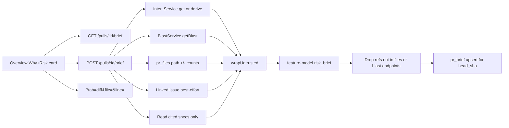

# Implementation Plan: Why + Risk Brief

## Spec source
- Path: `docs/specs/2026-08-14-why-risk-brief.md`
- Spec ID: SPEC-03

## Execution mode
multi-agent

## Success criteria
- [ ] AC-01
- [ ] AC-02
- [ ] AC-03
- [ ] AC-04
- [ ] AC-05
- [ ] AC-06
- [ ] AC-07
- [ ] AC-08
- [ ] AC-09
- [ ] AC-10
- [ ] AC-11
- [ ] AC-12
- [ ] AC-13
- [ ] AC-14
- [ ] AC-15
- [ ] AC-16
- [ ] AC-17
- [ ] AC-18
- [ ] AC-19
- [ ] AC-20
- [ ] AC-21
- [ ] AC-22
- [ ] AC-23
- [ ] AC-24
- [ ] AC-25
- [ ] AC-26
- [ ] AC-27

## AC coverage
| AC | Plan task(s) | Notes |
| AC-01 | Phase 4 — Overview Why+Risk card | One card: risk level, What, Why, Risks, Review focus |
| AC-02 | Phase 3 — GET empty envelope; Phase 4 — empty Generate state | No invented What/Why/risks/focus |
| AC-03 | Phase 2 — persist `risk_level`; Phase 4 — colour badge | Exactly `high` \| `medium` \| `low`; reuse existing tokens |
| AC-04 | Phase 2 — reject title-only what/why; Phase 4 — render What + Why | Not the PR title alone |
| AC-05 | Phase 2 — grounded risks; Phase 4 — list with citations | File path or blast endpoint from generate inputs |
| AC-06 | Phase 4 — review-focus list + count | Path, optional line range, short reason |
| AC-07 | Phase 5 — review-focus → Files changed | `?tab=diff&file=` (+ optional `line`) |
| AC-08 | Phase 5 — risk file citation → Files changed | Same focus helper; endpoint-only is not a file link |
| AC-09 | Phase 2 — one structured write; persist for head revision | POST always rebuilds |
| AC-10 | Phase 2 — collect intent, blast summary+names, diff stats, issue, specs | Specs only when actually read |
| AC-11 | Phase 2 — payload is stats only | No `+`/`-` hunk bodies; do not copy Intent hunk headers |
| AC-12 | Phase 3 — GET returns cache; no model | GET never writes |
| AC-13 | Phase 3 — POST regenerate; Phase 4 — Regenerate control | Replace stored row on success |
| AC-14 | Phase 3 — `stale` when sha mismatch; Phase 4 — stale badge | Show cached body; no silent rebuild |
| AC-15 | Phase 2 — drop invented file/endpoint refs before persist | Empty arrays after drop are valid |
| AC-16 | Phase 4 — mutation `isPending` generating/regenerating | One card; keep previous body if any |
| AC-17 | Phase 2/3 — on fail do not upsert; Phase 4 — show failure | Keep previous stored brief |
| AC-18 | Phase 3 — workspace-scoped pull lookup | Same rejection family as other pull routes; never return bodies |
| AC-19 | Phase 2 — `IntentService.derive` if missing; fail if derive fails | Do **not** use fail-open `ensureForReview` |
| AC-20 | Phase 2 — generate with whatever blast record contains | `partial`/`degraded` is not a brief hard-fail |
| AC-21 | Phase 2 — omit missing issue/spec; still generate | Do not invent ticket or spec text |
| AC-22 | Phase 2 — `resolveFeatureModel(..., 'risk_brief')` | Existing Settings slot; do not add an id |
| AC-23 | Out of scope | No MCP tool or payload field; do not touch `mcp/` |
| AC-24 | Phase 3 — Fastify rate-limit on POST | Small per-minute cap, keyed per pull |
| AC-25 | Phase 2 — `wrapUntrusted` on all collected facts | Never treat inputs as instructions |
| AC-26 | Phase 5 — non-navigating text when path not in diff | Overview card still renders |
| AC-27 | Phase 4 — keep IntentCard + BlastCard | Do not pass `risks` into IntentCard |

## Affected modules
| Module | Why | Notes from AGENTS.md / INSIGHTS.md |
| `server/` | New Fastify plugin `modules/brief/` (or `why-risk-brief/`); reuse table `pr_brief`; generate via feature-model `risk_brief` | Onion plugin like `intent/` / `onboarding/`. Register in `modules/index.ts`. Secrets never in DB. GET empty must be a 200 envelope (not 404) so pull-`not_found` stays distinct (`INSIGHTS` 2026-08-14 catalog empty vs unavailable). Fastify response Zod must include envelope fields or they are stripped. Peer calls: instantiate `IntentService` + `BlastService` (same direction as `reviews → intent`); do **not** import `intent/repository`, `blast/repository`, `intent/sources`, or `project-context/*`. Copy a local path-safe helper. Do not use `ensureForReview` (fail-open). Blast `partial`/`degraded` is input quality, not brief status (`INSIGHTS` 2026-08-08). Diff stats only — never concatenate `pr_files.patch` (`INSIGHTS` 2026-08-07). |
| `server/src/vendor/shared` + `client/src/vendor/shared` | Additive Why+Risk Brief DTO + GET/POST envelope | **High risk:** two byte-identical copies, no sync script (`INSIGHTS` 2026-08-01). Edit **both** `contracts/brief.ts` (and `review-api.ts` only if the envelope lives there) identically; typecheck both packages. Reuse `RiskSeverity`. Do **not** persist or return composed `PrBrief { intent, blast, risks, history }`. Do not delete `PrBrief`. |
| `client/` | Overview Why+Risk card; hooks; Files changed focus query | Colocate under `app/repos/[repoId]/pulls/[number]/_components/WhyRiskCard/` (or `BriefCard/`). Hooks in `src/lib/hooks/*` via `src/lib/api.ts` only. Reuse `SEV` / existing `--crit` / `--warn` / `--ok` tokens (`INSIGHTS` 2026-07-31) — do not invent a fourth scale. Path identity: `normalizeDiffPath` from `@/components/diff-viewer` (`INSIGHTS` 2026-08-07). `vi.mock` path must match the SUT import. Do **not** change `client/src/lib/feature-models.ts` (slot already exists). |
| `reviewer-core/` | Import `wrapUntrusted` only | Filesystem-free. No engine / prompt-assembly change. Do not inject this brief into reviews. |
| `mcp/` | Out of scope (AC-23) | `get_blast_radius` stub is irrelevant. |
| `e2e/` | Out of scope | Spec defers browser e2e (same as Intent / Blast). |

### Scaffolding already in repo (do not reinvent)

| Layer | Exists | Path / evidence |
| DB table | `pr_brief` PK `pr_id`, `json` jsonb | `server/src/db/schema/reviews.ts`; `0000_init.sql` — **no module writes it yet** |
| Composed DTO | `PrBrief = { intent, blast, risks, history }` | both `vendor/shared/contracts/brief.ts` — **not this product**; leave unused |
| `Risk` / `RiskSeverity` | `Risk` requires `kind` + `explanation`; `RiskSeverity` = `high\|medium\|low` | reuse **enum only**; new risk row type without required `kind` |
| Feature-model slot | `id: 'risk_brief'` in `FEATURE_MODELS` | both vendor `platform.ts` + `client/src/lib/feature-models.ts` (openai / gpt-4.1 — do not swap) |
| Intent HTTP | `GET`/`POST /pulls/:id/intent`; derive; `wrapUntrusted` | `modules/intent/`; POST `rateLimit max: 6` |
| Blast HTTP | `GET /pulls/:id/blast` compute-on-read | `modules/blast/`; `BlastService.getBlast` |
| Diff stats | `pr_files` path + additions + deletions + optional patch | `PrFile` in `contracts/platform.ts` |
| Linked issue | best-effort GitHub + body `#N` | `IntentService.fetchLinkedIssueBestEffort` — **copy a private equivalent** into brief facts; do not import `intent/sources.ts` |
| Plan/spec read | candidates from PR body, read only if safe + present | copy the “read if exists” idea; skip unreadable / escaping paths |
| Untrusted wrap | `wrapUntrusted` | `@devdigest/reviewer-core` |
| Prompt loader | `renderPrompt` | `server/src/platform/prompts.ts` |
| LLM + timeout | `completeStructured` + `withTimeout` | Mirror onboarding (`EXTRACT_TIMEOUT_MS` 90s, `maxRetries: 2`) |
| Rate limit family | onboarding generate `max: 3, timeWindow: '1 minute'` keyed per resource | `@fastify/rate-limit` on POST |
| Overview | `IntentCard` + `BlastCard` two-column row | `OverviewTab.tsx` — insert full-width card **above** that row |
| Intent unused chips | `IntentCard` optional `risks` prop | Do **not** pass it (AC-27) |
| Files changed | `?tab=diff`; `DiffTab` / `FileCard` | `CodeLine` already has `data-path` + `data-line`; FileCard has **no** file-level `data-*` yet |
| Path normalize | `normalizeDiffPath` | `client/src/components/diff-viewer` barrel |
| i18n | `messages/en/prReview.json` (`intent`, `blast`); `messages/en/brief.json` is composed/git-why scaffolding | Add `prReview.whyRisk` (or equivalent). Do **not** hijack `brief.json` “Intent / Blast / Risks / History” copy |
| Settings | `risk_brief` already listed | No Settings UI work |
| Do **not** use | composed `PrBrief`; `ensureForReview`; Intent hunk headers; `walkClone`; convention candidates; onboarding tour JSON; review-prompt slots; new MCP tool; auto-generate on Overview mount | Spec non-goals |

## Constraints & risks
- No monorepo workspace; `cd` into each package for scripts. Cross-package types via path aliases.
- Additive `@devdigest/shared` change is **in spec** and **high risk**. Edit **both** vendor copies in one change. Do not break existing `PrBrief` / `Risk` / `BlastRadius` required fields. Do not ship composed `{ intent, blast, risks, history }` as this card’s document.
- Fastify: one Zod schema drives request **and** response. Point GET/POST `response: { 200 }` at the **envelope** (including `stale`, `generated_for_sha`, nullable `brief`), not bare `WhyRiskBrief`, or extras are stripped.
- Reuse table `pr_brief` (one row per pull). Store the Why+Risk document **plus** `generated_for_sha` inside `json`. Do not add a second brief table. No migration unless json overlay is insufficient.
- GET never writes; POST always rebuilds (even if cache is fresh).
- Cache identity: pull id + `head_sha` at generate time. Stale = stored sha ≠ current pull `head_sha`. Head moving mid-flight: persist against the sha used for **that** generate (then GET may immediately mark stale).
- reviewer-core stays filesystem-free; only the API reads clone / issue / spec text.
- Secrets never in git or DB; provider keys stay in the secrets store. Stored JSON must not persist API keys. Logs must not include keys or patch text.
- Intent, blast summary, diff stats, issue, and spec excerpts are untrusted: wrap before the model. Rendered `what` / `why` / titles / reasons are untrusted display text (vendor `Markdown` or plain), not raw HTML.
- File paths and endpoints from the model: allow-list against generate inputs before persist (changed-file paths from `pr_files`, endpoint strings already listed on the blast record). Do not allow-list blast *caller* files that are not in the diff.
- Tenancy: workspace-scoped pull lookup on every route (`getPull(workspaceId, prId)` or equivalent). Other-workspace / unknown pull → existing `NotFoundError` (`not_found`, 404) **without** a brief body. `LocalNoAuth` still scopes by workspace.
- Do not add `FeatureModelId` values. Do not change Settings defaults. Do not add MCP tools (AC-23).
- Do not merge this card with Intent or Blast. Do not hide those cards. Do not feed Intent’s unused risk-chips slot.
- Do not send hunk **bodies** even if Intent already sends hunk **headers**.
- Do not auto-generate on Overview open, PR import, or Run Review.
- Peer-module imports: `brief → intent` (get / derive), `brief → blast` (`getBlast` only), `brief → settings` (`resolveFeatureModel`). `intent` / `blast` / `reviews` must not import `brief`. Do not own `pr_intent` CRUD from this module.
- Do not reuse blast `partial` / `degraded` as the brief document status.

## Approach

Locked HTTP names (spec marked these `assumption:` — do not invent a parallel set):

| Method | Path | Role |
| GET | `/pulls/:id/brief` | Current Why+Risk envelope. No row → 200 with `brief: null` (AC-02). Unknown pull → `not_found` without a body. Includes `stale`. **Never** calls the model. |
| POST | `/pulls/:id/brief` | Generate or regenerate. Rate-limited. Always rebuilds. Success → new envelope. Failure → error, previous row untouched. |

Locked query names for Files changed focus (spec left names to implementation):

| Query | Role |
| `tab=diff` | Existing Files changed tab |
| `file` | Repo-relative POSIX path (same identity as `normalizeDiffPath`) |
| `line` | Optional 1-based start line; omit when the citation has no range |

### Phase 0 — Shared contracts
- [ ] Additively extend **both** vendor copies of `contracts/brief.ts` (byte-identical). Reuse `RiskSeverity` for overall `risk_level`. Add `WhyRiskBrief` `{ what, why, risk_level, risks, review_focus }` where each risk is `{ title, explanation?, severity?: RiskSeverity, file_refs: string[] }` and each review-focus item is `{ path, line_start?, line_end?, reason }`. Add envelope `WhyRiskBriefRecord` `{ pr_id, generated_for_sha: string \| null, stale: boolean, brief: WhyRiskBrief \| null }`. Do **not** change composed `PrBrief`. Do **not** require `Risk.kind` on this document.  AC: AC-03, AC-04, AC-05, AC-06, AC-09, AC-12, AC-14
- [ ] Typecheck `client/` and `server/` after the dual edit so the copies still agree.  AC: AC-09, AC-12

### Phase 1 — Persistence module skeleton
- [ ] Add `server/src/modules/brief/` (routes, service, repository, constants, facts collector, grounding helpers, llm-schema, persist mapper). Register the plugin in `modules/index.ts`. Repository: workspace-scoped `getPull` / `getPrFiles` / `getRepo`; `getByPrId`; `upsert` on PK `pr_id` replacing `json`. Store `{ what, why, risk_level, risks, review_focus, generated_for_sha }` in `json`. No new table; no clone writes; no `generated_at` column.  AC: AC-09, AC-12, AC-13, AC-18
- [ ] Copy local POSIX-rel + path-safe helpers for spec-file reads (no `..`, no absolute, resolve stays inside clone + `sep`). Do not import `intent/sources.ts`, `conventions/sampler`, or `project-context/helpers`.  AC: AC-10, AC-21

### Phase 2 — Collect inputs, one model write, ground, persist
- [ ] Facts collector (no hunk bodies): (1) stored Intent via `IntentService.get`; if missing, `IntentService.derive` — on derive failure throw `AppError('generation_failed', …)` and **do not** invent intent text (`ensureForReview` is forbidden here); (2) `BlastService.getBlast` — use `summary` plus already-listed endpoint strings and changed-symbol/file names on that record; `partial`/`degraded` still proceeds; empty `ok` blast still proceeds; (3) diff **stats** from `pr_files` (path, additions, deletions, file count) — never `patch` text; (4) linked issue best-effort (GitHub PR `linked_issue` or body `#N`); 404/timeout → omit; (5) relevant spec excerpts only when a candidate path is actually read (PR/issue citations and/or Project Context-style `specs`/`docs`/`insights` paths cited by the pull — never the whole catalog, never invented bodies). Truncate in the same family as other extract payloads.  AC: AC-09, AC-10, AC-11, AC-19, AC-20, AC-21
- [ ] Add `server/src/prompts/risk-brief.system.md` (or equivalent name loaded via `renderPrompt`): require `{ what, why, risk_level, risks, review_focus }`; what/why must be the substance of the change, **not** a paraphrase of the PR title; cite only provided file paths and blast endpoints; English; keep SECURITY / untrusted rules.  AC: AC-04, AC-05, AC-06, AC-09, AC-25
- [ ] Call `resolveFeatureModel(container, workspaceId, 'risk_brief')` and `llm.completeStructured` with a module-local Zod schema. Wrap the user payload with `wrapUntrusted('risk-brief-facts', …)` covering intent, blast text, diff stats, issue, and spec excerpts. `withTimeout` ~90s; `temperature: 0`; `maxRetries: 2`. One brief write after the optional Intent derive — do not classify intent inside this write.  AC: AC-09, AC-19, AC-22, AC-25
- [ ] Post-parse invariants **before** any write: valid `risk_level`; non-empty `what` and `why` that are not the pull title alone (whitespace-normalized); drop any `file_refs` / `review_focus.path` that is not a changed-file path from this generate’s `pr_files` (optional `:line` or `:start-end` suffix allowed on file refs) or, for `file_refs` only, an endpoint string from the blast inputs; `review_focus` is files only (endpoints are not focus rows). Empty `risks` / `review_focus` after drop is valid. On model/timeout/invalid structured result / title-only what/why: throw `AppError('generation_failed', …)` and **do not** upsert.  AC: AC-04, AC-05, AC-06, AC-15, AC-17
- [ ] Successful path: upsert one row for this pull, keyed to the `head_sha` used for that generate (replace previous `json`).  AC: AC-09, AC-13

### Phase 3 — HTTP routes
- [ ] `GET /pulls/:id/brief`: workspace-scoped pull lookup; 200 envelope when stored (`brief` set, `generated_for_sha` from json, `stale` = stored sha ≠ current `head_sha`); 200 `{ pr_id, generated_for_sha: null, stale: false, brief: null }` when no row — **not** 404 and **not** invented prose; unknown pull `not_found` without a brief body. Response schema = `WhyRiskBriefRecord`. Do not call the model.  AC: AC-02, AC-12, AC-14, AC-18
- [ ] `POST /pulls/:id/brief`: same tenancy; run Phase 2; always rebuild; `config.rateLimit: { max: 3, timeWindow: '1 minute' }` with `keyGenerator` including pull id (per-pull cap, same family as onboarding generate). Success → new envelope (`stale: false` if sha still matches). Failure → `generation_failed` (or existing `external_service_error` mapped to that code); previous row untouched. Rate-limit → existing 429 family (`rate_limited`).  AC: AC-09, AC-13, AC-17, AC-18, AC-19, AC-24

### Phase 4 — Overview card (empty, cached, stale, pending, failure)
- [ ] Thin Overview integration: colocated `WhyRiskCard` (hooks in `src/lib/hooks/brief.ts`, re-export from `hooks/index.ts`). `useQuery` GET; `useMutation` POST that invalidates `["pr-brief", prId]`. Do not fetch when `prId` is null. Do not POST on Overview mount.  AC: AC-01, AC-02, AC-12
- [ ] Place the card **full-width above** the existing Intent \| Blast row. Keep `IntentCard` and `BlastCard` as they are; do **not** pass `risks` into `IntentCard`. English copy in `messages/en/prReview.json` (new `whyRisk` block).  AC: AC-01, AC-27
- [ ] Empty state (`brief === null`): Generate CTA; no fake What/Why/risks/focus. Stored brief: colour-coded overall `risk_level` badge (`high` → existing crit/red, `medium` → warn/yellow, `low` → ok/muted — only existing tokens); labelled What then Why; Risks list; Review focus list with item count; header **Regenerate** as ghost/icon refresh (Intent re-run family), not a primary page button.  AC: AC-02, AC-03, AC-04, AC-05, AC-06, AC-13
- [ ] Stale: small badge next to the title; keep the cached body readable; do not auto-POST. While mutation pending: generating/regenerating copy; keep showing the previous brief if one exists (no second competing card). On generate failure: keep previous brief; show that generation failed. After first successful generate, do not jump to Files changed.  AC: AC-14, AC-16, AC-17
- [ ] Empty in-section `risks[]` / `review_focus[]` is an in-section empty, not a page error. Endpoint-only risk citations render as labels, not file links.  AC: AC-05, AC-06

### Phase 5 — Files changed focus
- [ ] On the PR page, activating a review-focus path that is among `pr.files` (after `normalizeDiffPath`) sets `?tab=diff&file=<path>` and `line` when `line_start` is present. Activating a risk `file_refs` entry that is a changed-file path does the same. Line range past file length still opens the file. Do not navigate to GitHub blobs.  AC: AC-07, AC-08
- [ ] If the path is not among the pull’s changed files (dropped leftover or file left the diff), render non-navigating text; do not fail Overview.  AC: AC-26
- [ ] `DiffTab` / `SmartDiffViewer` / `DiffViewer`: when `file` query is set, expand that `FileCard` and scroll to it; when `line` is set, scroll to `[data-path][data-line]` (already on `CodeLine`). Add a file-level `data-file-path` on `FileCard` so path-only focus works. Path identity uses `normalizeDiffPath` in both Smart Diff and original order. Manual tab change away from diff may drop `file`/`line` (same family as dropping `finding`).  AC: AC-07, AC-08

## Recommendations
- HTTP paths above match Intent (`/pulls/:id/intent`). Stick to them.
- Persist `generated_for_sha` inside `json` — avoids a migration on a table that already fits one-brief-per-pull.
- GET 200 + `brief: null` (onboarding-style) rather than Intent’s 404-for-missing, so AC-02 empty is distinct from AC-18 / pull `not_found`.
- Reuse onboarding’s 90s timeout / structured-output / `maxRetries: 2`; then `generation_failed`. No extra validation retry required unless the first parse fails shape.
- Concurrent POSTs: PK upsert is last-write-win (still one brief). Rely on rate-limit + client `isPending` rather than a job queue (spec: synchronous, no background job).
- Instantiate `IntentService` and `BlastService` in `BriefService` (constructor), same as `reviews` → `IntentService`. Do not duplicate blast graph logic.
- Copy a small linked-issue fetch into brief facts rather than exporting Intent’s private method or importing `intent/sources.ts` (that file also extracts hunk headers, which this writer must not send).
- Colour: map `high|medium|low` → `var(--crit)` / `var(--warn)` / `var(--ok)` (or `SEV.CRITICAL` / `SEV.WARNING` plus muted/ok). Do not reuse finding labels “Critical / Warning / Suggestion”.
- Do not add an e2e flow unless test-writer later chooses.

## Skill routing (for implementer)
| Skill | When / which paths | Required? |
| onion-architecture | `server/src/modules/brief/**` — plugin boundaries; brief → intent/blast only; no reverse imports | yes |
| fastify-best-practices | `server/src/modules/brief/routes.ts` — Zod envelope response, rateLimit, errors | yes |
| drizzle-orm-patterns | `pr_brief` upsert/get; jsonb mapping | yes |
| postgresql-table-design | Reuse existing PK/`json`; add a column only if json overlay is insufficient | yes |
| zod | Dual `vendor/shared/contracts/brief.ts`; module llm-schema vs HTTP envelope | yes |
| security | Untrusted wrap, workspace tenancy, no secrets in JSON, no hunk bodies in logs, rate-limit, markdown-safe display | yes |
| typescript-expert | Dual vendor copies; envelope vs body types | no (if types stay straightforward) |
| frontend-ui-architecture | `WhyRiskCard` colocation; hooks in `lib/hooks`; Overview composition | yes |
| next-best-practices | Query-param tab/file/line on the existing client PR page | yes |
| react-best-practices | Split card sections; pending/empty/error; no fetch in presentational bits | yes |
| react-testing-library | Implementer smoke tests only; `vi.mock` = SUT import path | yes |
| engineering-insights | After non-trivial work | yes |
| test gap-fill | — | **defer** to `test-writer` (multi-agent); each `it(...)` cites `AC-NN` |
| plan vs code check | — | **defer** to `plan-verifier` (**last**, after tests) |
| architecture boundaries | — | **defer** to `architecture-reviewer` (after implementer; parallel with test-writer) |
| logic / security / pre-PR | — | **defer** to `pr-self-review` / `security` (after plan-verifier) |
| feature docs | — | **defer** to `doc-writer` (optional; do not duplicate the SDD spec) |

## Out of scope for implementer
- Architecture review (`architecture-reviewer`) — after implementer, parallel with test-writer
- Plan verification (`plan-verifier`) — **last**, after tests
- Test gap-fill (`test-writer`) — unless Execution mode is single-agent
- Docs (`doc-writer`) — do not write a second SDD spec
- Logic / security / pre-PR (`pr-self-review`) — after plan-verifier
- Opening PRs
- AC-23 (no MCP tool) — verify `mcp/` untouched; do not add tools
- Replacing or merging Intent / Blast / Verdict banner / Description / Smart Diff grouping
- Feeding Intent risk chips; mockup top PR BRIEF strip (verdict/score/cost)
- Injecting the brief into reviewer prompts or run traces
- Auto-generate on Overview open, import, or Run Review
- In-app editing of what/why/risks/focus
- Public / unauthenticated brief URLs; writing the brief into the git clone
- A dedicated Overview tab or PR-header tab
- New `FeatureModelId`; silent default swap for `risk_brief`
- Browser e2e
- Deleting or repurposing composed `PrBrief` as this product document

## Verification plan
Split ownership. Do **not** make implementer run a full package `pnpm test`.

### Implementer-owned (cheap)
| Package | Command | Scope |
| client | `pnpm typecheck`; `pnpm exec vitest run <touched test files>` | new Why+Risk card / focus-helper tests only; skip if none yet |
| server | `pnpm typecheck`; unit vitest on touched files only (`--exclude '**/*.it.test.ts'`) | grounding drop, no-hunk-body payload, title-only reject, stale flag; no Docker |

### test-writer-owned
| Package | Command | Scope |
| server | `pnpm exec vitest run --exclude '**/*.it.test.ts'` plus `pnpm exec vitest run .it.test` (Docker) | Unit: invented-ref drop, stats-only payload, blast partial still generates, missing issue/spec still generates, intent-derive failure does not persist. Integration: empty GET vs stored GET, POST replace, stale when head_sha moves, workspace isolation, invalid structured result does not persist, rate-limit family; each `it(...)` cites `AC-NN` |
| client | `pnpm exec vitest run <new tests>` | Empty Generate, colour-coded risk_level, What/Why shown, pending regenerate keeps previous, stale badge, review-focus click sets `tab=diff`, non-navigating missing path, Intent+Blast still visible; fetch mocked |

### plan-verifier
Trust Implementation Report + Test Report when those commands already `pass`.
Re-run Bash only if reports are missing, `partial`/`fail`, or an AC cannot be evidenced from files.

## Open questions
- none
