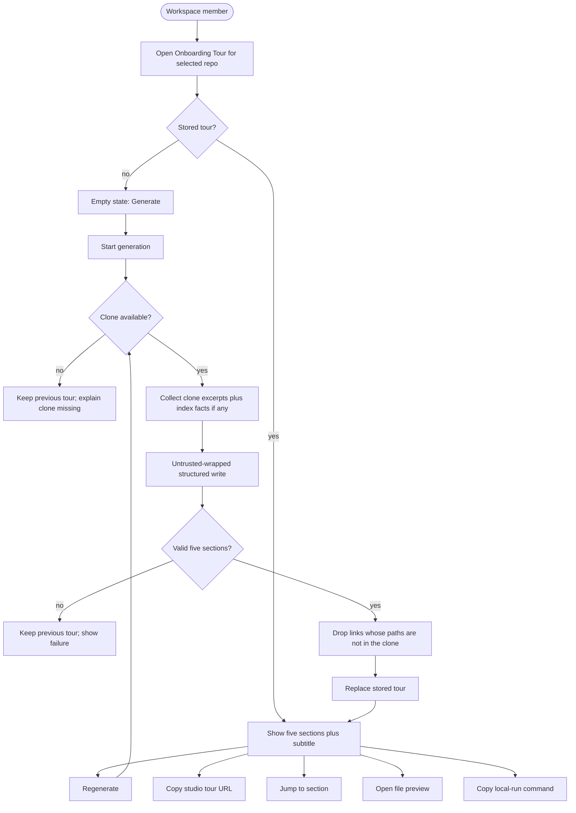
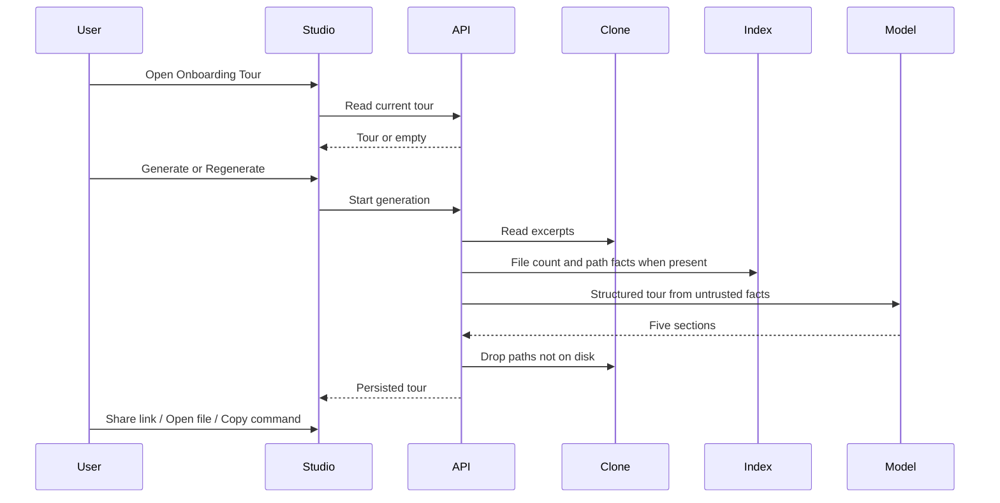

# Spec: Onboarding Generator
Spec ID: SPEC-02
Status: approved
Supersedes: none
Packages: client, server

## Problem and user

A developer who just selected an unfamiliar repository in the studio has no first-day map of that codebase. Repo-intel can already rank files and critical import chains, a feature-model slot named `onboarding` already exists in Settings, and a structured onboarding JSON shape already exists in the shared contracts — but there is no generate/read API, no persisted tour per repo, and no studio page that turns those facts into a readable tour.

Primary user: a workspace member looking at a selected repository. They need a **generated, regenerable** tour they can skim in one sitting: architecture, the files that actually matter, how to run locally, a reading order, and a few first tasks.

`/onboarding` today is the **add-repository** form. That route stays. The tour is a different, repo-scoped screen.

## Goals / Non-goals

### Goals

- From a selected repository, **generate** a five-part onboarding tour grounded in that repo’s clone and (when present) its index facts — never invented paths or scripts.
- Persist **one** current tour per repository and show it on an **Onboarding Tour** workspace page.
- Let the user **regenerate** the tour (replace the stored one) and see when it was last generated and how large the index was.
- Let the user **copy a shareable studio URL** for the tour page (same access rules as the rest of the studio).
- Render architecture **mermaid** when the model produced a valid diagram; list **critical-path files** with Open; show **local-run commands** with copy; show a **numbered reading path**; show **first-task cards** with complexity.

### Non-goals

- Replacing or merging with the add-repository screen at `/onboarding`.
- Public, unauthenticated tour URLs or share tokens (no anonymous internet sharing).
- Writing the tour markdown into the git clone / repo folder (Settings copy that mentions “tours are written to the repo folder” is out of scope here).
- In-app editing of generated prose (no WYSIWYG, no section-by-section regenerate).
- New MCP tools.
- Using the tour as review-prompt context (that is Project Context / skills).
- Generating tours for repositories the workspace cannot access.
- Auto-generate on repo import (user starts generation from the tour page).
- Multi-language tours (studio copy and generated text are English).

## Clarifications

- Q: What are the five parts? A: Architecture overview, critical paths, local launch, recommended reading order, first tasks — matching the product brief and the Onboarding Tour mockups (not the stale i18n line that lists “conventions & gotchas”).
- Q: Public share link? A: No. Share copies the current studio tour URL. Recipients still need studio access.
- Q: Approve and run the rest of the SDD pipeline in this session? A: Yes — the user asked to take the feature through the full SDD chain.
- Unresolved: none

## User stories

- As a workspace member, I want an Onboarding Tour for the selected repo, so I can orient without reading the whole tree.
- As a workspace member, I want to generate the tour when none exists, so I am not looking at an empty shell.
- As a workspace member, I want to regenerate after the repo has changed, so the tour is not stale.
- As a workspace member, I want architecture text plus a simple diagram, so I see how the pieces connect.
- As a workspace member, I want the critical files listed with a short why and Open, so I can jump to those files.
- As a workspace member, I want numbered local-run commands I can copy, so I can boot the project.
- As a workspace member, I want a numbered reading path, so I know which files to read first and why.
- As a workspace member, I want a few first tasks with complexity, so I have a low-friction first contribution.
- As a workspace member, I want to copy the page link, so I can send a teammate to the same tour in the studio.

## Acceptance criteria (EARS)

- AC-01: КОЛИ a workspace member opens Onboarding Tour for a selected repository, the system shall show that repository’s onboarding tour page (not the add-repository form).
- AC-02: КОЛИ no tour has been stored for that repository, the system shall show an empty state that lets the user start generation, and shall not invent sections.
- AC-03: КОЛИ the user starts generation (or regeneration) for a repository whose clone is available, the system shall produce exactly five sections in this order, with kinds `architecture`, `critical_paths`, `local_setup`, `reading_path`, `first_tasks`, and shall persist that tour as the repository’s current tour.
- AC-04: КОЛИ a stored tour exists, the system shall show the title **Onboarding for {repo-name}**, a subtitle that includes the index file count used for that generation and a relative last-generated time, and actions **Regenerate** and **Share link**.
- AC-05: КОЛИ a stored tour exists, the system shall provide in-page navigation to the five sections (Architecture overview, Critical paths, How to run locally, Guided reading path, First tasks) and shall render each section’s title and markdown body.
- AC-06: КОЛИ the `architecture` section includes a mermaid diagram string that the studio can parse, the system shall render that diagram in the Architecture overview block.
- AC-07: ЯКЩО the `architecture` diagram string is missing, empty, or not valid mermaid, ТОДІ the system shall still show the architecture body and shall not render a broken diagram placeholder.
- AC-08: КОЛИ the `critical_paths` section has file links, the system shall list each as a repo-relative path, a short description, and an **Open** control.
- AC-09: КОЛИ the user activates **Open** on a tour file link whose path is readable in the repository clone, the system shall show a read-only preview of that file’s current text.
- AC-10: КОЛИ the `local_setup` section has one or more commands, the system shall show them in order, each with a copy-to-clipboard control.
- AC-11: КОЛИ the `reading_path` section has file links, the system shall show them as a numbered list of repo-relative paths with a short reason for each.
- AC-12: КОЛИ the `first_tasks` section has tasks, the system shall show each as a card with a title, an optional related path, and a complexity badge `Low` | `Medium` | `High`.
- AC-13: КОЛИ generation succeeds, the system shall replace any previously stored tour for that repository (one current tour per repo).
- AC-14: КОЛИ generation is in progress, the system shall show a generating/regenerating state and shall not leave the user with a second competing tour.
- AC-15: КОЛИ the user activates **Share link**, the system shall copy the studio URL of the current repository’s Onboarding Tour page to the clipboard and shall not create a public unauthenticated URL.
- AC-16: КОЛИ generation runs, the system shall ground the tour in that repository’s clone (and index facts when the index is available), wrap those inputs as untrusted data, and shall not treat clone or index text as instructions.
- AC-17: ЯКЩО a generated file path is not present in the clone, ТОДІ the system shall omit that path from the stored tour and shall not persist invented paths.
- AC-18: ЯКЩО the clone is not available, ТОДІ the system shall refuse generation, shall keep any previously stored tour, and shall explain that the clone is required.
- AC-19: ЯКЩО generation fails (model error, timeout, or invalid structured result), ТОДІ the system shall keep any previously stored tour, shall not persist a partial tour, and shall show that generation failed.
- AC-20: ЯКЩО the caller is not a member of the repository’s workspace, ТОДІ the system shall reject tour read and generate requests without returning tour bodies.
- AC-21: The system shall use the existing Settings feature-model slot `onboarding` for the model that writes the tour.
- AC-22: The system shall not add a new MCP tool for this feature.
- AC-23: ДЕ the repository index reports a file count, the system shall use that count in the “Generated from index of N files” subtitle; ДЕ the index is empty or unavailable, the system shall still allow generation from the clone and shall show that the index count is 0 or unavailable rather than blocking.
- AC-24: ПОКИ a stored tour is shown, the system shall not highlight the add-repository `/onboarding` form as the Onboarding Tour nav item; only the repo-scoped tour page is the active Onboarding Tour destination.
- AC-25: КОЛИ a listed Open path is missing or unreadable in the clone, the system shall show that the file is unavailable and shall not fail the tour page.
- AC-26: The system shall rate-limit generation attempts per repository so a client cannot start unbounded concurrent generations (same family as other LLM extract actions: a small per-minute cap).

## Edge cases

- Add-repository `/onboarding` and repo tour `/repos/{repoId}/onboarding` are different pages; a path that merely contains the word `onboarding` must not send the user to the wrong one.
- Regenerating while a previous tour is on screen: on success the new tour replaces it; on failure the previous tour remains.
- Empty `links` / `commands` / tasks for a section: show the section body (or an empty in-section state), not a page-level error.
- Invalid mermaid in any section other than architecture: do not render it (diagrams are only required to display for architecture when valid).
- Extremely large file opened from **Open**: preview the text; do not execute it.
- Prompt-injection text inside README or other clone excerpts: ignored as data (AC-16); generation still completes or fails for unrelated reasons.
- Repo renamed in the studio: title uses the current repo name; stored sections are not rewritten until regenerate.
- Index finishes after a tour was generated with count 0: subtitle stays at the count from **that** generation until regenerate.
- Clipboard APIs unavailable: Share link / copy command still attempt copy; if the environment cannot copy, show that copy failed (do not invent a download).
- Zero first tasks or zero critical-path links after invented-path dropping: section still present with body; do not drop the kind from the five.

## Workflows

## Service communication

- **Studio (web)** asks the **API** for the selected repo’s current tour and to start generation. The browser does not read the clone to build section prose.
- **API** reads excerpts and file existence from that repo’s **local git clone**, and index file-count / ranked-path facts from **repo-intel when available**. It calls the workspace’s **onboarding** feature-model. It stores one tour document per repository.
- **Studio** renders markdown, mermaid, lists, and task cards. File **Open** preview is served by the **API** from the clone (same trust boundary as other clone reads).
- **MCP** is unchanged.

## Contracts

Cover each channel that applies; write `N/A` for unused channels.
Shapes only — not ORM/SQL/Zod. Mark invented names `assumption:`.

### HTTP

Existing shared shape (fact): `Onboarding` = `{ sections: OnboardingSection[] }`, each section `{ kind, title, body, diagram?, links: [{ label, path }] }`.

`assumption:` additive fields required by the mockup, on the same document:

- `commands`: ordered shell command strings on `local_setup` (may be empty).
- `note`: short reason/description on a file link (critical paths and reading path).
- `complexity`: `low` | `medium` | `high` on a first-task item (task title may be `label` or a dedicated title).
- Envelope for the page: `{ sections, generated_at, files_indexed }` where `files_indexed` is the index count recorded at generation time (0 if none).

`assumption:` resources (names not served today):

- Read current tour for a repo (empty/null sections when none stored — not the same as repo not found).
- Generate/regenerate (POST), rate-limited, returns the new envelope or a generation failure.
- Read-only file preview for a repo-relative path on that clone (Open). Reject paths that escape the clone.

Unauthenticated or cross-workspace callers get the same rejection family as other repo routes.

### MCP

N/A — no new tool or payload field (AC-22).

### Events / status

- Read: success with a tour, or success with empty/not-generated (AC-02). Clone missing is not “empty success” for **generate** (AC-18).
- Generate in progress: studio pending state (AC-14).
- Generate failure: previous tour retained (AC-19).
- Do not reuse repo-intel `partial` / `degraded` as the tour document status. Index-unavailable is AC-23 (count 0 / unavailable in the subtitle), not a failed tour.

### Errors

- `assumption:` `not_found` — repo does not exist in the workspace.
- `assumption:` `forbidden` / unauthenticated — AC-20.
- `assumption:` `clone_unavailable` — AC-18 on generate.
- `assumption:` `generation_failed` — model/timeout/invalid structured output (AC-19).
- `assumption:` `invalid_path` — Open/preview path fails clone-boundary checks.
- Missing file on **Open**: file-unavailable outcome for that preview (AC-25), tour page stays up.

## Design & UX analysis

Designs analysed (chat attachments): Onboarding Tour — architecture + TOC; critical paths + local run + reading path; reading path + first tasks.

### Gaps vs design

- Mockup sidebar also shows Eval Dashboard, Memory, Multi-Agent Review, Agent Performance, CI Runs. Those items are **not** this feature. Only **Onboarding Tour** is added as a Workspace destination for the selected repo. Project Context remains whatever the current studio already ships.
- Mockup **Share link** looks like a first-class share action. This spec is clipboard copy of the studio URL, not a public token page (Clarifications).
- Mockup **Open** does not specify GitHub vs in-app. This spec uses in-app read-only preview from the clone (local-first).
- Stale studio i18n (`generate.body` lists “overview, architecture, key modules, getting started, and conventions & gotchas”) disagrees with the mockup and this spec. Canonical five parts are the kinds in AC-03.
- Existing `Onboarding` contract has no `commands`, `note`, or `complexity`. The UI needs them (or an equivalent structured place). Additive shared-contract fields are in scope as a high-risk dual-copy change.
- Add-repo `/onboarding` already steals the `onboarding-tour` nav key via a pathname substring. The tour page must be the nav target; the add-repo form must not stay highlighted as Onboarding Tour (AC-24).

### Uncovered corner cases

- No selected repo in the shell: Onboarding Tour cannot bind to a repo (same as other repo pages).
- Generate clicked twice quickly: rate limit + single in-flight pending state (AC-14, AC-26).
- Preview of a binary path: treat as unavailable text, not a download of arbitrary bytes into a markdown renderer.

### Cross-module interactions

- **Feature-model `onboarding`** already exists in Settings; this feature must **use that slot**, not add a parallel id.
- **Shared `Onboarding` / `OnboardingSection` / `OnboardingLink`**: reuse; extend additively if commands/note/complexity cannot be represented.
- **Repo-intel** supplies file count and may supply ranked/critical paths as **facts** to the writer. Index off or empty must not block clone-based generation (AC-23).
- **Add-repository** route stays at `/onboarding`.
- **Project Context** is a different page (browse/attach markdown). Do not merge catalogs.
- **`@devdigest/shared`**: likely additive fields on onboarding DTOs (high risk: two vendored copies).

### UX recommendations (non-binding)

- Collapsible section cards as in the mockup.
- Architecture diagram below the prose, not instead of it.
- Complexity colours: Low green, Medium orange, High red — only if those tokens already exist; otherwise reuse existing badge chrome.
- After successful first generate, scroll to Architecture overview.
- Copy/Share should confirm briefly (copied) without a modal.

## Non-functional requirements

- Generation is a **synchronous** studio action with an explicit pending state, in the same family as convention extraction (rate-limited; timeout-guarded). No background job is required for MVP.
- Rate limit: a small per-minute cap on generate per the conventions-extract family (AC-26). Do not invent a different SLA number here.
- Clone and index bytes are **untrusted**. They must go through the existing untrusted delimiter wrapper before the model. Closing-delimiter spoofing in file text must not break out of the wrapper.
- Mermaid rendering must not execute script from diagram text (existing strict mermaid security level).
- Markdown bodies are repo-model output: render as markdown, not as HTML with scripts.
- Tour read/generate and file preview require workspace membership (AC-20).
- Secrets remain out of git and out of the database; provider keys stay in the existing secrets store. Tour JSON must not persist API keys.
- Generated claims about scripts, env vars, and paths must come from provided facts; invented paths are dropped (AC-17).

## Inputs and provenance

| Input | Source / provenance | Trusted? |
| Clone excerpts (README, manifests, key files) | Local git clone of the selected repository | no |
| Index file count and ranked/critical paths | Repo-intel for that repo, when present | no (derived from clone) |
| Feature-model id `onboarding` | Workspace Settings / built-in default | yes (config) |
| Stored tour JSON | Server-built from the last successful generation | yes as audit record; section prose is still model output over untrusted facts |
| Share URL | Current studio location | yes |
| Open preview bytes | Clone at click time | no |

## Untrusted inputs

- All clone excerpts and index facts sent to the model: wrap as untrusted data; never execute; never treat as instructions (AC-16).
- Generated markdown, mermaid, commands, and paths: treat as untrusted display data; mermaid parse-before-render; commands are copied as text, not executed by the studio.
- Open/preview paths: must stay inside the clone (no `..` escape, no absolute paths outside the clone).
- Share action copies a studio path the user already has open; it does not mint a secret token.

## Constraints & risks

- No monorepo workspace; each package keeps its own install. Cross-package types go through path aliases.
- Do not silently change `@devdigest/shared` except for additive onboarding DTO fields required by AC-10/AC-11/AC-12; if required, edit **both** vendored copies identically (high risk).
- Reuse `Onboarding`, feature-model `onboarding`, and the existing mermaid renderer. Do not add a second tour JSON shape.
- The `onboarding` persistence row is repo-scoped today; access must still be authorized via the repository’s workspace (AC-20). Do not return another workspace’s tour.
- Secrets never in git or DB.
- reviewer-core stays filesystem-free; only the API reads the clone.
- Do not reuse convention candidates, Project Context attachments, or review-prompt slots to store the tour.

## Assumptions

- Five section kinds and on-page titles: `architecture` → Architecture overview; `critical_paths` → Critical paths; `local_setup` → How to run locally; `reading_path` → Guided reading path; `first_tasks` → First tasks. The existing writer prompt that mentions `routes_and_apis` must emit `critical_paths` for this product (prompt text is scaffolding, not a second product contract).
- One stored tour per repository; regenerate is a full replace.
- Share link = copy studio URL; no public token table.
- Open = in-app read-only preview from the clone, not a GitHub redirect.
- Local-run copy extracts `commands` (additive field) rather than scraping prose.
- First-task complexity is `low` | `medium` | `high` (UI: Low / Medium / High).
- Language of generated titles and bodies: English.
- Generation is user-triggered, not automatic on import.
- Index facts are optional input; clone is mandatory for generate.
- HTTP resource names above are invented (`assumption:`) except the existing `Onboarding` section shape.
- Existing add-repo i18n/nav key collision is in scope to fix (AC-24).
- MCP `list_agents` is irrelevant; no agent subset.

## Open questions

- Should a later spec write the generated tour into the clone as markdown (the Settings “tours are written to the repo folder” line), or is studio-only storage permanent?
- Should **Open** later deep-link to GitHub when the remote is known, in addition to in-app preview?
