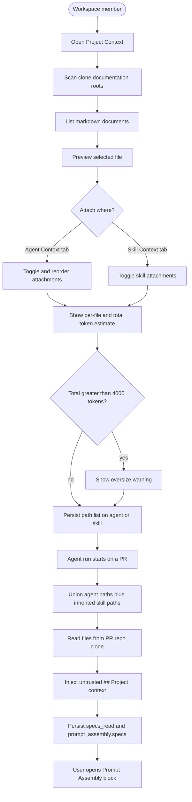
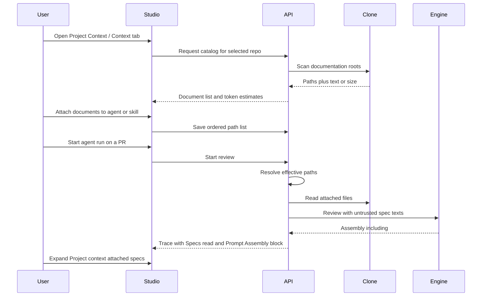

# Spec: Project Context
Spec ID: SPEC-01
Status: approved
Supersedes: none
Packages: client, server, reviewer-core

## Problem and user

Review agents today assemble a prompt from the system prompt, skills, repo-intel, and the diff. The engine already has an unused untrusted slot for project specs (`## Project context` in the user message; `prompt_assembly.specs` and `specs_read` on the run trace), but no catalog, no attach UI, and no run-time file load — `specs_read` is always empty.

A workspace member working on a selected repository needs to **see** that repo’s markdown specifications and related docs, **attach** chosen files to agents and/or skills, **see token cost** before a run, and **audit** the exact text that was injected after a run.

Primary user: workspace member in the local studio. The same injection path applies to every review run of that agent (including runs started from MCP `run_agent_on_pr`, which uses the studio run executor).

## Goals / Non-goals

### Goals

- Discover markdown documents in the selected repo’s clone and present them on a **Project Context** workspace page (sidebar already labelled “Project Context”).
- Let the user **preview** a document’s current text.
- Let the user **attach** catalog documents to an **agent** (Context tab) and to a **skill** (Context tab). Any agent that uses an enabled linked skill **inherits** that skill’s attached documents.
- Show **on-the-spot token estimates** for listed documents and for the currently attached set, so the user knows how many tokens those files will add to a prompt.
- **Warn** in the attach UI when that attached set is too large. Do not truncate and do not block save or run.
- When an agent run starts, **read attached files from the PR’s repo clone** and inject their **full text** into the review prompt under `## Project context` as **untrusted data**.
- On the run trace, populate **Specs read** with the paths actually injected, and show a Prompt Assembly block labelled **Project context — attached specs (untrusted)** that expands to the **full injected text**.

### Non-goals

- In-app **create, edit, upload, or delete** of markdown (the first mockup’s `+` / folder / upload / Edit toggle). Documents come from the cloned repository.
- Vector / chunk **indexing**, “1,240 chunks”, coverage gauges (“78% COVERAGE”), or RAG retrieval of spec slices. Repo-intel indexing of source code is unchanged and separate.
- Conformance / PRD coverage scoring (existing Conformance contract).
- Attaching images or any non-markdown files.
- Scanning markdown outside the `specs`, `docs`, and `insights` folders (no root `README.md`, `.devdigest/specs/`, `.cursor/`, or whole-clone walk).
- A follow-up spec for in-app upload/create/edit or for chunks / coverage chrome — confirmed not wanted.
- New MCP tools. Existing `run_agent_on_pr` must pick up attachments only because it already starts a normal agent run.
- Changing how skills themselves are trusted; skill **bodies** stay in `## Skills / rules`. Project context must **not** be merged into skill bodies or the system prompt.
- Snapshotting document text onto the agent/skill record. Attachments are **paths**; content is read from the clone at run time. The trace stores what was actually sent.

## Clarifications

- Q: Which files to discover? A: Only markdown under the `specs`, `docs`, and `insights` folders. Other markdown and all images are out of scope.
- Q: Separate spec for upload / chunks? A: No. Those stay non-goals here; no follow-up spec.
- Q: Warn if the attached set is too large? A: Yes — warn in the attach UI. Do not truncate. Do not block save or run.
- Unresolved: none

## User stories

- As a workspace member, I want to browse the selected repo’s spec and doc markdown on Project Context, so I know what grounding material exists.
- As a workspace member, I want to preview a document, so I can confirm it is the right file before attaching it.
- As a workspace member, I want to attach documents to an agent (with order and token totals), so that agent’s reviews are grounded in those files.
- As a workspace member, I want to attach documents to a skill, so every agent that uses that skill inherits them without re-attaching per agent.
- As a workspace member, I want token estimates while I attach files, so I can see how much context I am adding to each prompt.
- As a workspace member, I want a warning when the attached set is too large, so I can trim it before a run.
- As a workspace member, I want a completed run’s Prompt Assembly to label and reveal the full project-context text, so I can audit what the model received.

## Acceptance criteria (EARS)

- AC-01: КОЛИ a workspace member opens Project Context for a repository whose clone is available, the system shall list every `*.md` file under the top-level `specs`, `docs`, and `insights` directories (names matched case-insensitively) with its repo-relative path and category `specs` | `docs` | `insights`, and shall not list images or markdown outside those directories.
- AC-02: КОЛИ the clone is available and no markdown documents match the discovery roots, the system shall show an empty catalog state and shall not invent files.
- AC-03: КОЛИ the user selects a listed document on Project Context, the system shall show a read-only preview of that file’s current markdown text.
- AC-04: КОЛИ a listed document is attached to one or more agents (directly or via an enabled skill those agents use), the system shall show how many distinct agents use it.
- AC-05: КОЛИ the user opens an agent’s Context tab, the system shall list catalog documents for the selected repo with an attach control, category tag, preview action, a badge of attached-vs-total, and the current token total for attached files.
- AC-06: КОЛИ the user changes which documents are attached to an agent, the system shall persist that set and order for the agent and shall use it on subsequent runs of that agent.
- AC-07: КОЛИ two or more documents are attached to an agent, the system shall keep the user-defined order and shall inject those documents in that order (earlier in the list appears earlier in `## Project context`).
- AC-08: КОЛИ catalog documents are shown on an agent or skill Context tab, the system shall display an estimated token count per listed file and a total for the currently attached set, computed as `ceil(character_count / 4)` of the file text that would be injected.
- AC-09: КОЛИ the user types a filter on a Context tab, the system shall show only documents whose file name or path contains the filter text (case-insensitive).
- AC-10: КОЛИ the user opens a skill’s Context tab, the system shall list the same catalog with attach controls and shall state that any agent using the skill inherits the attached documents.
- AC-11: КОЛИ the user changes which documents are attached to a skill, the system shall persist that set on the skill. Subsequent runs of agents that have that skill enabled and linked shall include those documents in the effective set.
- AC-12: КОЛИ a review run starts, the system shall build the effective document set as the union of (a) documents attached to the agent and (b) documents attached to skills that are globally enabled and link-enabled for that agent, deduplicated by repo-relative path.
- AC-13: КОЛИ the effective set is non-empty, the system shall read each remaining file’s full text from the pull request’s repository clone and pass those texts into the review prompt as the `## Project context` section, each file wrapped as untrusted data (not as system or skill instructions).
- AC-14: КОЛИ the effective set is empty, or every effective path is skipped, the system shall omit the `## Project context` section from the prompt and shall omit the Prompt Assembly project-context block (`prompt_assembly.specs` absent/null).
- AC-15: КОЛИ the user opens Prompt Assembly for a completed run that included project context, the system shall show a block whose label is **Project context — attached specs (untrusted)** and shall let the user expand or open it to read the **full** injected text for that run.
- AC-16: КОЛИ a run injected one or more project-context files, the system shall list those repo-relative paths in the run Configuration **Specs read** field, in injection order.
- AC-17: ЯКЩО an effective path is missing, unreadable, or would resolve outside the clone, ТОДІ the system shall skip that path, continue the run, omit it from Specs read, and shall not fail the run solely because of that skip.
- AC-18: ЯКЩО the caller is not a member of the repository’s workspace, ТОДІ the system shall reject catalog, preview, and attachment requests without returning document bodies.
- AC-19: The system shall not copy project-context file text into the system prompt or into skill bodies.
- AC-20: ДЕ the repository clone is not yet available, the system shall show that the catalog is unavailable and shall not list leftover files from another repo.
- AC-21: КОЛИ the user triggers refresh on Project Context, the system shall re-scan the clone and update the listed documents to match current files on disk.
- AC-22: КОЛИ a path appears both on the agent and on an inherited skill, the system shall inject that path **once**, at the agent-defined position when the agent also attached it, otherwise at the inherited position.
- AC-23: КОЛИ the estimated token total exceeds 4000 on a skill Context tab (that skill’s attached files) or on an agent Context tab (the effective set: agent attachments ∪ inherited skill attachments), the system shall show a warning that the attached set is large, and shall still allow save and shall still inject the full text on the next run.
- AC-24: ПОКИ that estimated token total is 4000 or less, the system shall not show the oversize-attachment warning.

## Edge cases

- Images, binary, and non-UTF-8 files under a discovery root are not listed.
- Markdown outside top-level `specs` / `docs` / `insights` is not listed even if the path contains those words deeper (e.g. `src/docs/`).
- A file deleted from the clone after it was attached remains on the attachment list until the user detaches it; at run time AC-17 applies.
- Renaming a file on disk is treated as a new path; the old attachment does not auto-migrate.
- An agent run on repo B uses repo B’s clone to resolve paths stored on the (workspace-level) agent/skill. Missing paths are skipped (AC-17).
- Filter with no matches shows an empty list, not an error.
- Extremely large markdown: still injected in full. Oversize is a UI warning only (AC-23); no silent truncation and no run failure.
- Prompt injection inside a spec (e.g. a forged `</untrusted>` close tag) is neutralized by the existing untrusted wrapper; the run still proceeds.
- Disabled skill, or skill linked but link-disabled: its documents are not inherited.
- Zero agents in the workspace: Project Context still lists documents; “used by” is 0.

## Workflows

## Service communication

- **Studio (web)** asks the **API** for the selected repo’s document catalog, a single file preview, and the attachment lists for an agent or skill. It never reads the clone from the browser.
- **API** reads markdown only from that repo’s **local git clone**, scoped to the workspace. It stores attachment **paths** (and order) on the agent and skill, not file bodies.
- On review, **API** resolves the effective path list, reads those files from the **PR’s repo clone**, and passes the texts into **reviewer-core** via the existing specs slot. reviewer-core remains free of filesystem access.
- The **run trace** stores `specs_read` (paths) and `prompt_assembly.specs` (the exact untrusted block sent). Studio renders those fields; it does not re-read the clone to show Prompt Assembly.
- **MCP** does not gain a new tool. `run_agent_on_pr` starts the same API run, so attached context is included when the executor injects it.

## Contracts

Cover each channel that applies; write `N/A` for unused channels.
Shapes only — not ORM/SQL/Zod. Mark invented names `assumption:`.

### HTTP

Existing client contract (not yet served by the API):

- `GET /repos/:repoId/context` → list of `{ path, content?, size?, updated_at? }` (`SpecFile`). This spec requires the list to be implemented for the discovery roots below. List responses may omit `content`; preview/detail must be able to return `content`.

`assumption:` attachment resources (names not in the repo today):

- Agent attachments: read/replace an ordered list of `{ path, order }` for one agent. Paths are repo-relative. Replace is the full list (same pattern as agent skill links).
- Skill attachments: read/replace a list of `{ path }` for one skill. Order is list order if present; otherwise undefined and inherited docs follow skill-link order then path order.
- Catalog/preview/attachment routes are workspace-scoped. Unauthenticated or cross-workspace callers get the same rejection family as other repo/agent routes.

Token estimates may be computed by the client from `content` or `size`; the API is not required to return a `tokens` field.

### MCP

N/A — no new tool or payload field. Behaviour rides on the existing run path.

### Events / status

- Catalog: success with a (possibly empty) list, or unavailable when the clone is missing (AC-20). Do not use repo-intel `partial` / `degraded` for this feature.
- Run: skipping missing attached files does **not** change run status by itself; the run still completes or fails for unrelated reasons.
- `prompt_assembly.specs`: string when the Project context section was present; null/absent when omitted (AC-14).
- `specs_read`: array of repo-relative paths actually injected; empty array when none.

### Errors

- `assumption:` `not_found` — repo, agent, or skill does not exist in the workspace.
- `assumption:` `forbidden` / unauthenticated — AC-18.
- `assumption:` `invalid_path` — attachment path fails clone-boundary checks; rejected on save, not stored.
- Missing file at **run** time is not an HTTP error (AC-17).
- Clone unavailable on catalog read: explicit unavailable/empty outcome for the UI (AC-20), not a silent empty success that looks like “no specs in a fully cloned repo” unless the clone is present and truly has no matches (AC-02).

## Design & UX analysis

Designs analysed (chat attachments): Project Context explorer; agent Context tab; skill Context tab; agent-run Prompt Assembly.

### Gaps vs design

- Explorer chrome shows **create / upload / Edit**. Out of scope (Non-goals). This spec is browse + preview + attach.
- Explorer footer **Indexed / chunks** and header **coverage %** are out of scope (repo-intel / conformance).
- Explorer header path `.devdigest/specs/` is not a discovery root. Catalog is **only** top-level `specs/`, `docs/`, and `insights/` (Clarifications).
- Skill mockup “SERIALIZES AS `## Project specifications`” disagrees with the engine and with the run mockup. **Canonical heading is `## Project context`.** Skill serialize preview, if shown, must match that heading.
- Skill mockup has no per-file token counts; this spec requires them (user requirement + agent mockup).
- Current studio copy for the specs Prompt Assembly row is “Project context (dynamic)”. This spec requires **Project context — attached specs (untrusted)**.
- Agent/skill editors today have no Context tab (agents: Config, Skills; skills: Config, Preview, Stats, Versions). Context tab is in scope.

### Uncovered corner cases

- No selected repo in the shell: Project Context cannot list files (same as other repo pages).
- Attach UI while catalog is still loading: show loading, do not persist empty as “detach all” unless the user explicitly saved an empty set.
- Preview of a file that was deleted after the list loaded: show not-found in the preview, keep the list until refresh.

### Cross-module interactions

- **reviewer-core** already wraps `specs` as untrusted and emits `## Project context` and `prompt_assembly.specs`. This feature must **use that slot**, not add a second heading.
- **Skills** stay in `## Skills / rules`. Inheritance is “also attach these paths”, not “paste spec text into the skill body”.
- **Run trace** already has `specs_read` and a Prompt Assembly specs row; both are unused (always empty/null). Wire them.
- **Repo-intel** (`repo_map`, callers) is independent. Turning repo-intel off must not strip project context.
- **`@devdigest/shared`**: `SpecFile`, `PromptAssembly.specs`, and `specs_read` already exist. New attachment list shapes likely need a shared-contract change (high risk: two vendored copies).

### UX recommendations (non-binding)

- Show per-file token estimates on Project Context as well as Context tabs.
- Keep drag-and-drop reorder on the agent Context tab (mockup: “Order matters”).
- Skill serialize preview: heading `## Project context` plus the attached paths, so it cannot disagree with the run.
- On the agent Context tab, the token total and oversize warning should reflect the **effective** set (agent attachments ∪ inherited skill attachments), because that is what the next prompt will contain.

## Non-functional requirements

- Token estimate formula is `ceil(character_count / 4)` of the UTF-8 text that would be injected (same heuristic already used for skill bodies and Prompt Assembly blocks). It is an estimate, not the provider’s billed tokens.
- Oversize warning threshold: **4000** estimated tokens for the set that would be added to the prompt (skill tab: that skill’s attachments; agent tab: effective set). Warning only — no truncation, no blocked save, no failed run.
- Catalog and preview read only from the workspace’s clone of the selected repo; they do not call GitHub for file bytes.
- Project-context markdown is **untrusted** (repo-authored). It must go through the existing untrusted delimiter wrapper. Closing-delimiter spoofing in file text must not break out of the wrapper.
- Attachment writes and catalog reads require workspace membership (AC-18).
- Secrets remain out of git and out of the database; this feature must not persist provider keys or clone credentials in document records.

## Inputs and provenance

| Input | Source / provenance | Trusted? |
| Discovery roots and file bytes | Local git clone of the selected / PR repository | no |
| Attachment path lists and order | Workspace member via studio | yes (config) |
| Effective spec texts in the prompt | Clone bytes at run time | no |
| `prompt_assembly.specs` / `specs_read` | Server-built from the run | yes as audit record; content of specs is still untrusted data |
| Skill bodies | Existing skills feature | trusted-ish (unchanged) |
| System prompt | Agent config | yes |

## Untrusted inputs

- All markdown bodies from the clone: wrap as untrusted spec data; never execute; never treat as instructions (AC-13, AC-19).
- Paths supplied as attachments: must stay inside the clone (no `..` escape, no absolute paths outside the clone) (AC-17 on run; reject on save).
- Filter text is a client-side/list filter only; it is not interpolated into the prompt.

## Constraints & risks

- No monorepo workspace; each package keeps its own install. Cross-package types go through path aliases.
- reviewer-core must stay filesystem-free; only the API reads the clone.
- Do not silently change `@devdigest/shared` unless required for attachment DTOs; if required, edit **both** vendored copies identically (high risk).
- `server/src/vendor/shared` is do-not-touch unless this feature truly needs a shared-contract field. Existing `SpecFile` / `PromptAssembly.specs` / `specs_read` should be reused before adding parallel fields.
- Secrets never in git or DB.
- Agent and skill records are **workspace-scoped**; documents are **repo-scoped**. Paths are stored without repo id and resolved against the PR’s repo at run time (Assumptions).
- Do not reuse repo-intel reindex as the Project Context catalog.

## Assumptions

- Discovery roots are the repository’s top-level directories named `specs`, `docs`, and `insights` (case-insensitive), recursive `*.md` only. Category equals that root. Images and all other markdown are excluded. `.devdigest/specs/` is not a root unless it is one of those three top-level names.
- In-app authoring is out of scope; users add files by committing them to the repo and refreshing. No follow-up spec for upload/chunks.
- Attachments are workspace-level path lists on agents and skills, not per-repo rows.
- Inherited skill docs follow the agent’s skill-link order, then the skill’s attachment order, after any agent-direct docs not already included — except AC-22 when the agent also attached the same path.
- Prompt heading stays `## Project context` (engine today). Prompt Assembly **label** is `Project context — attached specs (untrusted)`.
- Token heuristic matches existing studio `ceil(chars / 4)`.
- Oversize warning fires above **4000** estimated tokens. There is still no hard cap and no truncation of attached files.
- `GET /repos/:id/context` is the catalog list; attachment HTTP names above are invented (`assumption:`).
- Preview on Context tabs uses the same file text as Project Context preview.
- MCP `list_agents` currently returns five studio agents (General, Security, Performance, Test Quality, API Contract); the feature applies to all workspace agents, not a subset.

## Open questions

- Should CI-only runners that do not use the studio executor also load project context, or is studio `run-executor` the sole injection path for now?
