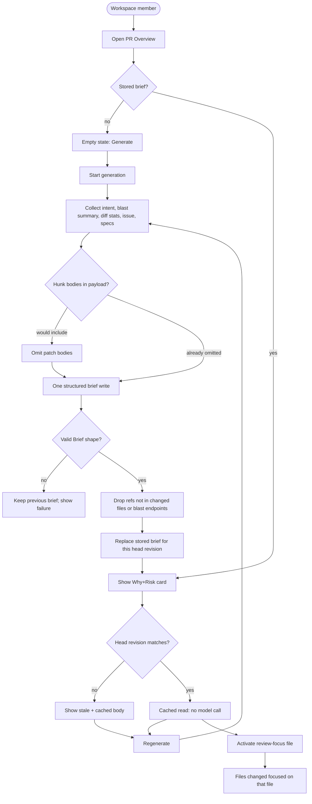

# Spec: Why + Risk Brief
Spec ID: SPEC-03
Status: approved
Supersedes: none
Packages: client, server

## Problem and user

A reviewer opening a pull request on Overview can already see **Intent** (L03: why the PR exists, in/out of scope) and **Blast Radius** (L04: symbols, callers, endpoints). Those cards do not answer the next question: *how risky is this change, what actually moved, and which files should I read first?*

There is no generated, regenerable Why+Risk Brief. Settings already has a feature-model slot `risk_brief`, and a per-PR `pr_brief` persistence row exists unused. The composed scaffolding document `{ intent, blast, risks, history }` is **not** this product.

Primary user: a **workspace member** reviewing a PR in the studio. They need one Overview card that states **what** changed and **why** (without restating the PR title), a colour-coded overall **risk level**, concrete **risks** grounded in real files or endpoints, and a **review focus** list that jumps into Files changed.

## Goals / Non-goals

### Goals

- On the PR **Overview** tab, show one **Why+Risk Brief** card: overall `risk_level` (`high` | `medium` | `low`) highlighted in colour; **What** and **Why**; a **Risks** list with links to real files (and endpoint labels from blast); **Review focus** — files to read first, each clickable into Files changed.
- `POST /pulls/:id/brief` collects **stored Intent (L03)**, **blast summary (L04)**, **diff stats** (paths and +/- counts), the **linked issue** when fetched, and **relevant specs** when actually read. It does **not** send diff hunk **bodies** to the model.
- One structured model call returns `Brief { what, why, risk_level, risks[], review_focus[] }`.
- `risks[]` and `review_focus[]` may cite only files or endpoints that appeared in those inputs. Invented paths are dropped, not stored.
- Persist the brief for that PR’s **current state** (head revision). Opening Overview shows the cached brief. A separate **Regenerate** control force-rebuilds it.
- Use the existing Settings feature-model slot `risk_brief` for the writer model.

### Non-goals

- Replacing or merging with the Intent card, Blast Radius card, Verdict / score banner, Description, or Smart Diff / Files changed grouping.
- Feeding Intent’s unused “risk chips” slot from this brief (risks live on the Why+Risk card).
- The mockup’s top **PR BRIEF** strip (verdict, finding counts, PR score, dollar cost) — that is review-summary chrome, not this feature.
- Injecting the Why+Risk Brief into reviewer prompts or run traces.
- New MCP tools.
- Sending full `+`/`-` hunk bodies (or whole patches) to the brief model.
- Auto-generate on Overview open, PR import, or Run Review.
- In-app editing of `what` / `why` / risks / focus (regenerate only).
- Public / unauthenticated brief URLs.
- Writing the brief into the git clone.
- A dedicated Overview tab or PR-header tab for this card.
- Browser e2e for this feature (same deferral as Intent / Blast).

## Clarifications

- Q: What does the Overview card show? A: Colour-coded overall risk level; What + Why (substance of the change, not a paraphrase of the PR title); concrete risks with real file/endpoint refs; Review focus as a clickable file list into Files changed; a Regenerate control.
- Q: What does generate send the model? A: L03 intent, L04 blast **summary** (plus endpoint/file names the blast record already lists), diff **stats** (paths and addition/deletion counts), linked issue when fetched, relevant specs when read. **No hunk bodies.**
- Q: How many model calls? A: One structured write for the brief. Intent is **collected**, not re-classified inside that write. If no stored intent exists, the system may derive Intent first (existing L03) and then run the single brief call.
- Q: Cache vs regenerate? A: Cached per PR + head revision. GET (or equivalent read) returns the stored brief. POST always rebuilds. Stale cache is shown until the user regenerates — no silent rebuild.
- Q: Where do Review focus clicks go? A: The PR **Files changed** tab, focused on that file (and line range when present) — not a GitHub blob.
- Unresolved: none

## User stories

- As a reviewer on Overview, I want a Why+Risk Brief for this PR, so I know what changed, why, and how risky it is before I read the diff.
- As a reviewer, I want the overall risk level colour-coded high / medium / low, so I can triage without reading the prose.
- As a reviewer, I want concrete risks tied to real files or endpoints, so I can judge whether the model is grounded.
- As a reviewer, I want a Review focus list of files, so I know what to read first.
- As a reviewer, I want each Review focus file to open Files changed at that file, so I do not hunt the diff.
- As a reviewer, I want the brief cached for this PR revision, so reopening Overview does not spend another model call.
- As a reviewer, I want to regenerate the brief, so I can rebuild after the PR or its inputs have moved.

## Acceptance criteria (EARS)

- AC-01: КОЛИ a workspace member opens Overview for a pull that has a stored Why+Risk Brief, the system shall show that brief on Overview as one card containing overall risk level, What, Why, Risks, and Review focus.
- AC-02: КОЛИ no Why+Risk Brief has been stored for that pull, the system shall show an empty state that lets the user start generation, and shall not invent What, Why, risks, or review-focus files.
- AC-03: КОЛИ a stored brief is shown, the system shall display overall `risk_level` as exactly one of `high`, `medium`, or `low`, visually distinct by colour for each value.
- AC-04: КОЛИ a stored brief is shown, the system shall show a **What** statement of what the pull changes and a **Why** statement of why it exists, and shall not use the pull title alone as either statement.
- AC-05: КОЛИ a stored brief has risks, the system shall list each risk with a title and at least one citation that is a real changed-file path or a blast endpoint from generate inputs.
- AC-06: КОЛИ a stored brief has review-focus items, the system shall list each as a file path (with an optional line range and a short reason) and shall show a count of those items.
- AC-07: КОЛИ the user activates a review-focus file that is among the pull’s changed files, the system shall switch to the Files changed tab and focus that file (and the cited line range when present).
- AC-08: КОЛИ the user activates a risk citation whose path is among the pull’s changed files, the system shall switch to the Files changed tab and focus that file (and the cited line range when present).
- AC-09: КОЛИ the user starts generation or regeneration for a pull, the system shall run **one** structured model write that returns `{ what, why, risk_level, risks, review_focus }` and shall persist that document as the pull’s current Why+Risk Brief for the pull’s head revision.
- AC-10: КОЛИ generation runs, the system shall include in the model payload: stored Intent (L03) when present, the L04 blast summary and the endpoint/file names already listed on that blast record, diff stats (changed paths and addition/deletion counts), the linked issue when it was fetched, and relevant spec text when it was actually read.
- AC-11: КОЛИ generation runs, the system shall not include diff hunk bodies (no `+`/`-` patch lines) in the model payload.
- AC-12: КОЛИ a stored brief exists for the pull’s current head revision, the system shall return that cached brief on read and shall not call the brief model.
- AC-13: КОЛИ the user activates **Regenerate**, the system shall rebuild the brief (new model write) and replace the stored brief on success.
- AC-14: КОЛИ the pull’s head revision differs from the revision the stored brief was generated for, the system shall still show the stored brief, shall mark it stale, and shall not rebuild until the user regenerates.
- AC-15: КОЛИ generation succeeds, the system shall drop any risk citation or review-focus path that is not a changed-file path from the pull or an endpoint string from the blast inputs, and shall not persist those invented refs.
- AC-16: КОЛИ generation is in progress, the system shall show a generating/regenerating state and shall not present two competing briefs.
- AC-17: ЯКЩО generation fails (model error, timeout, or invalid structured result), ТОДІ the system shall keep any previously stored brief, shall not persist a partial brief, and shall show that generation failed.
- AC-18: ЯКЩО the caller is not a member of the pull’s workspace, ТОДІ the system shall reject brief read and generate requests without returning brief bodies.
- AC-19: ЯКЩО no stored Intent exists when generate is requested, ТОДІ the system shall derive Intent with the existing L03 path first, then run the single brief write; ЯКЩО that Intent derive fails, ТОДІ the system shall fail generation, keep any previous brief, and shall not invent intent text inside the brief writer.
- AC-20: ДЕ blast status is `partial` or `degraded`, the system shall still allow generation using the blast summary and names that record already contains, and shall not treat incomplete blast as a hard generate failure.
- AC-21: ДЕ no linked issue was fetched or no spec text was read, the system shall still generate from the remaining inputs and shall not invent issue or spec content.
- AC-22: The system shall use the existing Settings feature-model slot `risk_brief` for the model that writes the brief.
- AC-23: The system shall not add a new MCP tool for this feature.
- AC-24: The system shall rate-limit brief generation per pull so a client cannot start unbounded concurrent generations (same family as other LLM extract actions: a small per-minute cap).
- AC-25: КОЛИ generation runs, the system shall wrap Intent, blast text, diff stats, issue, and spec excerpts as untrusted data, and shall not treat those inputs as instructions.
- AC-26: КОЛИ a review-focus path is not among the pull’s changed files (after drop, or the file left the diff), the system shall show that item as non-navigating text and shall not fail the Overview card.
- AC-27: ПОКИ a stored brief is shown, the system shall keep Intent and Blast as separate Overview cards and shall not hide them or move their contents into the Why+Risk card.

## Edge cases

- Empty `risks[]` or empty `review_focus[]` after invented-ref dropping: still a valid stored brief; show in-section empty, not a page-level error.
- Review focus cites a line range past the current file length: still open Files changed on that file; do not fail Overview.
- Endpoint-only risk citation (no file): show the endpoint label; do not pretend it is a Files changed path.
- Intent present but stale relative to head: still collect it as input; the user regenerates the brief after regenerating intent if they want both fresh.
- Blast empty (`ok` with zero symbols): generate anyway; do not invent endpoints.
- Linked issue 404 / timeout: omit issue text (AC-21); do not substitute a hallucinated ticket.
- Spec path that escapes the clone or is unreadable: skip that spec; continue.
- Generate clicked twice quickly: rate limit + single in-flight pending state (AC-16, AC-24).
- PR title equals a reasonable what/why: still invalid as the **only** content of those fields (AC-04); generation must produce distinct substance or fail (AC-17).
- Prompt-injection text in issue, spec, or intent: ignored as data (AC-25).
- Head revision changes while generate is in flight: persist against the revision used for **that** generate; if it no longer matches current head, the stored brief is immediately stale (AC-14).
- Files changed tab in Smart Diff vs original order: focus still finds the file by path.

## Workflows



```mermaid
sequenceDiagram
  participant User
  participant Studio
  participant API
  participant Intent as Intent L03
  participant Blast as Blast L04
  participant Model as risk_brief model
  User->>Studio: Open Overview
  Studio->>API: Read current Why+Risk Brief
  API-->>Studio: Cached brief or empty
  User->>Studio: Generate or Regenerate
  Studio->>API: POST brief
  API->>Intent: Load stored intent; derive if missing
  API->>Blast: Load blast summary and listed names
  API->>API: Diff stats, linked issue, readable specs
  API->>Model: One structured write untrusted facts, no hunk bodies
  Model-->>API: what, why, risk_level, risks, review_focus
  API->>API: Drop invented file or endpoint refs
  API-->>Studio: Persisted brief
  User->>Studio: Activate a review-focus file
  Studio->>Studio: Files changed tab focused on that file
```

## Service communication

- **Studio (web)** asks the **API** to read the pull’s current Why+Risk Brief and to generate/regenerate it. The browser does not call the model and does not assemble Intent or blast facts itself.
- **API** loads **Intent** (existing L03 persist/derive), **Blast** (existing L04 compute-on-read record — summary plus already-listed files/endpoints, not a second graph job), **diff stats** from the pull’s changed-file list, **linked issue** best-effort from GitHub when the pull references one, and **spec excerpts** only when those files are actually read. It calls the workspace’s **`risk_brief`** feature-model **once**. It stores one brief document per pull, keyed to the head revision used for that generate.
- **Studio** renders the card on Overview and, on review-focus / risk file activation, switches to Files changed focused on that path.
- **MCP** is unchanged.

## Contracts

Cover each channel that applies; write `N/A` for unused channels.
Shapes only — not ORM/SQL/Zod. Mark invented names `assumption:`.

### HTTP

`assumption:` resources (Intent-like; names not served today as this product):

- Read current Why+Risk Brief for a pull — empty/not-found when none stored (not the same as pull not found). Include `stale` when the stored head revision ≠ current pull head.
- Generate/regenerate: `POST /pulls/:id/brief` (rate-limited). Always rebuilds. Returns the new brief or a generation failure. Does not accept hunk bodies from the client; the server collects inputs.

`assumption:` stored/returned document (`Brief`):

- `what`: string — what the pull changes (not the title alone).
- `why`: string — why the pull exists (not the title alone).
- `risk_level`: `high` | `medium` | `low`.
- `risks[]`: each `{ title, explanation?, severity?: high|medium|low, file_refs[] }` where each `file_refs` entry is a changed-file path (optional `:line` or `:start-end`) or a blast endpoint string from inputs.
- `review_focus[]`: each `{ path, line_start?, line_end?, reason }` — `path` is a changed-file path from the pull.
- Envelope extras: `pr_id`, `generated_for_sha` (or equivalent head revision), `stale`.

The existing composed scaffolding shape `{ intent, blast, risks, history }` is **not** this document. Additive shared-contract change is in scope and high-risk (both vendor copies).

Unauthenticated or cross-workspace callers get the same rejection family as other pull routes.

### MCP

N/A — no new tool or payload field (AC-23).

### Events / status

- Read: success with a brief, or success/empty when never generated (AC-02).
- Generate in progress: studio pending state (AC-16).
- Generate failure: previous brief retained (AC-17).
- `stale: true` when head revision moved (AC-14) — not a generate failure.
- Do not reuse blast `partial` / `degraded` as the brief document status (AC-20).

### Errors

- `assumption:` `not_found` — pull does not exist in the workspace.
- `assumption:` `forbidden` / unauthenticated — AC-18.
- `assumption:` `generation_failed` — model/timeout/invalid structured output, or L03 intent derive failed when it was required (AC-17, AC-19).
- `assumption:` `rate_limited` — AC-24.

## Design & UX analysis

Designs analysed (chat attachments): PR Overview (Intent, Risk areas, Blast, Review focus, top PR BRIEF banner); Risk areas list close-up; Files changed (Smart Diff groups).

### Gaps vs design

- Mockup splits **Risk areas** (under Intent) and **Review focus** (full-width bottom) plus a top **PR BRIEF** verdict/score banner. Product is **one** Why+Risk card on Overview that owns What, Why, overall risk level, Risks, and Review focus. The verdict/score banner is **out of scope**.
- Mockup Risk areas sit inside/under Intent. Intent already has an unused optional chips slot for “L05 brief”. This spec does **not** populate that slot; risks render on the Why+Risk card (AC-05, AC-27).
- Mockup file links look like GitHub-style `path:line` (Blast today uses remote blob URLs). Product requires in-studio **Files changed** focus (AC-07, AC-08).
- Mockup Review focus is four bullets with reasons. Product allows zero or more after grounding drop; empty is an in-section state, not a failure.
- Blast plan reserved “full PR Brief card above Intent | Blast”. This card is that Overview slot: full-width above the existing two-column Intent | Blast row. Intent and Blast stay.

### Uncovered corner cases

- No `prId` resolved yet: do not fetch or invent a brief (same as Intent/Blast).
- Files changed in “original” order vs Smart Diff: path identity still finds the file.
- Colour tokens: reuse existing severity / warn / ok chrome if present; do not invent a fourth risk scale.

### Cross-module interactions

- **Feature-model `risk_brief`** already exists in Settings; this feature must **use that slot**, not add a parallel id.
- **Intent (L03)** is an input. Do not duplicate in-scope / out-of-scope lists on the Why+Risk card.
- **Blast (L04)** is an input (summary + listed names). Do not redraw the blast tree inside this card.
- **Project Context (SPEC-01)** may supply relevant spec files when they are actually read; this feature does not browse or attach the catalog.
- **Smart Diff / Files changed** is the navigation target for focus/risk file citations.
- **`@devdigest/shared`**: the stored Brief shape does not match composed `PrBrief`; changing vendor contracts is high risk (two copies). Existing `RiskSeverity` `high|medium|low` matches overall `risk_level`.
- **MCP** blast stub is irrelevant; no brief tool.

### UX recommendations (non-binding)

- Place the card full-width above Intent | Blast so risk level is visible without scrolling past Description.
- Risk level as a prominent badge: high = existing critical/red, medium = warn/yellow, low = muted or ok — only if those tokens already exist.
- What then Why as two short labelled blocks; do not quote the PR title.
- Risks as expandable rows (mockup chevrons) with file/endpoint citations as monospace links.
- Review focus as an ordered list; path is the link, reason is the rest of the line.
- Regenerate as a ghost/icon refresh control on the card header (same family as Intent re-run), not a primary page button.
- Stale: a small badge next to the title, keep the body readable.
- After first successful generate, keep scroll position (do not jump to Files changed).

## Non-functional requirements

- Generation is a **synchronous** studio action with an explicit pending state, in the same family as Intent derive (rate-limited; timeout-guarded). No background job is required for MVP.
- Rate limit: a small per-minute cap on generate per pull (AC-24). Do not invent a different SLA number here.
- Intent, blast, issue, spec, and diff-stat text are **untrusted**. They must go through the existing untrusted delimiter wrapper before the model.
- Brief read/generate require workspace membership (AC-18).
- Secrets remain out of git and out of the database; provider keys stay in the existing secrets store. The stored brief must not persist API keys.
- Model payload must not contain hunk bodies (AC-11). Logs must not include API keys or full patch text.

## Inputs and provenance

| Input | Source / provenance | Trusted? |
| Stored Intent (`intent`, `in_scope`, `out_of_scope`) | L03 persist for this pull; derived first if missing | no (model output over untrusted PR text) |
| Blast summary + listed files/endpoints | L04 blast record for this pull | no (derived from index/clone) |
| Diff stats (paths, additions, deletions, file count) | Pull changed-file list | no (GitHub/import) |
| Linked issue title/body | GitHub, only when fetched | no |
| Relevant spec excerpts | Clone / Project Context catalog, only when actually read | no |
| Feature-model id `risk_brief` | Workspace Settings / built-in default | yes (config) |
| Head revision | Pull `head_sha` at generate time | yes (identity) |
| Stored brief JSON | Server-built from the last successful generate | yes as audit record; prose is still model output |

## Untrusted inputs

- Intent, blast summary, diff stats, issue, and spec excerpts sent to the model: wrap as untrusted data; never execute; never treat as instructions (AC-25).
- Generated `what`, `why`, risk titles, and reasons: treat as untrusted display text (markdown-safe / plain), not as HTML with scripts.
- File paths and endpoints from the model: allow-list against generate inputs before persist (AC-15).
- Review-focus navigation stays inside the studio PR page (Files changed); it does not fetch arbitrary URLs.

## Constraints & risks

- No monorepo workspace; each package keeps its own install. Cross-package types go through path aliases.
- Do not silently change `@devdigest/shared` except for the Brief transport/persist shape required by this spec; if required, edit **both** vendored copies identically (high risk). Do not keep shipping the unused composed `{ intent, blast, risks, history }` as if it were this product.
- Reuse feature-model `risk_brief`, existing Intent and Blast HTTP behaviour, and the existing `pr_brief` per-pull row. Do not add a second brief table.
- Access must be authorized via the pull’s workspace (AC-18). Do not return another workspace’s brief.
- Secrets never in git or DB.
- reviewer-core stays filesystem-free; only the API reads clone/issue/spec text.
- Do not reuse convention candidates, onboarding tours, or review-prompt slots to store the brief.
- Do not send hunk bodies to the model even if Intent already sends hunk **headers** — this writer gets stats only.

## Assumptions

- HTTP: `GET` (or empty-success read) + `POST /pulls/:id/brief`. POST always regenerates; GET never writes.
- Cache identity: pull id + head revision (`head_sha`). One current brief per pull (replace on success).
- If Intent is missing, generate runs existing L03 derive first, then one brief write. Blast is compute-on-read and never a second LLM.
- “Relevant specs” = markdown actually read for this generate: a plan/spec already used by L03, and/or Project Context catalog files under `specs` / `docs` / `insights` that are cited by the pull/issue or attached for this repo. Never the whole catalog; never invented spec bodies. Truncation follows the same family as other LLM extract payloads.
- Diff stats include changed paths and +/- counts (and file count). Hunk headers are optional to omit; hunk **bodies are forbidden**.
- `review_focus[]` is files only (changed paths). Endpoints may appear on `risks[]` citations, not as review-focus rows.
- Overall `risk_level` is independent of per-risk `severity`; the card always shows the overall level after a successful generate.
- Studio copy and generated prose are English.
- Generate is user-triggered (empty-state Generate or header Regenerate), not automatic on import or Overview mount.
- Files changed focus uses the existing PR tab query (`tab=diff`) plus a file (and optional line) focus parameter — exact query names are implementation.
- Placement: full-width on Overview above the Intent | Blast row.
- No prompt injection of this brief into reviews in this spec.
- MCP `get_blast_radius` remaining a stub does not block this feature (API blast is the source).
- Default `risk_brief` model in Settings stays whatever the registry already ships until a human changes it (no silent default swap required here).

## Open questions

- none
