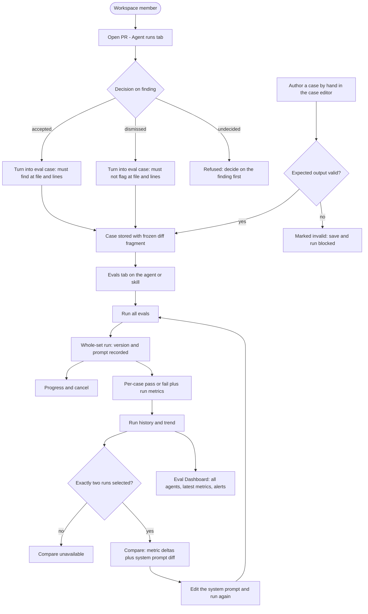
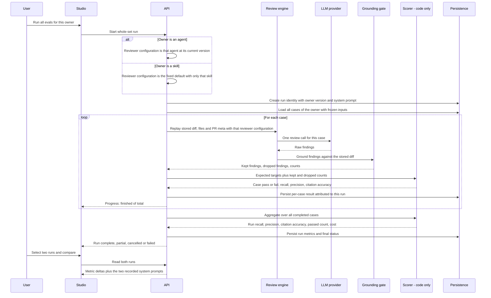

# Spec: Eval Pipeline
Spec ID: SPEC-04
Status: approved
Supersedes: none
Packages: client, server

## Problem and user

A workspace member authors reviewer agents and skills in Skills Lab, edits their system prompts, attaches skills, and bumps their version. Today there is **no way to know whether an edit made the agent better or worse**. The only feedback is the next real pull request, which is a different diff every time — so a prompt change and a diff change are indistinguishable.

Meanwhile the user has already produced a labelled dataset without noticing: every finding they **accepted** is a true positive the agent must keep producing, and every finding they **dismissed** is noise the agent must stop producing. That signal is stored on `findings` (`accepted_at` / `dismissed_at`) and is currently used only for display.

Primary user: a **workspace member tuning a reviewer agent (or a skill)**. They need a regression harness inside the product: turn their own accept/dismiss decisions into eval cases with one click, freeze the inputs so runs are comparable, run the whole set on demand, and see recall / precision / citation accuracy move when they change the prompt. The eval cases live in Postgres next to the findings they were born from — this is the **product plane**, not a repo-local test harness.

## Goals / Non-goals

### Goals

- **One-click case creation** from a real finding on the PR page: an **accepted** finding becomes a `must_find` expectation at that file and line range; a **dismissed** finding becomes a `must_not_flag` expectation. The finding's diff fragment is stored with the case.
- **Manual authoring** of cases through a case editor: name, frozen input (diff / files / PR meta), expected-output JSON with a validity indicator, "Run on save".
- **Frozen inputs** — a case replays exactly the diff, files and PR meta stored on it. Two runs of different agent versions therefore differ only by the agent, never by the input.
- **Whole-set runs** with a stable identity: running an owner's full set produces one comparable run record that knows which agent version and system prompt produced it, and to which every per-case result is attributable.
- **Code-only scoring** — no model call anywhere in the scorer. A finding matches an expectation when the file matches and the line ranges overlap. From that: `recall`, `precision`, `citation_accuracy`.
- **Evals tab in both editors** — the Agent editor and the Skill editor each show eval metrics, the case list with per-case status, and per-case run / edit / delete. A skill's set runs against a fixed default reviewer configuration carrying only that skill, so the numbers measure the skill itself and no agent has to be chosen.
- **Run history and two-run comparison** — pick two whole-set runs and see the metric deltas plus a diff of the two system prompts ("old prompt vs new prompt").
- **Eval Dashboard** — a sidebar page listing every reviewer agent with its latest metrics, recent whole-set runs across all agents, and a per-agent view with metric cards, deltas, a trend chart and the run history table.
- The user can perform the target experiment: run the set, change the system prompt, run again, watch the metrics move; then deliberately spoil the prompt and watch precision drop.

### Non-goals

- **No LLM judge anywhere in scoring.** Expectations are file + line range; matching is mechanical.
- **No CI gating or hard metric thresholds.** Trend and alerts first; blocking policy later.
- No change to how PR reviews are triggered, executed or stored — evals reuse the existing review engine, they do not fork it.
- No bulk auto-generation of cases from finding history. One click per finding, plus manual authoring.
- The repo-local `evals/` package skill eval, the `PreToolUse` hook in `.claude/settings.json`, and mutation testing — **specified separately in SPEC-05**.
- The **"Promote v7"** action shown in the compare modal (rolling an agent's config back to a winning version) — see Open questions.
- Scheduled / automatic eval runs (cron, on-agent-save, on-merge). Runs are user-triggered.
- Sharing, exporting or importing eval sets across workspaces.

## Clarifications

- Q: A whole-set run has no identity today (`eval_runs` is per case). A: Add a persistent grouping for "one run of the whole set" via an **additive** migration, so two whole-set runs can be compared side by side and plotted as one point per run. Behavioural requirement only: stable identity, recorded agent version / system prompt, per-case results attributable to it. The exact table/column layout is the implementation plan's decision.
- Q: Which editors get the Evals tab? A: **Both** — Agent editor and Skill editor. `eval_cases.owner_kind` already supports `agent` and `skill`.
- Q: What is in scope? A: One-click case creation from a finding, manual case creation/editing, the case list, whole-set runs, code-only scoring, run history, two-run comparison, metric trend charts, and the Eval Dashboard page.
- Q: What is out of scope? A: The repo-local `evals/` harness, the `PreToolUse` hook, and mutation testing — those are SPEC-05.
- Q: What does the scorer count as a match? A: Same file (after path normalization) **and** overlapping line ranges. Full-file finding kinds match on file presence alone, mirroring the existing grounding gate.
- Q: Does a `must_not_flag` case fail when the agent reports an unrelated finding elsewhere in the same file? A: Yes. The design shows those cases as "assert empty" / "expected 0 findings, got 1", so any grounded finding on such a case is noise (AC-31). The looser targeted-only reading is parked in Open questions.
- Q: When the eval-case owner is a **skill**, which configuration executes the run? A: A **fixed default reviewer configuration carrying only that skill** — never a user-picked agent. It isolates the skill's own contribution, keeps runs comparable across skill-body versions, and needs no agent selector in the Skill Evals tab, which matches the design. Consequently a skill-owned run records the **skill version** as its version, the way an agent-owned run records the agent version (AC-51, AC-52, AC-53).
- Unresolved: none

## User stories

- As a member reviewing a PR, I want to turn an accepted finding into an eval case in one click, so my "the agent was right here" judgement becomes a permanent regression check.
- As a member reviewing a PR, I want to turn a dismissed finding into an eval case in one click, so the noise I rejected can never silently come back.
- As an agent author, I want to write an eval case by hand from a diff snippet and an expected-output JSON, so I can cover a case I have not yet seen in a real PR.
- As an agent author, I want the case input frozen, so a difference between two runs is caused by my prompt, not by a moving diff.
- As an agent author, I want to run the whole set with one action and watch progress, so I can tune without babysitting individual cases.
- As an agent author, I want recall, precision and citation accuracy per run, so I know whether I gained coverage, lost noise, or started hallucinating locations.
- As an agent author, I want to compare two runs side by side with the prompt diff, so I can see exactly which prompt change moved which metric.
- As an agent author, I want a trend chart across runs, so a slow regression is visible before it becomes a habit.
- As a workspace member, I want an Eval Dashboard listing all reviewer agents with their latest metrics, so I can see at a glance which agent needs attention.
- As a skill author, I want the same Evals tab on a skill, so a shared rubric can be regression-tested independently of any one agent.
- As a skill author, I want my skill's set to run against the same fixed reviewer baseline every time, so a metric change means my skill body changed and nothing else.
- As an agent author, I want to know that scoring never calls a model, so I can trust the numbers to be deterministic and free.

## Acceptance criteria (EARS)

### One-click case creation from findings

- AC-01: КОЛИ the user activates "Turn into eval case" on a finding that they have accepted, the system shall create an eval case owned by the agent that produced that finding, storing the finding's diff fragment as the case input and an expectation of type `must_find` targeting that finding's file and line range.
- AC-02: КОЛИ the user activates "Turn into eval case" on a finding that they have dismissed, the system shall create an eval case owned by the agent that produced that finding, storing the finding's diff fragment as the case input and an expectation of type `must_not_flag` targeting that finding's file and line range.
- AC-03: ЯКЩО the user activates "Turn into eval case" on a finding that is neither accepted nor dismissed, ТОДІ the system shall not create a case and shall state that a decision on the finding is required first.
- AC-04: КОЛИ an eval case is created from a finding, the system shall complete the action without prompting for further input and shall confirm creation with a way to open the new case.
- AC-05: ЯКЩО an eval case already exists for that finding, ТОДІ the system shall not create a second case and shall point the user at the existing one.

### Manual authoring

- AC-06: КОЛИ the user opens the eval case editor, the system shall let them set the case name, the input (diff, files, PR meta) and the expected output as JSON, and shall persist the case against the owner whose Evals tab it was opened from.
- AC-07: ПОКИ the expected-output text in the editor does not parse as JSON, the system shall mark it invalid and shall refuse both save and run.
- AC-08: ЯКЩО the expected output parses but omits a field the scorer needs (a `must_find` target without a file or without a start line), ТОДІ the system shall refuse the save and shall name the missing field.
- AC-09: ДЕ "Run on save" is enabled in the case editor, the system shall run that single case immediately after a successful save and shall show the result, its duration and its cost on the editor.
- AC-10: КОЛИ the user deletes an eval case, the system shall remove the case together with its run records and shall recompute the owner's metrics from the remaining cases.

### Frozen inputs

- AC-11: КОЛИ a case is executed, the system shall replay the stored diff, files and PR meta exactly as stored and shall not fetch the live pull request, repository, or file contents.
- AC-12: КОЛИ the user saves an edit that changes a case's stored input or expected output, the system shall record a new input revision, shall keep the existing run records, and shall mark those records as produced against an earlier revision.
- AC-13: ПОКИ a run history contains records produced against more than one input revision of the same case, the system shall indicate which comparisons cross a revision boundary.

### Whole-set runs

- AC-14: КОЛИ the user activates "Run all evals" for an owner, the system shall execute every eval case of that owner as a single whole-set run with a stable identity.
- AC-15: КОЛИ a whole-set run starts, the system shall record the version of its owner (the agent version for an agent-owned set, the skill version for a skill-owned set) together with the system prompt used for that run, and shall attribute every per-case result to that run.
- AC-16: ДЕ an owner's set holds eight or more cases, the system shall include all of them in a whole-set run and shall list all of them in the Evals tab without truncating below the full set.
- AC-17: ПОКИ a whole-set run is executing, the system shall show finished-of-total progress and shall offer cancellation.
- AC-18: КОЛИ the user cancels a running whole-set run, the system shall stop starting further cases, shall persist the run as cancelled with the results already produced, and shall not present it as a complete run.
- AC-19: ЯКЩО a case fails to execute (provider error, timeout, invalid model output), ТОДІ the system shall record that case as errored with its reason, shall continue with the remaining cases, and shall finish the run with status `partial`.
- AC-20: ЯКЩО every case of a whole-set run fails to execute, ТОДІ the system shall persist the run as failed and shall not publish metrics for it.
- AC-21: ЯКЩО the owner has no eval cases, ТОДІ the system shall refuse to start a whole-set run and shall show the empty-set state.
- AC-22: ЯКЩО a whole-set run for the same owner is already in progress, ТОДІ the system shall refuse to start a second one and shall surface the run already in flight.

### Scoring (code only)

- AC-23: КОЛИ a run is scored, the system shall compute pass/fail and all metrics with deterministic code only, and shall make no model call and no network call during scoring.
- AC-24: КОЛИ the scorer compares an expected target with a produced finding, the system shall treat them as matched when their normalized file paths are equal and their line ranges overlap; ДЕ the produced finding's kind is one of the full-file kinds, the system shall treat equal file paths alone as a match.
- AC-25: КОЛИ the scorer normalizes a file path, the system shall strip diff-side prefixes and leading `./`, shall compare with forward slashes, shall compare case-sensitively, and shall reject any path that escapes its root.
- AC-26: КОЛИ scoring a run, the system shall compute `recall` as the number of matched expected `must_find` targets divided by the number of all expected `must_find` targets in that run.
- AC-27: КОЛИ scoring a run, the system shall compute `precision` as the number of grounded produced findings that match an expected `must_find` target divided by the number of all grounded produced findings in that run.
- AC-28: КОЛИ scoring a run, the system shall compute `citation_accuracy` as the number of findings that survived the grounding gate divided by the number of findings the model produced before that gate.
- AC-29: ЯКЩО a metric's denominator is zero, ТОДІ the system shall report that metric as `1` and shall label it as having no applicable expectations instead of presenting it as a measured score.
- AC-30: КОЛИ scoring a single case, the system shall mark it passed only when every expected target of that case was matched and no grounded produced finding of that case was left unmatched.
- AC-31: КОЛИ scoring a case whose expectation is `must_not_flag`, the system shall count every grounded produced finding for that case as unmatched noise, including a finding located elsewhere in the same file.
- AC-32: The system shall map each produced finding to at most one expected target, so that a single finding cannot satisfy two expectations and a duplicated finding counts as noise.
- AC-33: КОЛИ a run produces no findings at all, the system shall score `must_find` targets as unmatched, shall pass `must_not_flag` cases, and shall not treat empty output as an execution error.
- AC-34: КОЛИ a run completes, the system shall persist per-case results and the run-level metrics, so that reading history does not recompute scores.

### Evals tab, history and comparison

- AC-35: КОЛИ the user opens the Evals tab of an agent or of a skill, the system shall show that owner's eval metrics, the case list with each case's expectation type and last result, and per-case run, edit and delete controls.
- AC-36: КОЛИ the Evals tab shows metrics, the system shall state that scoring is mechanical — a finding counts when the file matches and the line ranges overlap, with no model call in the scorer.
- AC-37: КОЛИ the user opens run history for an owner, the system shall list whole-set runs newest first with timestamp, the owner version recorded on the run, recall, precision, citation accuracy, passed-case count and cost.
- AC-38: КОЛИ the user selects exactly two whole-set runs of the same owner and activates Compare, the system shall show the delta for recall, precision, citation accuracy and cost, together with a diff between the system prompts recorded on those two runs.
- AC-39: ЯКЩО fewer or more than two runs are selected, ТОДІ the system shall keep Compare unavailable.
- AC-40: КОЛИ two whole-set runs of the same owner recorded different owner versions, the system shall present each run's own metric values, so a change in recall and precision between them is visible without re-running either.

### Eval Dashboard

- AC-41: КОЛИ the user opens Eval Dashboard from the sidebar, the system shall list every reviewer agent of the workspace with its latest complete run's recall, precision and citation accuracy, and shall list recent whole-set runs across all agents.
- AC-42: КОЛИ the user opens a single agent from the Eval Dashboard, the system shall show metric cards with the delta against the previous complete run, a trend chart with one point per whole-set run, and the run history table.
- AC-43: ЯКЩО the latest complete run's recall, precision or citation accuracy is lower than the previous complete run's, ТОДІ the system shall show an alert naming the metric, the size of the drop and the agent version.
- AC-44: КОЛИ the user activates "Run all agents" on the Eval Dashboard, the system shall start one whole-set run for each agent that has at least one eval case, and shall skip agents with none.
- AC-45: КОЛИ the Eval Dashboard renders an agent card, the system shall render the agent title in the theme's primary foreground colour at a contrast ratio of at least 4.5:1 against the card surface.
- AC-46: ПОКИ an owner has no runs, the system shall show the empty history state and shall not display placeholder metric values.
- AC-47: ПОКИ the most recent run of an owner is `partial` or `cancelled`, the system shall mark it as such in history and shall take the latest **complete** run as the source of the headline metrics and deltas.

### Access, safety, verification

- AC-48: ЯКЩО a caller requests eval cases, runs or dashboards for a workspace they are not a member of, ТОДІ the system shall reject the request and shall return no case input and no run data.
- AC-49: КОЛИ eval inputs (stored diff, file paths, PR title and body) reach the model, the system shall wrap them as untrusted data and shall not treat them as instructions.
- AC-50: The system shall provide a package-level verification command that creates a set of at least eight cases covering both expectation types, executes the set against a deterministic reviewer stub, and fails when the scored metrics differ from the expected values — without any model call in the scorer.

### Skill-owned runs

- AC-51: КОЛИ a whole-set run is started for an eval set owned by a skill, the system shall execute every case with the fixed default reviewer configuration carrying only that skill, and shall not use any agent's own system prompt or attached skill set.
- AC-52: КОЛИ a skill-owned whole-set run starts, the system shall record the skill version that produced it as that run's owner version, so that two skill-owned runs of the same set are comparable on the same terms as two agent-owned runs.
- AC-53: ПОКИ the Skill Evals tab is shown, the system shall offer no agent selection for running that skill's set.
- AC-54: ЯКЩО no agent has that skill attached, ТОДІ the system shall still allow a whole-set run for the skill and shall score it normally.
- AC-55: ЯКЩО the two runs selected for Compare do not share the same owner kind and owner, ТОДІ the system shall keep Compare unavailable and shall state that runs of different owners are not comparable.

## Edge cases

- **Set with only `must_not_flag` cases** — the recall denominator is zero; recall reports `1` labelled as not applicable (AC-29), while precision still carries the signal.
- **Run where the agent returns zero findings** — recall drops to 0 (if any `must_find` targets exist), precision reports `1` labelled as not applicable, all `must_not_flag` cases pass. This is a legitimate result, not an error (AC-33).
- **Provider errors mid-set** — the run finishes `partial` with the completed cases scored; the dashboard headline keeps using the last complete run (AC-19, AC-47).
- **`must_not_flag` case where the agent flags something unrelated in the same file** — counted as noise and the case fails (AC-31). This is the strict "assert empty" reading of the design; the looser targeted-only reading is an open question.
- **Duplicate findings on the same target** — the first matches, the rest count as noise (AC-32), so a model that spams the same location loses precision.
- **Finding of a full-file kind (`secret_leak`, `lethal_trifecta`, `phantom`, `hook`)** — matches on file presence, so its line number never causes a false miss (AC-24), consistent with the grounding gate.
- **Expected target whose line range no longer exists in the frozen diff** — the case is unwinnable; the scorer still runs it and reports the miss. Surfacing it is an authoring problem, not a scorer branch.
- **Case edited after runs exist** — historical runs are kept and labelled as an earlier revision; comparisons that cross the boundary are flagged (AC-12, AC-13).
- **Case deleted while a whole-set run referencing it is in flight** — the run finishes without that case and remains attributable; the deleted case's rows disappear with it (AC-10).
- **Agent version bumped between two runs** — expected and desirable; the recorded version is what makes "v6 → v7" comparison meaningful (AC-15).
- **Two users click "Run all evals" for the same owner at once** — the second attempt is refused (AC-22).
- **Expected-output JSON is valid JSON but semantically empty (`[]`) on a `must_find` case** — refused at save with the missing-field message (AC-08).
- **Prompt-injection text inside a stored diff or PR body** — wrapped as untrusted data (AC-49); it can only affect the score, never the scorer.
- **Path written as `b/src/config.ts` in the case but `src/config.ts` in the finding** — normalized to the same path before comparison (AC-25).
- **A skill's case list is empty while the agents using that skill have cases** — the skill's Evals tab shows its own empty state; it does not borrow the agents' cases.
- **A skill that no agent has attached yet** — its set still runs, because the run does not depend on any agent (AC-54).
- **The same case set measured before and after the skill body changed** — the two runs record different skill versions and are comparable exactly like two agent versions (AC-52); an agent-owned run is never offered as the counterpart (AC-55).

## Workflows





## Service communication

- **Studio (web)** owns all eval UI: the "Turn into eval case" action on the finding card, the Evals tab in the Agent editor and the Skill editor, the case editor, the Eval Dashboard page and the compare modal. It never calls a model and never scores anything; it reads and writes exclusively through the API.
- **API** owns the eval module: case CRUD, creation-from-finding (it reads the finding's decision, file, line range and diff fragment itself — the client does not supply them), whole-set run orchestration, progress, cancellation, scoring, persistence and the dashboard aggregate. Workspace scoping is resolved on every route.
- **API → review engine**: for each case the API invokes the same review path used for real pull requests, passing the case's frozen diff, files and PR meta instead of live pull-request data, together with the reviewer configuration for that owner. For an **agent-owned** set that is the agent's own configuration (system prompt, model, strategy, attached skills) at the version recorded on the run. For a **skill-owned** set it is the fixed default reviewer configuration carrying only that skill, so the measurement isolates the skill's contribution and never depends on which agents happen to use it (AC-51).
- **Review engine → LLM provider**: one review call per case. This is the only model call in the pipeline.
- **Review engine → grounding gate**: the existing gate keeps findings whose line range intersects a hunk of the stored diff (file presence alone for full-file kinds). Its kept/dropped counts are the source of `citation_accuracy`.
- **API → scorer**: pure in-process code. Input is the expected targets plus the kept findings and the pre-gate count; output is pass/fail and the three metrics. No I/O.
- **MCP** is unchanged — no eval tool is added.
- Runs are LLM-bound and slow, so the API reports progress incrementally rather than holding one long request for the whole set.

## Contracts

Cover each channel that applies; write `N/A` for unused channels.
Shapes only — not ORM/SQL/Zod. Mark invented names `assumption:`.

### HTTP

Existing and reused: `POST /findings/:id/accept`, `POST /findings/:id/dismiss`, `GET /agents/:id/versions`, `GET /agents/:id/versions/:version`.

`assumption:` new eval surface (route names invented; shapes reuse the existing `EvalCase`, `EvalCaseInput`, `EvalRunRecord`, `EvalRunResult`, `EvalTrendPoint`, `EvalDashboard` contracts wherever they already fit):

- **List cases** — by owner (`owner_kind`, `owner_id`). Each entry: the stored `EvalCase` fields plus `expectation` (`must_find` | `must_not_flag`), `expected_count`, and a last-result summary (`passed` | `failed` | `never_run`, `actual_count`, `recall`).
- **Create / update / delete case** — payload is `EvalCaseInput`; update returns the case with its new `input_revision`.
- **Create case from finding** — `POST /findings/:id/eval-case`. No body: the server derives owner, name, frozen input and expectation from the finding's own decision, file, line range and diff fragment. Returns the created case, or a conflict pointing at the existing case (AC-05).
- **Run one case** — returns `EvalRunResult` (`run_id`, `case_id`, `result`).
- **Start a whole-set run** — body `{ owner_kind, owner_id }`. No agent selection is accepted for a skill owner (AC-53). Returns the run identity plus initial status.
- **Read a whole-set run** — `{ id, owner_kind, owner_id, status, owner_version, system_prompt, started_at, finished_at, cases_total, cases_finished, passed, recall, precision, citation_accuracy, cost_usd, per_case[] }` where `owner_version` is the agent version for an agent-owned run and the skill version for a skill-owned run, and each `per_case` entry is an `EvalRunRecord` plus `case_input_revision` and, when it errored, a reason.
- **Cancel a whole-set run** — idempotent; returns the run with status `cancelled`.
- **Run history for an owner** — whole-set runs newest first (the trend and the history table read from this).
- **Compare two runs** — `{ a, b, delta: { recall, precision, citation_accuracy, cost_usd }, prompts: { a, b } }`. Both runs must share the same `owner_kind` and `owner_id` (AC-55); for a skill-owned comparison the compared bodies are the two recorded skill versions rather than two agent prompts.
- **Owner dashboard** — `EvalDashboard` (`cases_total`, `current`, `delta`, `trend[]`, `recent_runs[]`, `alert`), where each `trend` point is one **whole-set run**, not one case run.
- **Workspace dashboard** — one entry per reviewer agent: agent identity, model, latest complete run's timestamp, version, recall, precision, citation accuracy, passed-of-total; plus recent whole-set runs across all agents.
- **Run all agents** — starts one whole-set run per agent with at least one case; returns the started run identities and the skipped agents.

`assumption:` **expected-output envelope** stored in the existing `expected_output` (typed `unknown`, so **no `@devdigest/shared` change is required**):

```
{ "expectation": "must_find" | "must_not_flag",
  "findings": [ { "file": "src/config.ts", "start_line": 12, "end_line": 12,
                  "severity": "CRITICAL", "category": "security", "title": "..." } ] }
```

- `file` and `start_line` are the only fields the scorer reads; `end_line` defaults to `start_line`; `severity`, `category` and `title` are display-only and are never matched on.
- For `must_not_flag`, `findings` holds the forbidden targets; an empty array means "assert empty".
- A bare JSON array is accepted as `must_find` with those findings, which keeps the design's hand-written array form valid.

### MCP

N/A — no new tool and no change to the existing tools.

### Events / status

- Whole-set run status: `queued` | `running` | `complete` | `partial` | `cancelled` | `failed`.
- Per-case result within a run: `passed` | `failed` | `errored`.
- Progress: `cases_finished` of `cases_total` while `running` (AC-17).
- A case row's display state: `passed` | `failed` | `never_run`.
- Expected-output editor state: `valid JSON` | `invalid JSON` (AC-07).

### Errors

`assumption:` stable outcomes:

- `not_found` — case, run, finding, agent or skill absent in this workspace.
- `forbidden` / unauthenticated — AC-48.
- `finding_not_decided` — AC-03.
- `eval_case_exists` — AC-05.
- `invalid_expected_output` — unparsable or missing a scorer-required field (AC-07, AC-08).
- `no_cases` — whole-set run requested for an empty set (AC-21).
- `run_in_progress` — a second whole-set run for the same owner (AC-22).
- `case_execution_failed` — per-case provider error or timeout, recorded on the case, not fatal to the run (AC-19).
- `run_failed` — every case errored (AC-20).
- `runs_not_comparable` — Compare requested for two runs that do not share the same owner (AC-55).

## Design & UX analysis

Designs analysed (local screenshots): PR page "Agent runs" tab with the finding action row; Eval Dashboard (all agents); Eval Dashboard single-agent view; Compare runs modal; Agent editor Evals tab; Skill editor Evals tab; Eval case editor modal. The i18n namespace `eval` is already written and is treated as the intended copy.

### Gaps vs design

- **Agent titles on the Eval Dashboard cards render black on a dark surface** ("Security Reviewer", "Performance Reviewer", "Custom Mentor") and are effectively unreadable. This is a defect, not a preference — the titles must use the primary foreground colour (AC-45).
- The case editor screenshot shows three input tabs (**Diff / Files / PR meta**) while the existing copy defines only `diff` and `prMeta`. The Files tab needs copy, or the scope is Diff + PR meta only — resolved here as a scoped decision (see Assumptions) rather than inventing a Files editing surface.
- The compare modal offers **"Promote v7"**, which is a config-rollback action outside the agreed scope. Recorded as a Non-goal and an Open question rather than silently dropped or silently built.
- The single-agent dashboard shows an **agent selector dropdown** and a **"30 days" range filter** that no copy or contract covers. Treated as non-binding UX; the contracts do not carry a range parameter.
- The design labels the set as a "20-trace gold set" and shows pass counts like `17/20`, while the Agent Evals tab shows `6 / 8 passing` with `9 cases`. The mismatch between "cases" and "traces passed" needs one vocabulary: this spec counts **cases**, and `traces_passed` / `traces_total` in the existing contract map onto passed cases and total executed cases.
- The dashboard trend chart plots one point per run; today's per-case `eval_runs` rows cannot produce that series, which is exactly why a whole-set run identity is required.
- Sidebar: `activeKeyFor()` already reserves the `eval` key and the label `Eval Dashboard` already exists in copy, but there is no nav entry and no route — the design's sidebar position under SKILLS LAB (after Conventions) is the target.
- The finding card currently renders Accept and Dismiss only; the design's row is Accept / Dismiss / Learn / Turn into eval case / Reply to author. This spec adds **only** the eval action; Learn and Reply stay out of scope.

### Uncovered corner cases

- No design state for a whole-set run **in progress** (progress indicator, cancel affordance) or for a **partial** / **cancelled** run badge in the history table.
- No design state for a case whose expected target no longer exists in its frozen diff.
- No design for the "this comparison crosses a case edit" warning (AC-13).
- No design for the conflict when a finding already has an eval case (AC-05) or when the finding is undecided (AC-03).
- The alert banner is shown as a single line; no design for multiple simultaneous metric drops.
- The Skills → Evals screenshot shows "Run on evals" with no agent picker, which is consistent with the resolved decision, but it carries no label for the **skill version** a run was produced with — the history table needs that column to make two skill runs comparable (AC-52).
- No design for the "runs of different owners are not comparable" state in the compare selection (AC-55); in practice the run history is already scoped to one owner, so it is a guard rather than a screen.

### Cross-module interactions

- **Findings and reviews**: the eval action reads the finding's decision and diff fragment; it must not alter accept/dismiss behaviour or the review record.
- **Agents and agent versions**: the "v6 → v7" labels are the existing integer `version` and its `config_json` snapshot, which is also where the compared system prompts come from. Evals must not bump a version.
- **Skills**: the Skill editor's currently disabled "Run on evals" button becomes real; the skill's own case set is separate from any agent's, and its runs execute against the fixed default reviewer configuration with only that skill (AC-51) rather than borrowing an agent's prompt.
- **Review engine and grounding gate**: reused unchanged. `citation_accuracy` is a read of the gate's kept/dropped counts, not a second implementation of grounding.
- **Charts**: the vendored recharts wrappers already used by the skill Stats tab cover the trend line, metric cards and bar rows.
- **Diff rendering**: the existing diff viewer covers the case editor's diff preview.
- **`@devdigest/shared`**: the eval contracts already exist in both vendored copies. Expectation type lives inside `expected_output` so no shared change is needed for it; whole-set run shapes are the one place a shared addition may be required, and that is high risk.

### UX recommendations (non-binding)

- Show the expectation badge (`MUST FIND` / `MUST NOT FLAG`) and the "expected N findings, got M" line on every case row, as the design does — it makes a failure self-explanatory without opening the case.
- Keep the "scoring is mechanical" note visible on the Evals tab; it is the feature's main trust signal.
- Render `1` with a "not applicable" label rather than a green 100% when a denominator is zero, so a set of only `must_not_flag` cases does not look perfect by accident.
- Put progress on the same control that started the run ("Run all evals" → "Running 4/9 · Cancel") instead of a separate banner.
- Mark `partial` and `cancelled` rows in the history table distinctly enough that they are not read as regressions.
- On the compare modal, put the metric deltas above the prompt diff, as the design does — the number is the question, the prompt is the answer.

## Non-functional requirements

- **Scoring is deterministic and offline**: the same expected targets and the same produced findings always yield the same metrics, with zero model calls and zero network calls (AC-23). Scoring a set of 20 cases completes in under one second on the API host.
- **Runs are LLM-bound**: a whole-set run of N cases costs N review calls. The system must show incremental progress (AC-17) rather than a single opaque wait, and must remain cancellable at case granularity (AC-18).
- **Per-case timeout**: a case that does not return within the review path's existing per-run timeout is recorded as errored and does not stall the rest of the set (AC-19).
- **Cost accounting**: every case run records its own cost; a whole-set run records the sum, and the dashboard shows cost per run (AC-37).
- **Concurrency**: at most one whole-set run per owner at a time (AC-22). "Run all agents" starts one run per agent and must not exceed the review path's existing provider-concurrency limits.
- **Tenancy**: every eval read and write is scoped to the caller's workspace and checked explicitly, since the owner reference (`owner_kind` + `owner_id`) is not enforced by a foreign key (AC-48).
- **Secrets**: provider keys stay in the existing secrets store — never in the database, never in a case input, never in a run record, never in logs.
- **Data volume**: a case stores a diff fragment, not a whole repository; case inputs are bounded to the size the review path already accepts for a diff.
- **Migrations are additive**: the whole-set run identity is added without dropping or repurposing existing eval tables or columns.

## Inputs and provenance

| Input | Source / provenance | Trusted? |
| --- | --- | --- |
| Finding decision (`accepted_at` / `dismissed_at`) | The user's own accept/dismiss actions in earlier lessons | yes (user intent, and the reason the dataset exists) |
| Finding file, line range, severity, category, title | Model output already grounded against a real PR diff | no |
| Stored case diff fragment | The PR diff the finding came from, or pasted by the user in the case editor | no |
| Stored case files / PR meta (title, body) | GitHub pull-request data, or hand-authored in the case editor | no |
| Expected-output JSON | Server-derived on one-click creation; hand-edited by the user otherwise | no (hand-editable, may be invalid) |
| Case name | Server-derived from the finding, or user-typed | no |
| Agent configuration (system prompt, model, strategy, skills) | `agents` and the `agent_versions` snapshot | yes (workspace config) |
| Agent version integer | Existing version bump on config change | yes (identity) |
| Fixed default reviewer configuration for skill-owned runs | Workspace-level reviewer baseline shared by every skill run (`assumption:` — source not decided here) | yes (workspace config) |
| Skill body and skill version | The skill authored in the Skill editor | yes (workspace-authored config; the version is the run identity) |
| Produced findings for a run | Live model output for that case | no |
| Grounding kept/dropped counts | Existing grounding gate over the stored diff | yes (computed) |
| Metrics, pass/fail, per-case results | Computed in-process by the scorer | yes (deterministic) |
| Cost and duration per case | Provider usage reported by the review path | yes (measured) |

## Untrusted inputs

- **Stored diff fragment, file list and PR title/body**: replayed into the model on every run — wrapped as untrusted data with the existing injection guard, never interpolated raw (AC-49).
- **Expected-output JSON**: hand-editable in the UI, so invalid JSON is an expected state, not a crash (AC-07). It must be parsed defensively and bounded in size; unknown fields are ignored rather than trusted.
- **File paths** in cases and in findings: normalized before comparison, with traversal outside the root rejected (AC-25). Paths are never used to read from disk — the scorer works purely on strings.
- **Finding titles, rationales and case names**: rendered as untrusted display text, never as executable markup.
- **Case inputs never trigger network fetches**: a case cannot make the system retrieve a URL, a repository or a live pull request (AC-11).

## Constraints & risks

- Additive migrations only. The database already holds the whole course schema; existing empty eval tables and columns must not be "cleaned up" or repurposed.
- `eval_runs` is per case with no run grouping, so a whole-set run currently has no identity — this is the one schema gap this feature must close, at the behavioural level stated in AC-14 and AC-15.
- `@devdigest/shared` exists as two byte-identical vendored copies (`server/src/vendor/shared`, `client/src/vendor/shared`) and is imported by client, server and reviewer-core. The eval contracts already there cover cases, per-case run records, trend points and the dashboard. Expectation type must ride inside `expected_output` (typed `unknown`) so no shared change is needed for it. Any shape genuinely required for whole-set runs is an **additive** change applied identically to both copies — high risk, and it must be called out in the plan rather than slipped in.
- No monorepo workspace: `server/` and `client/` install and build independently; cross-package types go through tsconfig path aliases.
- `reviewer-core` stays filesystem-free and database-free. The scorer belongs on the API side of that boundary unless it is written as an equally pure module; either way it must not gain I/O.
- The grounding gate is the single source of `citation_accuracy`. Reimplementing overlap logic in the scorer for citation purposes would let the two definitions drift.
- Evals reuse the real review path. Any shortcut that bypasses it (a cheaper "eval-only" prompt assembly) would make the metrics unrepresentative of production reviews.
- Owner references are not foreign-keyed to agents or skills, so workspace ownership must be checked explicitly on every eval route.
- Whole-set runs spend real money on every click. Cost per run must be visible before the user is tempted to run all agents repeatedly.
- The `must_not_flag` strictness decision (AC-31) is the main product risk: it is the correct reading of the design, but it will fail cases where the agent found something genuinely useful nearby.
- Skill-owned runs are only comparable while the fixed default reviewer configuration stays fixed. Changing that baseline silently shifts every skill's historical metrics, so it must be recorded on each run (AC-52) and treated as a breaking change to the trend, not as a routine setting.

## Assumptions

- HTTP route names, the expected-output envelope, the whole-set-run payload and the error codes above are invented and marked `assumption:`; only the reused shared contracts and the existing findings/agents routes are facts.
- The verification command is `verify:l06`, placed in `server/package.json` next to the existing `verify:l03`, and run as `pnpm verify:l06` from `server/`. It uses a deterministic reviewer stub instead of a live provider so it is free and repeatable.
- A whole-set run is the unit plotted on the trend chart and compared in the compare modal; a single-case run (the per-case play button and "Run on save") is recorded and shown on the case, but is not a trend point.
- The compare modal's "v6 → v7" labels are the existing integer agent version recorded on each run, and the compared prompts come from the corresponding `agent_versions` snapshots. For a skill-owned run the same slot carries the skill version, and the compared bodies are the two skill versions.
- `assumption:` the **fixed default reviewer configuration** used for skill-owned runs is a single workspace-level reviewer baseline (provider, model, strategy and a neutral base system prompt) that is identical for every skill, with only the skill under test attached. Where that baseline is sourced from — the workspace's existing default reviewer settings, a built-in constant, or a new setting — is not decided here and is not implied to exist today; the requirement is only that it is **fixed**, shared by all skill runs, and recorded on the run so a metric move is attributable to the skill and not to the baseline.
- `assumption:` a skill has a version comparable to the agent's integer version (the Skill editor already shows a version badge and a Versions tab); if a skill's version is not an integer, the run records whatever stable version identifier the skill already carries.
- Metrics are stored as fractions in `0..1` and presented as whole percentages, matching the existing contract bounds and the design.
- `traces_passed` / `traces_total` in the existing dashboard contract mean passed cases and executed cases of the latest complete run.
- The Evals tab is added to the Agent editor next to its existing tabs (the unused `evals` copy key already exists) and to the Skill editor in place of its currently disabled "Run on evals" button.
- The Eval Dashboard nav entry sits in the SKILLS LAB section after Conventions, reusing the already-reserved `eval` key and the existing `Eval Dashboard` label.
- The case editor ships **Diff** and **PR meta** input tabs, matching the existing copy. The design's third **Files** tab is deferred; `input_files` continues to be stored and replayed, just not hand-edited.
- The Eval Dashboard alert is derived from the last two complete runs of an agent (AC-43) rather than stored as authored text.
- Deleting a case removes its runs (the existing cascade), and historical whole-set runs keep the aggregate they were scored with (AC-34), so history does not silently rewrite itself.
- "Run all agents" applies to reviewer agents only; skills are run from their own Evals tab.
- All studio copy stays English and comes from the existing `eval` namespace.

## Open questions

- Should the compare modal's **"Promote v7"** action belong to a later spec (rolling an agent's configuration back to the version that scored better), or is it dropped from the design entirely?
- Should a `must_not_flag` case be allowed a **targeted** mode — fail only when a finding matches the forbidden target, tolerate unrelated findings elsewhere in the file — as a per-case option alongside the strict "assert empty" default of AC-31?
- Does the single-agent dashboard need the **time-range filter** ("30 days") shown in the design, or is "all runs" enough for the first version?
- Should whole-set runs be **resumable** after a `partial` result (re-run only the errored cases), or is a full re-run always the answer?
- Should the Eval Dashboard surface **cost budget** guidance (e.g. estimated cost before "Run all agents"), given that a single click can start a run for every agent?
