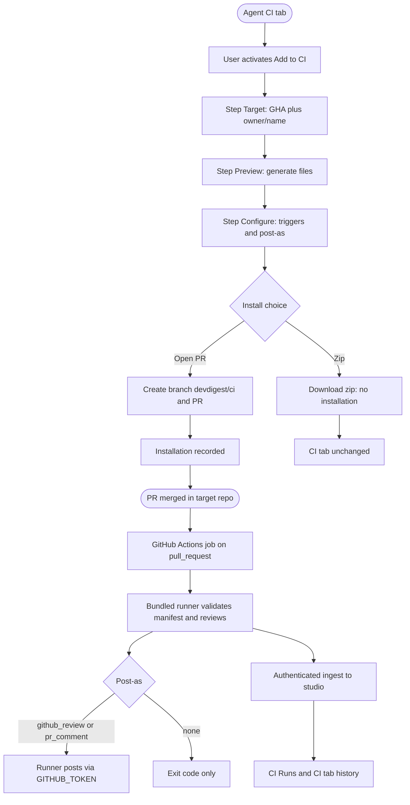
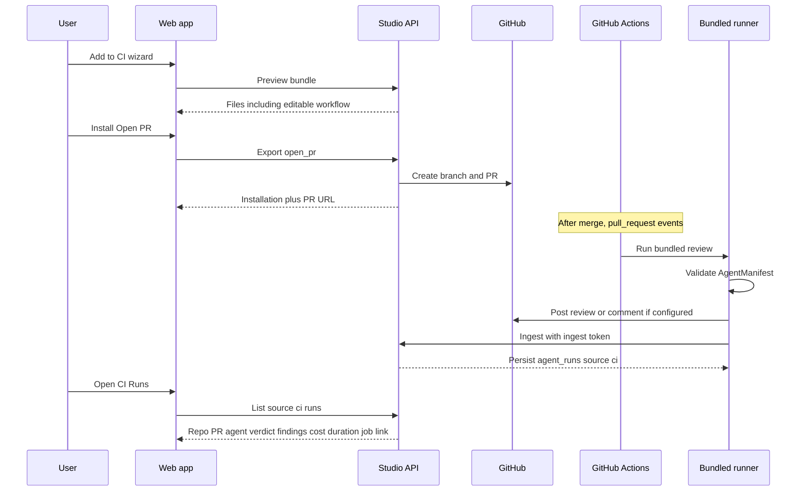

# Spec: Export to CI
Spec ID: SPEC-06
Status: draft
Supersedes: none
Packages: client, server

## Problem and user

A tuned reviewer agent today runs only on the author’s machine. The rest of the team cannot rely on that review on every pull request: the configuration lives in the studio, not in the target repository, and there is no GitHub Actions job that executes it.

**Export to CI** copies a versioned agent configuration (model, system prompt, attached skills, parameters) into the target repo and runs the same review engine on `pull_request` events via a **bundled agent-runner**. Studio records those CI executions as ordinary agent runs with `source='ci'` so the team can see repository, PR, agent, verdict, findings, cost, duration, and a job link without treating CI as a second review product.

Primary user: a **workspace member** who has tuned an agent in Skills Lab and wants that agent to run automatically on pull requests in a GitHub repository they can push to.

## Goals / Non-goals

### Goals

- Let the user export a tuned agent to **GitHub Actions** through a four-step wizard: **Target → Preview → Configure → Install**.
- Serialize the agent to a manifest under `.devdigest/agents/<slug>.yaml` that studio and the bundled runner both validate with the **same** `AgentManifest` schema.
- Preview the generated bundle (manifest, attached skills, memory snapshot, workflow, bundled runner) with an **editable** GitHub Actions workflow.
- Configure `pull_request` triggers (`opened`, `synchronize`, optionally `reopened`) and how the job publishes results (GitHub review / PR comment / exit code only).
- Install by **opening a PR** on a dedicated branch (never writing to `main`) **or** downloading the same files as a zip.
- Show per-agent **CI tab**: active-repo count, installations, workflow/manifest version, recent CI history, and **Fail CI on**.
- Show a global **CI Runs** page of runs with `source='ci'` (not local studio runs).
- Ingest a CI result into `agent_runs` with `source='ci'` **only** through an authenticated channel.
- Persist **Fail CI on** as the existing agent field `ci_fail_on`, serialized into the manifest so the job can exit non-zero when findings meet the gate.

### Non-goals

- Multi-agent review service and the PR feed / timeline.
- Publishing a real GitHub Action `devdigest/review-action` (any such `uses:` in mocks is a placeholder, not the runner).
- CircleCI, Jenkins, or Generic CLI generators (they are not implemented).
- Byte-identical model output between local studio and CI.
- Changing how local (non-CI) reviews are triggered.
- L07 persistent memory product and L08 plugins.
- Writing generated files directly to `main`.
- Requiring a GitHub App to block merges (branch protection + non-zero job exit is enough).
- Rewriting `reviewer-core` (the runner reuses it; this spec does not expand into a new engine).
- Treating unused table `ci_runs` as a second source of truth for CI history.

## Clarifications

- Q: Which CI providers are in scope? A: **GitHub Actions only.** CircleCI / Jenkins / Generic CLI cards in the design are out of scope; do not require disabled fake targets.
- Q: Where is a CI run stored? A: **`agent_runs` with `source='ci'`.** Existing `ci_installations` may record installations; `ci_runs` stays unused scaffolding, not a second history.
- Q: May the wizard push to `main`? A: **No.** Dedicated branch `devdigest/ci` and a PR titled “Add DevDigest CI review”.
- Q: What executes in Actions? A: A **bundled runner** invoked from the generated workflow (checkout + setup-node + `node .devdigest/runner.mjs …`). Not a published `devdigest/review-action@v1`.
- Q: Does zip create an installation? A: **No.** Zip downloads files only; an installation is created when the user opens the install PR (or when a later ingest is attributed to an existing installation). Explicit “I installed it” is out of scope.
- Q: Who posts the GitHub review or PR comment? A: The **runner in Actions** using `GITHUB_TOKEN`, not the studio after ingest. Studio ingest only records the run.
- Q: How is ingest authenticated? A: A **workspace-scoped ingest token** the user adds as a GitHub Actions secret. Unauthenticated ingest is rejected. No OIDC in this spec.
- Q: **Update CI config** with several installations? A: **Only from the installation row.** That row’s repository is pre-filled. There is no header control that picks “some” installation.
- Q: Where is the ingest token issued? A: **Automatically on first export** (Install step). If the workspace has no token yet, the system mints one and shows it so the user can copy it into Actions secrets. Settings is not required for the first mint.
- Unresolved: none

## User stories

- As an agent author, I want to export my tuned agent to GitHub Actions, so every pull request in the target repo is reviewed with that configuration.
- As an agent author, I want to preview the files (including an editable workflow) before install, so I can see what will land in the repo.
- As an agent author, I want to choose PR triggers and how results are posted, so the job matches our review process.
- As an agent author, I want DevDigest to open a PR with the bundle instead of writing to `main`, so the team can review the install itself.
- As an agent author, I want to download a zip of the same files, so I can add them manually when I cannot open a PR from the studio.
- As an agent author, I want a CI tab that lists where this agent is installed and the Fail CI on gate, so I can see and adjust deployment without leaving the agent.
- As a workspace member, I want a global CI Runs page, so I can audit automated reviews across repos without mixing them with local studio runs.
- As a workspace member, I want CI ingest to require a secret, so an unauthenticated caller cannot write fake runs into the workspace.
- As an agent author, I want **Update CI config** on a specific installation row, so I re-export that repository and not another one.
- As an agent author, I want the wizard to issue the ingest token on first export, so I can copy it into Actions secrets without a Settings detour.

## Acceptance criteria (EARS)

### Agent CI tab

- AC-01: КОЛИ the user opens an agent’s **CI** tab, the system shall show CI deployment status including how many repositories currently have an installation for that agent (“Active in N repos”), a control to start export (**+ Add to CI**), the **Fail CI on** segmented control, and the installation list (or the empty state when N is 0).
- AC-02: КОЛИ the user activates **+ Add to CI** or **+ Add repository**, the system shall open the Export to CI wizard at step **Target**.
- AC-03: КОЛИ the user activates **Update CI config** on an installation row, the system shall reopen the Export to CI wizard populated from **that** row (same agent, target GitHub Actions, and that row’s repository) so the user can regenerate files and open or update the install PR for that repository only.
- AC-04: ЯКЩО the agent has no installations, ТОДІ the system shall show an empty CI-deployment state and shall still allow **+ Add to CI** / **+ Add repository**; it shall not present **Update CI config** and shall not present a successful install PR as already done.
- AC-05: КОЛИ the CI tab lists installations, the system shall show each installation’s repository (`owner/name`), target label **GitHub Actions**, last known job status, and a relative timestamp of that last activity.
- AC-06: КОЛИ the CI tab is shown, the system shall show the exported workflow/manifest version associated with each installation (the agent version serialized at the last successful open-PR export for that repo).
- AC-07: КОЛИ the user changes **Fail CI on** on the CI tab to **Critical**, **Warning+**, or **Never**, the system shall persist that choice on the agent as `ci_fail_on` `critical`, `warning`, or `never` respectively, and shall not remove the existing Config-tab CI-gate control.
- AC-08: ЯКЩО the agent’s stored `ci_fail_on` is `any`, ТОДІ the CI tab’s three-segment control shall not highlight Critical, Warning+, or Never as selected until the user picks one of those three values (which then overwrites `any`).
- AC-09: КОЛИ the user opens the CI tab after CI-sourced runs exist for that agent, the system shall show a history of those runs (at least status, time, and target repo) distinct from local studio runs.

### Export wizard — Target

- AC-10: ПОКИ the Export to CI wizard is open, the system shall show four steps in order: Target, Preview, Configure, Install, and shall highlight the current step.
- AC-11: КОЛИ the user is on step Target, the system shall present **GitHub Actions** as the selectable, recommended target (runs on `pull_request` events) and shall not require CircleCI, Jenkins, or Generic CLI as selectable targets.
- AC-12: КОЛИ the user is on step Target, the system shall collect the target repository as `owner/name`, and ДЕ a workspace repository is already connected, the system shall default that field to the connected repo.
- AC-13: ЯКЩО the repository field is empty or is not `owner/name`, ТОДІ the system shall refuse to continue to Preview and shall state that a valid repository is required.
- AC-14: КОЛИ the user activates Continue on Target with GitHub Actions and a valid repository, the system shall advance to Preview.

### Export wizard — Preview

- AC-15: КОЛИ the user reaches Preview, the system shall generate a file bundle for that agent and repository without creating a CI installation and without opening a GitHub PR.
- AC-16: КОЛИ Preview is shown, the system shall list at least: the agent manifest `.devdigest/agents/<slug>.yaml`, one file per attached skill under `.devdigest/skills/`, `.devdigest/memory.jsonl`, `.github/workflows/devdigest-review.yml`, and the **bundled runner** (so the workflow can execute without a published Action).
- AC-17: КОЛИ the user selects the workflow file in Preview, the system shall show its YAML in an editor marked **editable**, and shall include the user’s edits in the bundle used at Install.
- AC-18: ДЕ a generated file is not the workflow, the system shall allow it to be read-only in the Preview list.
- AC-19: КОЛИ the generated workflow is produced, the system shall make the review job invoke the bundled runner after checkout and Node setup (for example `node .devdigest/runner.mjs review --agent …`) and shall **not** specify `uses: devdigest/review-action@v1` as the real runner.
- AC-20: КОЛИ the manifest is generated, the system shall serialize the current agent configuration (name, provider, model, system prompt, attached skill slugs, strategy, `ci_fail_on`) into `AgentManifest` and shall validate it with that schema before offering Install.
- AC-21: ЯКЩО the generated manifest fails `AgentManifest` validation, ТОДІ the system shall refuse Install and shall state that the manifest is invalid.
- AC-22: The system shall not write LLM provider API keys, `GITHUB_TOKEN`, or the ingest token into any generated file.
- AC-23: КОЛИ `.devdigest/memory.jsonl` is generated, the system shall write a snapshot of current workspace memory if any exists, otherwise an empty or placeholder file (L07 persistent memory is not required).
- AC-24: КОЛИ the user activates Back on Preview, the system shall return to Target without installing.

### Export wizard — Configure

- AC-25: КОЛИ the user is on Configure, the system shall offer `pull_request` triggers `opened`, `synchronize`, and `reopened`, with `opened` and `synchronize` selected by default and `reopened` optional.
- AC-26: КОЛИ the user is on Configure, the system shall offer **Post results as**: GitHub review (recommended), PR comment, or None (exit code only).
- AC-27: КОЛИ Configure is shown, the system shall state that blocking merges is done by setting **Fail CI on** on the CI tab so the job exits non-zero, then adding a **required status check** in GitHub branch protection, and that **no GitHub App is required**.
- AC-28: КОЛИ the user activates Continue on Configure, the system shall advance to Install with the selected triggers and post-as mode.

### Export wizard — Install

- AC-29: КОЛИ the user is on Install, the system shall offer **Open a PR with these files** (recommended) and **Copy files as a zip**, and shall state that the PR is titled “Add DevDigest CI review” and includes the generated files.
- AC-30: КОЛИ the user confirms Install with **Open a PR**, the system shall create or update branch `devdigest/ci` in the target repository, open or update a pull request against the repository’s default/base branch (default `main`) with title “Add DevDigest CI review” containing the generated files, and shall **not** push those files to `main` (or otherwise commit directly on the base branch).
- AC-31: КОЛИ the open-PR install succeeds, the system shall persist a CI installation for that agent, repository, and target `gha`, and shall return the install PR URL.
- AC-32: ЯКЩО the workspace has no GitHub credential configured (`GITHUB_TOKEN`, with `GITHUB_PAT` as the existing fallback), ТОДІ the system shall refuse open-PR install, shall not write to the repository, and shall tell the user to add a GitHub token in Settings.
- AC-33: ЯКЩО GitHub rejects creating or updating the branch or PR, ТОДІ the system shall not claim success, shall not record a successful installation for that attempt, and shall surface a failure the user can act on.
- AC-34: КОЛИ the user confirms Install with **Copy files as a zip**, the system shall download the same generated files as a zip and shall **not** create a CI installation and shall **not** open a GitHub PR.
- AC-35: КОЛИ Install is shown, the system shall tell the user to add the provider API key and the workspace ingest token as GitHub Actions secrets (named in the copy) before the workflow can review and ingest, and shall note that Actions supplies `GITHUB_TOKEN` for posting reviews or comments.
- AC-36: КОЛИ the user activates Back on Install, the system shall return to Configure without installing.
- AC-53: КОЛИ the user first reaches Install and the workspace has no ingest token, the system shall mint a workspace-scoped ingest token, show it once as a copyable value, and shall not require a Settings visit to obtain that first token.
- AC-54: КОЛИ the user reaches Install and a workspace ingest token already exists, the system shall name the Actions secret to add and shall not require minting a second token (rotation UX is out of scope).

### Manifest identity and runner

- AC-37: The system shall guarantee that studio and the bundled agent-runner validate the agent YAML with the **same** `AgentManifest` schema, so an invalid manifest is rejected at export and at CI run time.
- AC-38: The system shall not require CI output to be byte-identical to a local studio review of the same PR; the CI run trace shall record manifest version, model, dependency/tool versions available to the runner, and the git commit SHA under review.
- AC-39: КОЛИ the exported manifest’s `ci_fail_on` is `critical` and the job keeps at least one finding of severity critical, the system shall cause the CI job to exit non-zero.
- AC-40: КОЛИ the exported manifest’s `ci_fail_on` is `warning` and the job keeps at least one finding of severity warning or critical, the system shall cause the CI job to exit non-zero.
- AC-41: КОЛИ the exported manifest’s `ci_fail_on` is `never`, the system shall not fail the CI job solely because findings exist.
- AC-42: КОЛИ post-as is GitHub review or PR comment, the runner in Actions shall publish that result using the job’s `GITHUB_TOKEN`; the studio shall not post the review or comment as a side effect of ingest.
- AC-43: КОЛИ post-as is None (exit code only), the runner shall not post a GitHub review or PR comment and shall still apply the Fail CI on exit code.

### Ingest and CI Runs

- AC-44: КОЛИ an authenticated CI job submits a result for a completed review, the system shall persist an `agent_runs` row with `source='ci'` (findings count, cost, duration, and status at minimum) and shall accept that result **only** via the authenticated ingest endpoint (or another verified channel specified in Contracts).
- AC-45: ЯКЩО ingest is called without a valid workspace ingest token, ТОДІ the system shall reject the request with HTTP 401 and shall not persist a run.
- AC-46: КОЛИ the user opens **CI Runs** from the Global sidebar, the system shall list runs with `source='ci'` for the current workspace and shall not list local (`source='local'`) studio runs in that table.
- AC-47: КОЛИ CI Runs has at least one CI-sourced run, the system shall show each row’s repository, pull request, agent, verdict, findings, cost, duration, and a link to the CI job.
- AC-48: ЯКЩО there are no CI-sourced runs, ТОДІ the system shall show the empty CI Runs state (no automated reviews yet) rather than an error.
- AC-49: The system shall not modify the multi-agent-run service or the PR feed/timeline as part of export, ingest, or CI Runs.

### Unwanted / tenancy

- AC-50: ЯКЩО an export request names a CI target other than GitHub Actions (`gha`), ТОДІ the system shall refuse the export and shall not generate CircleCI, Jenkins, or Generic CLI files.
- AC-51: ЯКЩО the caller is not a member of the agent’s workspace, ТОДІ the system shall reject preview, export, installation reads, Fail CI on updates, and CI Runs reads for that workspace without leaking manifests or run payloads.
- AC-52: КОЛИ ingest succeeds, the system shall store the run in the workspace that owns the ingest token and shall not attach it to a different workspace.

## Edge cases

- Closing the wizard (or navigating away) after Preview but before Install leaves no installation and no GitHub PR.
- Two installations of the same agent in two repos are both listed; “Active in N repos” counts distinct repositories with an installation.
- Re-export to a repo that already has `devdigest/ci` updates that branch and the existing install PR when possible, rather than pushing to the base branch.
- Zip-only path: CI tab stays empty until an open-PR install exists; a later ingest from a manually added workflow may still appear on CI Runs as `source='ci'` without an installation row.
- Changing **Fail CI on** in the studio does not change already-exported YAML until the user completes **Update CI config** (open PR) or otherwise replaces the files; the job reads the manifest in the repo.
- Stored `ci_fail_on` value `any` is valid on Config tab and in the enum; the CI tab has no fourth segment (AC-08).
- Provider API key missing in Actions: the job fails in GitHub; studio ingest is not required for that failure to be visible in Actions. When ingest never happens, CI Runs does not invent a succeeded row.
- Duplicate ingest of the same job: the system shall not require two `agent_runs` rows for the same CI job; a repeat submission for the same job identity updates or is ignored rather than duplicating history (`assumption:` job identity is the Actions run URL or equivalent in the artifact).
- Default/base branch is not named `main`: open-PR still targets the repository default branch (`CiExportInput.base` default `main` is the request default, not a hard-coded push to `main`).
- Agent with zero attached skills: manifest `skills` is empty; skill files may be omitted; export remains valid.
- Workflow YAML the user empties or invalidates in Preview: Install still sends the edited text; GitHub Actions will fail the job if YAML is invalid — studio may warn but is not required to parse Actions YAML.

## Workflows

User journey — export and later CI execution:

## Service communication

- **Web app → API:** preview bundle, export (open PR or zip), list installations, list CI-sourced runs, persist `ci_fail_on`. The web app does not talk to GitHub or to Actions except through the API (open PR) and the user’s browser (zip download).
- **API → GitHub:** open-PR install uses the workspace GitHub credential from Settings. The API does not post PR reviews for CI jobs.
- **GitHub Actions → bundled runner:** the job checks out the PR, runs the bundled runner against the exported manifest and the PR diff. The runner uses `reviewer-core` as the review engine (no studio DB). LLM credentials come from Actions secrets, not from the repo.
- **Runner → GitHub:** posts a review or comment when configured, using the job `GITHUB_TOKEN`.
- **Runner → API:** authenticated ingest of the result artifact into `agent_runs` (`source='ci'`). Studio does not pull artifacts unprompted in this spec.
- **Out of band:** the user copies ingest token and provider API key into Actions secrets. Those values never pass through generated files.

## Contracts

Cover each channel that applies; write `N/A` for unused channels.
Shapes only — not ORM/SQL/Zod. Mark invented names `assumption:`.

### HTTP

Reuse existing shared shapes where they already fit. Do **not** require a `@devdigest/shared` change unless a field below cannot be expressed; prefer local DTOs for list projections.

- `assumption:` `POST /agents/:id/ci-preview` (or equivalent generate-without-install). Body: `repo` (`owner/name`), `target` (`gha` only in this spec), optional `post_as`, `triggers`, `base`, plus any in-wizard workflow override. Response: `{ files: CiFile[] }` where `CiFile` is `{ path, contents, editable }`. No `installation`. Rejects non-`gha` targets.
- `assumption:` `POST /agents/:id/export-ci` (existing name). Body `CiExportInput`: `repo`, `target` (`gha`), `action` `open_pr` | `files`, `post_as` `github_review` | `pr_comment` | `none`, `triggers` (event names: `opened`, `synchronize`, `reopened`), `base`. Response `CiExport` for `open_pr`: `{ installation: CiInstallation, files, pr_url }`. For `action=files` (zip): return the zip/files **without** requiring a persisted `installation` (`pr_url` null).
- `assumption:` `GET /agents/:id/ci-installations` — list `CiInstallation` plus last-run status, relative time, and exported manifest/agent version (extra fields may be a server-local envelope so `CiInstallation` need not change).
- `assumption:` `GET /ci-runs` — workspace list of `agent_runs` with `source='ci'`, projected for the table: repository, PR number (or identity), agent, verdict, findings count, cost, duration, job URL. This is **not** a read of table `ci_runs`.
- Existing `PATCH /agents/:id` already accepts `ci_fail_on` (`never` | `critical` | `warning` | `any`); the CI tab uses the first three labels only.
- `assumption:` `POST /ci/ingest` — CI job submits `CiResultArtifact` plus trace fields (manifest version, model, dependency/tool versions, commit SHA, job URL, optional verdict). Authenticated with the workspace ingest token (Authorization bearer or equivalent header). Writes `agent_runs` with `source='ci'`.
- `assumption:` first-token mint is a side effect of showing Install (or of `ci-preview` / `export-ci` when no token exists). Response (or Install payload) may include a one-time `ingest_token` plaintext plus the Actions secret name. Do not persist the plaintext token in Postgres.

### MCP

- N/A — no new MCP tools. Existing review tools are unchanged.

### Events / status

- Installation last-run status shown on the CI tab: `succeeded` | `failed` | `no_findings` | `running` (`assumption:` reuse `CiRunStatus` labels).
- `agent_runs.status` for ingested CI runs follows the existing run status vocabulary; `source` is `ci`.
- Preview/export are synchronous request/response; there is no `partial` preview. Ingest of a still-running job may be omitted; `running` is only required if the product later streams job start (not required for MVP ingest-on-complete).

### Errors

Stable `error.code` values (`assumption:` unless already used elsewhere):

| Outcome | HTTP | `error.code` (`assumption:`) |
| --- | --- | --- |
| Ingest without valid token | 401 | `ingest_unauthorized` |
| Open PR without GitHub token in Settings | 409 or 400 | `missing_github_token` |
| Invalid `AgentManifest` | 422 | `invalid_manifest` |
| Target not `gha` | 422 | `unsupported_ci_target` |
| Invalid `owner/name` | 422 | `invalid_repo` |
| GitHub failed to open/update PR | 502 | `github_pr_failed` |
| Agent or workspace not found / not a member | 404 / 403 | existing `not_found` / forbidden pattern |
| Zip requested | 200 file download | not an error |

## Design & UX analysis

Five attached screens were analysed (agent CI tab; wizard Target; Preview; Configure; Install).

### Gaps vs design

- **Target cards:** mock shows CircleCI, Jenkins, and Generic CLI as peer cards. **This spec is GHA-only.** Those three must not be required as disabled placeholders. If a later lesson adds generators, the same wizard step can grow.
- **Preview file list:** mock lists five files and omits the bundled runner, while the workflow invokes `node .devdigest/runner.mjs`. The bundle **must** include the runner; the list count in the install copy (“5 generated files”) is a mock artifact, not a hard count.
- **Fail CI on:** design has three labels (Critical / Warning+ / Never). The agent enum has four values including `any`. Config tab already exposes all four. CI tab maps Warning+ → `warning` and leaves `any` unmatched until the user picks a three-way value.
- **Config tab vs CI tab:** Fail CI on appears in both places; this spec does not remove the Config control.
- **CI Runs columns:** i18n table is Timestamp, Pull request, Source, Findings, Cost, Status. The product brief requires **repository, PR, agent, verdict, findings, cost, duration, job link**. The page follows the brief; i18n is stale.
- **CI tab copy:** existing `ci.json` uses “Continuous Integration”, “Publish to CI”, and a GitHub App note (`blockMergeDesc`). Design uses “CI deployment”, **Update CI config** / **+ Add to CI**, and **no GitHub App**. Behaviour follows the design, not the stale App sentence.
- **Stats tab** in the agent chrome of the mock is not part of this feature (agent editor today has Config, Skills, Context, Evals).
- **Install file count** in the recommended card is derived from the actual generated list, not hard-coded to 5.

### Uncovered corner cases

- Update CI config is **per installation row** (AC-03). The mock’s header Update button is a design extra and is not required.
- Zip path vs “Active in N repos”: zip does not increment N.
- `ci_fail_on` = `any` on the three-segment control (AC-08).
- Missing GitHub token only on the open-PR path; zip still works.
- Stale Fail CI on in the repo after a studio-only change (user must Update CI config).

### Cross-module interactions

- Agent Config tab and CI tab share `ci_fail_on`.
- CI Runs is a **Global** sidebar item (`/ci-runs` is already a nav key); the page does not exist yet.
- Ingest writes `agent_runs` like local reviews but `source='ci'`; PR feed and multi-agent runs stay untouched.
- Settings GitHub token is the open-PR credential; Actions secrets are the job’s LLM and ingest credentials.
- `reviewer-core` is the engine inside the bundled runner; this feature does not change the engine’s public review contract.

### UX recommendations (non-binding)

- Keep GitHub Actions as a single recommended card on Target; do not ship greyed Circle/Jenkins/CLI cards that look broken.
- Show the bundled runner in the Preview file list so the workflow’s `runner.mjs` invocation is not a surprise.
- After changing Fail CI on, hint that **Update CI config** is needed to push the gate into the repo.
- Prefer “Warning+” as the visible label while persisting `warning`.
- On CI Runs, make the job link the primary way to leave the studio for Actions logs.
- Align wizard copy with the design tip (required status check, no GitHub App), and drop the App-required sentence in existing CI strings.

## Non-functional requirements

- **Secrets:** LLM keys, GitHub tokens, and the ingest token never live in git, in generated bundle files, or in the database. GitHub credentials stay in the existing local secrets store. The ingest token is workspace-scoped and stored with the same secret-store rules (not in Postgres).
- **Authn/authz:** Preview, export, installation list, CI Runs, and Fail CI on updates require a workspace member. Ingest requires the ingest token and binds the run to that workspace only (AC-45, AC-51, AC-52).
- **No GitHub App** is required to fail the check or to post a review/comment from Actions (`GITHUB_TOKEN` + required status check).
- **Manifest validation** is the same schema at export and in CI (AC-37); invalid YAML must fail closed (no review posted from an invalid manifest).
- **Tenancy:** generated skill bodies and memory snapshots are the exporting workspace’s data; they are written only into the user-chosen target repo via PR or zip, not into other workspaces’ API data.
- Latency SLAs for preview/export are not specified; preview and export are request-scoped (no background job required for file generation). GitHub open-PR duration is bounded by GitHub, not by an invented studio timeout.

## Inputs and provenance

| Input | Source / provenance | Trusted? |
| --- | --- | --- |
| Agent config (model, prompt, skills, `ci_fail_on`, strategy) | Studio agent record / version | yes (workspace-authored) |
| Target repository `owner/name` | User (wizard); default from connected workspace repo | no |
| Workflow YAML edits | User in Preview | no |
| Triggers and post-as | User in Configure | yes (user intent) |
| Workspace `GITHUB_TOKEN` | Settings / local secrets file | yes (user-provided credential; treat as secret) |
| Provider API key in Actions | User-managed Actions secret | yes as credential; never stored in studio DB |
| Ingest token | Studio-issued workspace secret, copied to Actions | yes as credential |
| CI result artifact | Runner in GitHub Actions | no (untrusted network caller even when authenticated) |
| Posted GitHub review/comment body | Runner output (model findings) | no |
| Memory snapshot | Current workspace memory, or empty placeholder | no (content); yes as “what we exported” |
| Git commit SHA under review | GitHub Actions / git in the job | yes (identity of the commit) |

## Untrusted inputs

- **Target `repo` string:** must match `owner/name`; reject traversal, URLs, and extra path segments. Used only as a GitHub repo identity for the install PR.
- **Editable workflow YAML:** user-controlled text placed in the install PR. Do not execute it in the studio. Do not interpolate secrets into it.
- **Ingest payload:** even with a valid token, treat findings, titles, verdicts, and URLs as untrusted display data. Bound size; validate with the artifact schema; wrap any text later shown in the UI. Job URL is stored as a link, not fetched as HTML to render.
- **Generated skill markdown and memory.jsonl:** workspace content copied into a public PR; authors must understand it will be visible in the target repo. Still do not treat it as executable instructions inside the studio API.
- **GitHub API errors and repo contents:** untrusted; do not reflect raw GitHub error bodies as HTML.

## Constraints & risks

- No monorepo workspace; `client/` and `server/` install separately. Cross-package types use tsconfig path aliases.
- `@devdigest/shared` / `vendor/shared` is high risk: server `eval-ci.ts` already has `AgentManifest`; the client copy is **not** byte-identical (known drift). Prefer reusing `CiExportInput`, `CiExport`, `CiInstallation`, `CiFile`, `CiResultArtifact` as-is. Do **not** change `vendor/shared` unless an AC field cannot be expressed; list projections may be server-local DTOs. Do not “sync” the whole `eval-ci.ts` file as cleanup.
- Secrets never in git or the DB (`server/AGENTS.md`). Wizard must not embed keys in YAML.
- Empty course tables (`ci_installations`, `ci_runs`) must not be dropped. Installations may use `ci_installations`. **Runs** use `agent_runs.source='ci'`, not `ci_runs`.
- Do not change the multi-agent-run service or the PR feed.
- Do not publish or depend on `devdigest/review-action@v1`.
- `reviewer-core` stays without DB/GitHub/fs; the bundled runner is the adapter that calls it from Actions.
- Client UI primitives: `ExportWizardSteps` already exists (showcase only). Nav already treats `/ci-runs` as a sidebar item; the page and the agent CI tab do not exist yet.
- Worktree B scope: CI HTTP surface, CI Runs page, agent CI tab — not unrelated modules.

## Assumptions

- Opening the install PR uses the workspace GitHub token already configured in Settings (`GITHUB_TOKEN`, `GITHUB_PAT` fallback).
- Target repo is `owner/name`; default to the current workspace repo when one is connected.
- **Fail CI on** on the CI tab is the same agent field `ci_fail_on`. Labels: Critical / Warning+ / Never. Warning+ → `warning`. Config-tab four-value control remains.
- **Update CI config** is a **per-row** control on the installation list (not a header action that guesses a repo). **+ Add to CI** and **+ Add repository** both start the wizard for a new export (Add repository emphasizes choosing a repo). The design’s header “Update CI config” button is not required.
- Generated bundle includes a bundled runner file (e.g. `.devdigest/runner.mjs`) even if the design list shows five files.
- `.devdigest/memory.jsonl` is a snapshot of current workspace memory if any exists, otherwise empty/placeholder (L07 is not built).
- LLM credentials for the CI job are not written into the repo; the user adds the provider API key as an Actions secret. `GITHUB_TOKEN` is provided by Actions for posting.
- Ingest: CI job calls `assumption: POST /ci/ingest` with a workspace-scoped ingest token stored as an Actions secret. Studio **mints the first token on the Install step** and shows it copyable; later Installs name the existing secret. Unauthenticated ingest is rejected. No OIDC.
- Install PR title: “Add DevDigest CI review”. Branch: `devdigest/ci`. Does not push to `main`.
- Zip does **not** create an installation.
- Preview workflow YAML is editable; other generated files may be read-only in the list.
- CI Runs is a Global sidebar page listing `source='ci'` only.
- Posting a GitHub review or PR comment is performed by the runner in Actions, not by the studio after ingest.
- Wizard does not write secrets into generated files.
- Route names `POST /agents/:id/export-ci`, `POST /agents/:id/ci-preview`, `GET /ci-runs`, `POST /ci/ingest`, and error codes in the Errors table are `assumption:` reuse or invention as noted. `AgentManifest`, `CiExportInput`, `CiFile`, `CiInstallation`, `CiExport`, `CiResultArtifact` already exist in shared contracts (server copy includes `AgentManifest`).
- `CiExportInput.target` remains the enum `gha|circle|jenkins|cli` at the schema level; this product **rejects** non-`gha` rather than generating those targets.
- Studio issues at most one ingest token per workspace for this lesson (rotation UX is not specified).
- “Verdict” on CI Runs is the review conclusion the runner reported (or a pass/fail derived from findings vs `ci_fail_on` when post-as is none).
- Duplicate ingest for the same job URL updates the existing `agent_runs` row or is a no-op.
- First ingest-token mint happens on the Install step (AC-53). A Settings surface to re-copy the token later is optional and not required for MVP.

## Open questions

- Should ingest of a failed Actions job (runner crash before artifact) create a `failed` `agent_runs` row, or only successful runner completions? Non-blocking; MVP may ingest only when the runner can POST.
- Stale i18n (`blockMergeDesc` GitHub App, CI Runs columns, “Publish to CI”) should be updated to match this spec; not a product unknown.
- Client vs server `eval-ci.ts` drift (`AgentManifest` only on server) is an implementation risk, not a product unknown.
