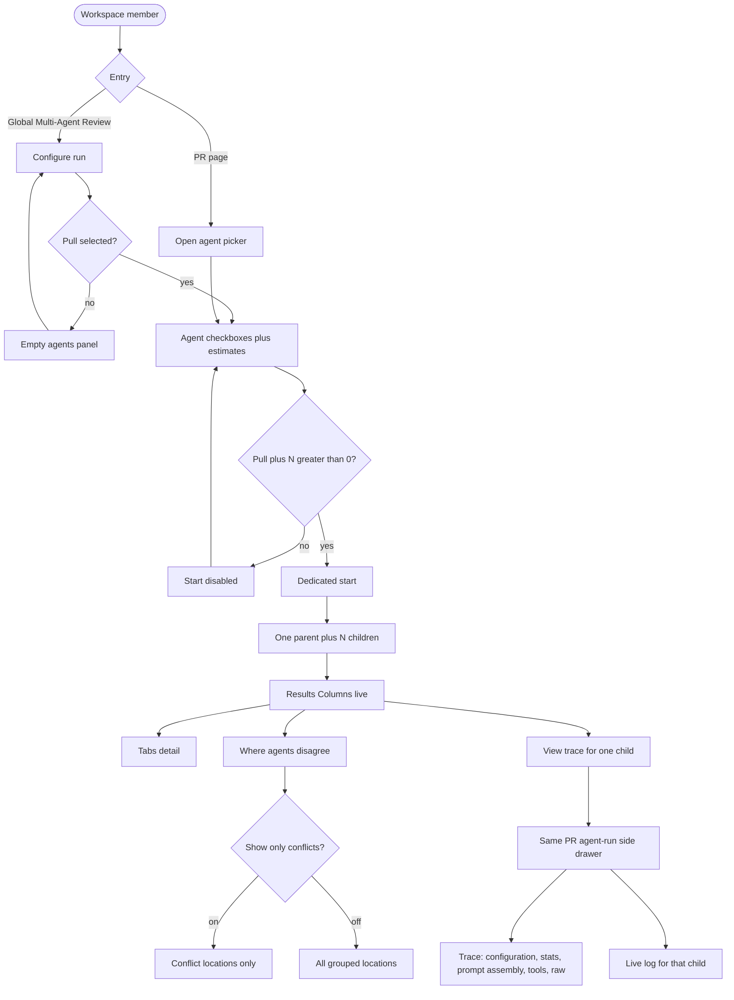
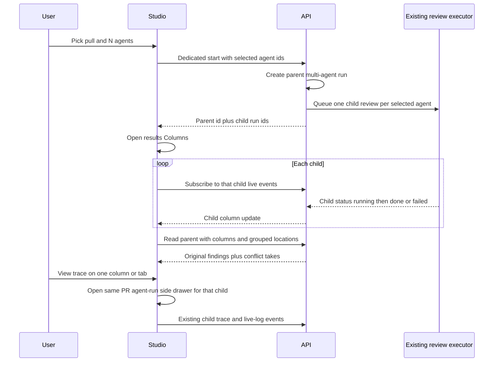

# Spec: Multi-Agent Review
Spec ID: SPEC-06
Status: draft
Supersedes: none
Packages: client, server

## Problem and user

One pull request can carry a security leak, a performance cliff, and a domain-rule break at the same time. A single reviewer persona under-covers that mix. Several specialised reviewers give wider coverage **only if** the product keeps every original finding with its agent, shows where those agents disagree (including “did not flag”), and never hides the time or money of the fan-out.

Today the studio can start one agent or every enabled agent via `POST /pulls/:id/review`. There is no picker for an explicit set, no parent run that groups those child runs, no Configure-run surface, and no Columns / Tabs compare view. A `multi_agent_runs` row and a `MultiAgentRun` transport shape already exist; they are unused.

Primary user: a **workspace member** comparing specialised reviewers on one pull. They pick the pull and the agents, start one parent run, watch live columns, and decide from attributed findings plus an explicit disagreement block.

## Goals / Non-goals

### Goals

- **Agent picker on the PR page** and a **Configure run** screen: choose a pull, check agents, see time and cost estimates from past completed runs, start with **Run multi-agent review (N)**.
- Start goes through a **dedicated** start resource. The studio sends only the selected agent set. Child reviews execute through the **existing** review executor (same path as today’s manual review). `POST /pulls/:id/review` stays `{ agentId } | { all: true }`.
- **One parent multi-agent run** groups the child agent runs so they can be read and rendered together.
- **Finding grouping** uses the existing file+line conflict heuristic. Originals and agent attribution are never dropped or merged away.
- **Where agents disagree**: for one code location, every selected agent’s take is visible, including **did not flag**. A **Show only conflicts** toggle filters to strict conflicts.
- **Results** in two modes: **Columns** (live per-agent status) and **Tabs** + finding detail (confidence, suggested fix, Accept, Dismiss, Turn into eval case).
- Reuse the **same side drawer** already used on the PR page for an agent run (Trace + Live log). Each column / agent tab has its own status and a **View trace** control. A log-tab switch **without** that drawer is not enough.

### Non-goals

- Changing `ci/` or `agent-runner/`.
- Changing `POST /pulls/:id/review` or `RunRequest` to accept a list of agent ids.
- Making the existing review executor schedule child agents concurrently. Product copy may still say fan-out / parallel; wall-clock is whatever that executor already does.
- Implementing **Learn** or **Reply to author** (design shows them; worktree A reuses only Accept, Dismiss, Turn into eval case).
- Memory curator, Agent Performance, CI Runs, Eval Dashboard changes.
- New MCP tools.
- A history index of all parent runs across the workspace (results are the parent just started, or the latest parent for that pull).
- Replacing the PR Overview / Agent runs / Files changed tabs, Intent, Blast, or Why+Risk Brief.
- Browser e2e for this feature (same deferral as Intent / Blast / Why+Risk).
- Public / unauthenticated multi-agent URLs.

## Clarifications

- Q: How does the studio submit the selected agent set? A: A dedicated start resource (`POST /pulls/:id/multi-agent-run`). It fans out through the existing review executor. Do **not** extend `POST /pulls/:id/review`.
- Q: Learn / Reply on finding detail? A: Out of this worktree. Tabs detail uses the same actions already shipped on the PR finding card: Accept, Dismiss, Turn into eval case.
- Q: How does the user see each agent’s logs on the multi-agent results page? A: **View trace** (column or tab) opens the **same side drawer** as a PR agent run — not an inline log switch. The drawer has Trace and Live log; Trace includes configuration, stats, prompt assembly, tool calls, and raw output; the footer can copy raw output. Each open is scoped to **that child run**.
- Unresolved: none

## User stories

- As a reviewer on a PR, I want a picker of agents with time and cost estimates, so I can start a multi-agent review without guessing the bill.
- As a reviewer, I want a Configure run screen where I pick a pull and agents, so I can fan out without being on that PR page.
- As a reviewer, I want one parent run for the set I picked, so child runs stay comparable as one session.
- As a reviewer, I want each finding to keep its original text and the agent that wrote it, so grouping never hides who said what.
- As a reviewer, I want a disagreement block that includes “did not flag”, so silence is a visible conclusion.
- As a reviewer, I want to show only conflicts, so I can hide grouped locations where every selected agent agrees.
- As a reviewer, I want Columns with live per-agent status, so I can watch the fan-out without waiting for the last agent.
- As a reviewer, I want Tabs with finding detail, so I can accept, dismiss, or turn a finding into an eval case the same way I do on the PR page.
- As a reviewer, I want View trace on each column or agent tab, so I can open the same PR-page run drawer for that agent (logs, configuration, stats, prompt assembly, copy raw output).

## Acceptance criteria (EARS)

- AC-01: КОЛИ a workspace member opens Configure run with no pull selected, the system shall show a pull picker and an empty agents panel that tells the user to pick a pull first, and shall not list agent checkboxes or invent estimates.
- AC-02: КОЛИ a workspace member selects a pull on Configure run, the system shall list the workspace’s reviewer agents as checkboxes with a name, a short description, and a time and cost estimate derived from that agent’s past completed runs.
- AC-03: КОЛИ an agent has no past completed run, the system shall still list that agent as selectable and shall omit a numeric time or cost figure for it (no invented seconds or dollars).
- AC-04: КОЛИ at least one selected agent has a numeric estimate, the system shall show an aggregate estimate for the current selection: wall-clock as the **maximum** of those per-agent time estimates, cost as the **sum** of those per-agent cost estimates, and shall not hide either figure when it is known.
- AC-05: КОЛИ the user toggles **Select all** on the agents list, the system shall select every listed agent; КОЛИ every listed agent is already selected, the same control shall clear the selection.
- AC-06: ЯКЩО no pull is selected or the selected agent count is 0, ТОДІ the system shall disable **Run multi-agent review (N)** and shall not start a parent run.
- AC-07: КОЛИ the user starts a run with N ≥ 1 selected agents on a selected pull, the system shall create **one** parent multi-agent run for that pull, create one child agent run per selected agent attributable to that parent, and shall label the start control **Run multi-agent review (N)** with that N.
- AC-08: КОЛИ a parent run is started, the studio shall send only the selected agent identifiers on the dedicated start resource and shall not call `POST /pulls/:id/review` to start that parent.
- AC-09: КОЛИ the dedicated start succeeds, the system shall execute each child review through the existing review executor (same isolation: one child’s failure does not abort the others) and shall return identifiers for the parent and each child so the studio can subscribe to live child status.
- AC-10: КОЛИ the existing PR **Run Review** control is opened, the system shall show an agent picker with checkboxes, per-agent time and cost estimates from past completed runs, **Run multi-agent review (N)**, and a link to configure agents — not a one-click “run all” / single-agent menu as the only path to a multi-agent parent.
- AC-11: КОЛИ the user starts from the PR picker, the system shall use the same dedicated start resource and the same parent/child grouping as Configure run (AC-07–AC-09).
- AC-12: КОЛИ a parent run exists for a pull, the system shall group its child agent runs under that parent so a later read returns those children together and does not mix in child runs from a different parent or from a standalone `POST /pulls/:id/review`.
- AC-13: КОЛИ the user starts from the existing `POST /pulls/:id/review` path (single agent or `all: true`), the system shall **not** create a parent multi-agent run.
- AC-14: КОЛИ findings from a parent’s child runs are shown, the system shall keep every original finding and its agent attribution, and shall not delete, merge, or rewrite finding bodies in order to group them.
- AC-15: КОЛИ two or more findings from the same parent share the same file and start line, the system shall treat them as one grouped location using the existing conflict heuristic (same file + line; conflict when at least one selected agent flagged it and at least one other selected agent that ran did not, or when flagged severities diverge).
- AC-16: КОЛИ the results view is shown, the system shall include a **Where agents disagree** block that, for each grouped location, lists every selected agent that ran and that agent’s take: the finding severity when it flagged the location, or **did not flag** when it did not.
- AC-17: ПОКИ **Show only conflicts** is off, the system shall list every grouped location for the parent (including locations where every selected agent that ran assigned the same severity).
- AC-18: КОЛИ **Show only conflicts** is on, the system shall list only grouped locations that match the conflict heuristic in AC-15, and shall still show **did not flag** takes on those rows.
- AC-19: КОЛИ a parent run is in progress, the system shall show results in **Columns** mode by default, one column per selected agent, each with that child’s live status (`running` | `done` | `failed`), and shall update a column when that child finishes without waiting for every sibling.
- AC-20: КОЛИ a child run has completed successfully, its column shall show that agent’s score (when present), duration, cost, summary, and that child’s findings.
- AC-21: КОЛИ the user switches to **Tabs**, the system shall show one tab per selected agent (name and score when present) and, for the active tab, finding detail that includes confidence, suggested fix when the finding has one, and Accept, Dismiss, and Turn into eval case — the same actions as the PR finding card.
- AC-22: КОЛИ the user Accepts, Dismisses, or turns a finding into an eval case from Tabs detail, the system shall persist that action on the original finding (same outcomes as the PR page) and shall not require a different decision model.
- AC-23: КОЛИ the user activates **View trace** on a column or on an agent tab, the system shall open the **same side drawer** already used on the pull-request agent-run page for **that child run**, and shall not replace the drawer with only an in-page log toggle.
- AC-34: КОЛИ that drawer is open, the system shall offer **Trace** and **Live log** as the two modes, and shall default to Live log while that child is `running` and to Trace when it is not.
- AC-35: КОЛИ the drawer is on Trace and a persisted trace exists for that child, the system shall show configuration, stats, prompt assembly, tool calls, and raw output for that child — the same sections as the PR agent-run drawer.
- AC-36: КОЛИ the user activates **Copy raw output** and that child has raw output, the system shall copy that child’s raw model output to the clipboard.
- AC-37: ПОКИ the drawer is on Live log and that child is `running`, the system shall stream that child’s existing live-log events; КОЛИ the child is no longer running, the system shall show that child’s persisted log in the same Live log mode.
- AC-24: КОЛИ a dedicated start succeeds, the system shall navigate the user to that parent’s results for the pull (Columns / Tabs + disagreement block) and shall keep a control to return to Configure run.
- AC-25: ЯКЩО a child run fails or is cancelled, ТОДІ the system shall keep the parent visible, mark that column `failed`, leave sibling columns unchanged, and shall not drop already-persisted findings from successful siblings.
- AC-26: ЯКЩО the caller is not a member of the pull’s workspace, ТОДІ the system shall reject start and read of parent runs without returning child findings, traces, or estimates.
- AC-27: ЯКЩО a selected agent id is unknown or not in the workspace, ТОДІ the system shall reject the start, shall not create a parent, and shall not start any child.
- AC-28: The system shall not persist provider secrets in git or in the database.
- AC-29: The system shall not add a new MCP tool for this feature.
- AC-30: ДЕ a child column is still `running`, the system shall not invent a score, finding list, duration, or cost for that child; those fields appear only from that child’s own completion data.
- AC-31: КОЛИ the user opens Multi-Agent Review from global navigation with no in-progress configure context, the system shall show Configure run (AC-01) and shall not invent a parent run.
- AC-32: КОЛИ the user opens results for a pull that has at least one parent run, the system shall show the latest parent for that pull unless a specific parent identifier is requested.
- AC-33: The system shall rate-limit dedicated starts per pull in the same family as `POST /pulls/:id/review` (a small per-minute cap) so a client cannot start unbounded fan-outs.

## Edge cases

- Repo has zero pulls: Configure run picker is empty; run stays disabled (AC-06).
- Workspace has zero reviewer agents: after a pull is selected, the agents list is empty; run stays disabled (AC-06).
- Disabled agents: still listed and selectable on the picker (same as today’s single-agent menu), estimates from their past completed runs when any exist.
- One selected agent (N = 1): still a valid parent with one child; disagreement block is empty or has no conflict rows (no sibling to disagree with).
- Two parents on the same pull over time: latest is the default results document (AC-32); older parents stay readable by id; child runs never move between parents.
- Estimate history includes failed runs: only **completed** child/agent runs contribute to averages (AC-02).
- Finding without a file or start line: it stays on its agent column / tab; it does not join a grouped location or the disagreement block.
- Same file, different start lines: two grouped locations, not one.
- Same file+line, same severity from every agent: visible when **Show only conflicts** is off (AC-17); hidden when on (AC-18).
- Toggle on with zero conflict rows: in-section empty, not a page-level error.
- Start clicked twice quickly: rate limit (AC-33) plus no second parent for the same in-flight click; in-progress start control stays pending.
- Pull merged or closed: picker still allows a multi-agent run (same as today’s review-on-merged warning).
- Standalone review started while a parent is running: both proceed; standalone children do not appear as columns of the parent (AC-12, AC-13).
- Prompt-injection text in finding titles / rationales: rendered as finding data, not as instructions (existing finding card).
- View trace while the child is still `running`: drawer opens on Live log and streams; Trace may show a pending empty until the persisted document exists (same as the PR page).
- View trace on a `failed` child: drawer still opens; Trace / log show whatever that child persisted; Copy raw output stays disabled when raw output is absent.

## Workflows

## Service communication

- **Studio (web)** lists pulls and agents, shows estimates, and starts a parent run. The browser does not execute reviews and does not group findings itself beyond rendering the parent payload.
- **API** owns parent identity, child attribution, estimate aggregation from past completed agent runs, and the derived disagreement / conflict view. It starts children only through the **existing review executor**.
- **Existing review executor** loads the diff once per start batch (current behaviour) and runs each child with isolated failure. This spec does not require a new scheduler.
- **Studio** subscribes to each child’s existing live-event stream. **View trace** mounts the **same side drawer** as the PR agent-run page for that child (Trace + Live log; configuration, stats, prompt assembly, copy raw output). It does not invent a log-only panel.
- **MCP** is unchanged.

## Contracts

Cover each channel that applies; write `N/A` for unused channels.
Shapes only — not ORM/SQL/Zod. Mark invented names `assumption:`.

### HTTP

Existing unused transport (`MultiAgentRun` in the shared observability contract) is the **read** shape. Additive request fields are `assumption:`.

- `assumption:` `POST /pulls/:id/multi-agent-run`  
  Body: `{ agent_ids: string[] }` (N ≥ 1, workspace agents only).  
  Rate-limited in the same family as `POST /pulls/:id/review`.  
  Returns a `MultiAgentRun`: `id`, `pr_id`, `pr_number?`, `ran_at`, `agent_count`, `total_duration_ms`, `total_cost_usd`, `columns[]`, `conflicts[]`.  
  On accept, children are `running` with empty findings; `conflicts` may be empty until children complete.

- `assumption:` `GET /pulls/:id/multi-agent` — latest parent for that pull, or empty / not-found when none exist (not the same as pull not found).

- `assumption:` `GET` of one parent by id — same `MultiAgentRun` document when the caller asks for a specific parent.

- Existing, unchanged: `POST /pulls/:id/review`, `GET /runs/:id/events`, `GET /runs/:id/trace`, finding Accept / Dismiss / undecide, `POST /findings/:id/eval-case` (Turn into eval case).

Column (`AgentColumn`): `run_id`, `agent_id`, `agent_name`, `provider`, `model`, `status` (`done` | `failed` | `running`), `verdict`, `score`, `summary`, `duration_ms`, `cost_usd`, `findings[]` (id, severity, category, title, file, start_line, kind).

Conflict take: `agent_id`, `persona`, `verdict` (severity or ignored / did-not-flag), `note` (short derived label; not a new model write).

Picker estimates are **not** required as a new resource if the studio can derive them from existing agent + run-history reads. `assumption:` if a dedicated estimate field is added, it is `{ estimate_duration_ms, estimate_cost_usd }` per agent, null when no completed history.

Unauthenticated or cross-workspace callers get the same rejection family as other pull routes.

### MCP

N/A — no new tool or payload field (AC-29).

### Events / status

- Parent start: HTTP returns immediately with parent id + child run ids (children `running`).
- Per child: existing run-event stream (`running` → `done` | `failed`).
- Parent read: columns reflect each child’s current status; `conflicts` recomputed from persisted findings (not stored as a separate write-ahead document).
- Do not reuse blast `partial` / `degraded` as the parent status.

### Errors

- `assumption:` `not_found` — pull or parent id not in the workspace.
- `assumption:` `forbidden` / unauthenticated — AC-26.
- `assumption:` `invalid_run_request` — empty `agent_ids`, or an id that is not a workspace agent (AC-06, AC-27).
- `assumption:` `rate_limited` — AC-33.

## Design & UX analysis

Designs analysed (chat attachments): Configure run with a pull selected and four agents checked; Configure run empty (no pull); results Columns; results Tabs (Security); PR Overview with **PICK AGENTS TO RUN** popover.

### Gaps vs design

- Mock Configure run empty still labels the start button **Run multi-agent review (4)**. Product: N is the current selection; the control is disabled when N = 0 or no pull is selected (AC-06).
- Mock agent cards use rich, run-specific summaries (“Two critical exposures…”) **before** the run. Product estimates are time and cost from **past** completed runs; pre-run copy is the agent’s own description, not a fabricated last-run verdict.
- Mock Architecture row looks like a previous-run result (duration, cost, prose) while unchecked. Product still shows estimates for unchecked agents; it does not show a live verdict until that agent is part of a parent and has finished.
- Mock Tabs finding actions include **Learn** and **Reply to author**. Product worktree A omits them (Clarifications).
- Mock header copy says “fan-out via worktrees” and “parallel”. Product may keep that language; this worktree does **not** change executor scheduling or git worktrees.
- Mock disagreement notes (“Not a security concern”, “Cosmetic; out of scope”) read like generated rationale. Product uses a short derived **did not flag** note, not a new model call.
- Sidebar already highlights Multi-Agent Review in the mock; the studio shell has an active-key hook for that path but no page yet. This spec adds Configure run + results, not Agent Performance or CI Runs.
- Mock Columns / Tabs show **View trace** (and a log-mode switch) but **no side drawer**. Product must open the PR agent-run drawer for that child (AC-23–AC-37). A tab that only swaps the column body to a log stream does not satisfy those criteria.

### Uncovered corner cases

- No `prId` on the PR page: do not open a picker that can start (same as today’s Run Review).
- View trace from Columns vs Tabs: same drawer, same child; do not open two drawers.
- Columns vs Tabs: last mode for the open results view is a session convenience; default on first open of a parent is Columns (AC-19).
- Colour tokens for agent personas: reuse existing severity / category chrome; do not invent a fourth score scale.

### Cross-module interactions

- **Review executor** is reused, not forked. Parent grouping is a new service surface beside reviews.
- **Finding actions and eval-case-from-finding** stay the PR-page contracts.
- **Live log + run trace** reuse the PR-page agent-run **side drawer** (same Trace / Live log modes and Trace sections). Results do not grow a second, thinner log chrome.
- **`@devdigest/shared`**: `MultiAgentRun` / `AgentColumn` / `Conflict` already exist. A dedicated start **request** body is additive and high-risk (both vendor copies). Do not change `RunRequest`.
- **`multi_agent_runs`** table already exists (parent identity). Child-to-parent attribution is required behaviour; the physical link is an implementation decision (additive). Do not “clean up” unused columns.

### UX recommendations (non-binding)

- Keep the PR picker compact (popover) and Configure run as the full two-step form.
- Footer aggregate on Configure run: `≈ {max time} • ${sum} • fan-out` when any selected estimate exists.
- “Configure agents…” in the PR popover goes to the existing Agents list, not Configure run.
- Opening **View trace** for agent B while the drawer is already open for agent A should retarget the same drawer to B’s child (one drawer, not stacked).

## Non-functional requirements

- Dedicated start is rate-limited per pull in the same family as `POST /pulls/:id/review` (AC-33).
- Child live updates use the existing per-run event stream; the studio does not poll-invent column status.
- No extra SLA number is specified for fan-out wall-clock (executor scheduling is unchanged).
- Auth / tenancy: workspace membership on every parent start and read (AC-26).

## Inputs and provenance

| Input | Source / provenance | Trusted? |
| Pull id | Studio selection / route | yes (workspace-scoped id) |
| Selected agent ids | Studio checkboxes | yes after server membership check |
| Agent description | Agent record | yes (workspace-authored) |
| Time / cost estimates | Past completed `agent_runs` for that agent | yes (server-computed) |
| Child findings, scores, summaries | Review executor + persisted reviews | no (model output) |
| Conflict takes / did-not-flag | Derived from persisted findings of the parent’s children | yes (derived) |
| Live log / trace | Existing run bus + persisted trace | mixed (tool lines trusted; model text not) |

## Untrusted inputs

- Finding titles, rationales, suggestions, summaries, and verdicts are model output. The studio renders them as data (existing markdown finding card). They are not instructions to the API or to later agents.
- Agent names and descriptions are workspace-authored; still bound by existing agent-record length limits.
- The start body is only a list of agent ids. The server resolves agents; the client cannot inject prompt text through this resource.

## Constraints & risks

- Worktree A surfaces: PR page picker, Multi-Agent Review (Configure run + results), the multi-run service and its new files. Do not edit `ci/` or `agent-runner/`.
- No monorepo workspace; path aliases only.
- Secrets stay in `~/.devdigest/secrets.json`, never in git or the DB.
- `server/src/vendor/shared` already holds `MultiAgentRun`. Adding a start-request shape is an explicit additive shared-contract change (both vendor copies). Do not silently change `RunRequest` or finding records.
- Existing review executor is **sequential** today. This spec treats that as a given; “parallel” in the mock is copy, not a scheduler requirement.
- `multi_agent_runs` exists without a child foreign key. Implementation must make attribution durable without inventing a second parent concept.
- Changing unused course tables “for cleanup” is out of bounds.

## Assumptions

- Default checkbox state after a pull is selected: **all enabled** agents selected; disabled agents listed but unchecked.
- N = 1 is allowed and still creates a parent (AC-07).
- Parent runs are created **only** by the dedicated start (picker or Configure run), never by `POST /pulls/:id/review`.
- After a successful start, the studio opens that parent’s results (AC-24).
- Wall-clock estimate = max of selected per-agent time estimates; cost estimate = sum (AC-04). Matches the mock footer even though the executor may run children one after another.
- **did not flag** `note` is a short derived label (e.g. ignored / did not flag), not an LLM sentence.
- Grouping key is file + start line (existing `Conflict` comment). Line-range overlap is not required for this worktree.
- Latest parent is the default when opening results for a pull (AC-32).
- Columns vs Tabs: first open of a parent is Columns; switching is client-only.
- Picker estimates can be computed from existing run-history reads; a new stats route is optional.
- The run drawer on Multi-Agent Review results is the same product surface as the PR agent-run drawer (not a fork with fewer sections).
- No browser e2e in this worktree.

## Open questions

- Whether a later worktree should actually schedule child reviews concurrently (out of scope here).
- Whether a workspace-wide parent-run history page is wanted (non-goal).
- Whether disagreement notes should ever be model-written (currently derived only).
